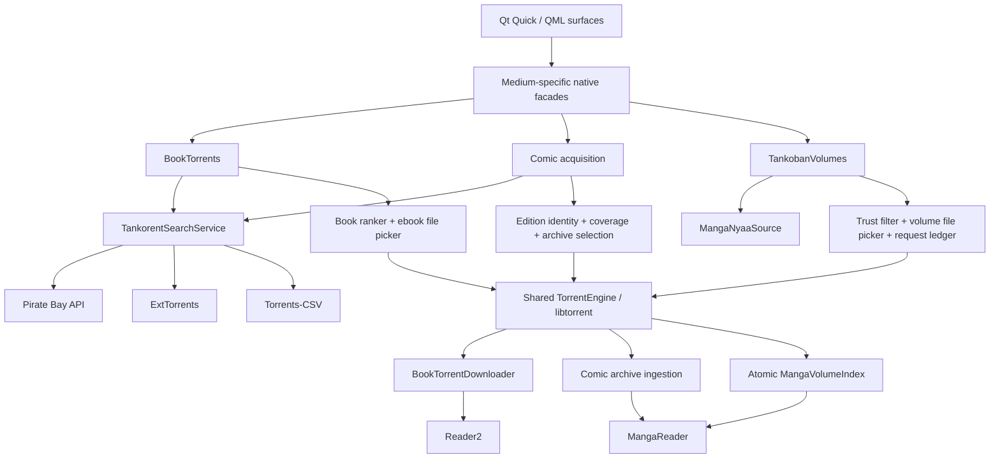
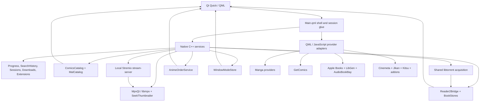

<p align="center">
  
</p>

<h1 align="center">Colosseum</h1>

<p align="center">
  <strong>A native desktop media shell for manga and comics, books and audiobooks, movies, shows, and anime.</strong>
</p>

<p align="center">
  Qt 6 · QML · C++ · Qt WebEngine · mpv · libtorrent · Stremio-compatible extensions
</p>

> [!IMPORTANT]
> Colosseum is an active, fast-moving development build. Windows with Qt 6.11.1 and MSVC 2022 is the current tested path. It is not yet a polished, portable, one-command release.

## What Colosseum is

Colosseum is a fullscreen-first desktop media environment built around three connected worlds:

- **Tankoban** for manga and western comics
- **Biblio** for ebooks and audiobooks
- **Theatre** for movies, shows, and anime

The worlds share one shell rather than living as three unrelated applications. Continue, search history, local downloads, wallpapers, open sessions, and the taskbar cross the world boundaries while each medium keeps its own reader, player, metadata rules, and acquisition policy.

The interface is written in Qt Quick/QML. Native C++ objects own durable state, files, torrent transport, readers, playback, WebEngine bridges, downloads, system integration, and the services that should not live in declarative UI.

## Current state at a glance

| Area | Current state |
|---|---|
| Home shell | Implemented: universal Continue, Tankoban bookshelf, Theatre strip, Biblio reading desk, persistent wallpapers, living QML wallpapers, top bar, taskbar, and shared scrolling |
| Tankoban | Implemented as separate **Manga** and **Comics** tabs with shared chrome |
| Manga | Chapter reading, local downloads, per-series Tankoban Mode, volume torrent acquisition, complete-chapter fallback packing, and one shared manga/comics reader |
| Western comics | Read-only SQLite catalog, catalog-run and curated-series pages, GetComics acquisition, alternate torrent sources, archive ingestion, and shared-reader delivery |
| Biblio | Apple Books discovery, torrent and LibGen ebook acquisition, AudioBookBay matching, the fresh Reader2 ebook reader, and audiobook read-along inside the reader |
| Theatre | Movies, Shows, Anime, detail pages, extension-backed sources and subtitles, mpv playback, local video downloads, seek previews, and keyless absolute anime ordering |
| Search | Implemented per world with durable native history; Home-wide cross-world search is not yet built |
| Genre discovery | Local baked MAL catalog for manga/anime when present, with the live provider ladder retained as fallback |
| Extensions | Theatre addon store supports discovery, preview, install, enable, ordering, and removal |
| Downloads | Unified vault for manga chapters, Tankoban volumes, comics, LibGen ebooks, and video; native-torrent ebooks and audiobook files remain world-owned |
| Sessions | Implemented for books, manga/comics, and video; audiobook playback is an engine inside the book reader, not a separate taskbar app |
| Windowing | Fullscreen-first with a persistent frameless developer-windowed mode, shell-wide F11 switching, native minimize, and protected fullscreen transitions |
| Universe pages | The bespoke universe collection is currently archived and absent from Home until it can return as a complete custom-made set |
| Vinyl | Visible as a coming-soon world, not implemented |
| Platforms | Windows-first development build; other platforms are not packaged or verified |

## Recent development snapshot

The current tree has moved well beyond the previous README:

- **Biblio now opens the fresh Reader2.** The imported legacy book-reader application was retired. The replacement uses native QML chrome over a constrained WebEngine paper and preserves the existing progress, bookmark, annotation, and settings stores.
- **The book reader is also the audiobook surface.** The standalone audiobook player was removed. One app-wide `AudiobookSession` survives behind the reader's Audio tab and transport pill, including chapter lists, speed, seeking, read-along following, and pairing.
- **Tankoban is explicitly split into Manga and Comics.** The two media share the world header but keep separate shelves, discovery routes, and data loading.
- **Comics moved to a native SQLite seam.** `ComicsCatalog` reads `data/comics_catalog.db` in read-only mode for catalog search, series runs, curated editions, download rows, and mirrors. It stays dormant when the artifact is absent.
- **Manga and anime genre pages gained a local catalog brain.** `MalCatalog` reads a pipeline-built `data/mal_catalog.db` and returns the shapes the existing pages already understand. Jikan, AniList, and Kitsu remain fallback lanes.
- **Anime can use canonical absolute playback order.** `AnimeOrderService` reconciles provider IDs with public community mappings, offers Absolute or Seasons views only when the mapping is complete, and builds cross-season queues without rewriting source IDs.
- **The player gained seek thumbnails and chapter marks.** An ffmpeg-backed thumbnailer caches five-second buckets and serves nearby frames while a new hover frame is loading.
- **Continue is now series-aware.** Episodes from one show collapse into one tile, and removing that tile forgets the whole show group instead of allowing a sibling episode to reappear.
- **Per-world Next Up rows use the same real session doors as Continue.** Theatre plays through the video-session path; Tankoban reads through the shared comic-session path.
- **The shell gained a real window-mode authority.** Fullscreen and frameless windowed modes persist, readers and players use the same transition verb, and living wallpapers freeze when an immersive surface owns the screen.
- **The five bespoke universe pages were archived together.** One Piece, Dragon Ball, the MCU, Cosmere, and Weekly Shonen Jump remain preserved under `archive/`, but their Home entry points and live routes are intentionally absent.

## The three worlds

### Tankoban

Tankoban treats manga and western comics as related forms of sequential art without flattening their identities or publication structures. The world now has dedicated **Manga** and **Comics** tabs beneath one shared top surface.

#### Manga

The chapter-first path combines focused sources:

- **WeebCentral** for search, series resolution, chapters, page lists, and chapter downloads
- **AniList** for primary art and metadata
- **Kitsu** as an art, metadata, and outage fallback
- **MangaDex** for canonical volume structure, tankōbon covers, and known chapter ranges
- **MalCatalog** for local genre discovery when `data/mal_catalog.db` is deployed
- **Jikan**, AniList, and Kitsu as the live genre fallback ladder

The standard series page remains chapter-first. Chapters are grouped under real volume covers where the source relationship can be established, with an honest flat fallback when ranges are incomplete.

##### Tankoban Mode

Tankoban Mode is a persistent per-series alternative to chapter-first reading. It presents canonical volume records and uses the native `MangaTankobanService`, exposed to QML as `TankobanVolumes`, to compose the lifecycle:

1. MangaDex volume records and WeebCentral chapters are normalized into stable series and volume identities.
2. Open Library and Apple Books provide best-effort volume synopsis enrichment.
3. `MangaNyaaSource` searches Nyaa's literature lane with volume-aware queries and uploader trust rules.
4. The user chooses a ranked source. The app does not silently select one.
5. `MangaVolumeTorrentDownloader` fetches metadata, selects only the required archive, and safely unions file priorities when several requested volumes share a pack.
6. `MangaVolumeArchiveIngestor` validates images, natural-sorts pages, and atomically publishes the local volume.
7. The same MangaReader used by chapters and western comics opens the result.

A durable request ledger separates the user's volume intent from a torrent's info hash, so several volumes can share transport without collapsing into one user-facing job.

When torrent acquisition is not used, **Build from chapters** is available only if WeebCentral exposes a complete chapter-to-volume map. A partial volume is never labeled ready.

#### Western comics

Western comics separate catalog identity from availability.

The primary catalog seam is `ComicsCatalog`, a native read-only SQLite service over `data/comics_catalog.db`. Depending on the deployed artifact, it can provide:

- GCD-backed series runs and exact-title resolution
- all-words title search ranked by exactness, availability, and year
- curated series and collected-edition records
- GetComics download rows and stored mirror doors
- run-specific `gcd:` identities for Continue and session restoration

An exact title redirects to a catalog run only when the match is unambiguous. Same-name runs remain separate rather than being guessed together.

**GetComics** remains a live content and acquisition lane. A verified release can resolve a current mirror, download its archive, extract pages, and publish them through the same comic index and reader identity used by torrent acquisition.

Collected editions can also open **Find alternate sources** through Tankorent:

- edition-aware query planning uses title, format, ISBN, and collected issue coverage
- results are deduplicated by canonical info hash
- identity evidence is considered before swarm health
- uploader trust and archive coverage are evaluated
- ambiguous packs require an explicit archive choice
- restart-safe request state keeps acquisition intent separate from transport
- selected archives converge through the same `ComicDownloader` ingestion boundary

Weak or ambiguous rows stay visible for transparency, but they require explicit user choice.

### Biblio

Biblio separates identity, editions, delivery, reading, and listening:

- **Apple Books** supplies book and audiobook discovery, charts, covers, authors, genres, descriptions, ratings, and identity.
- **BookTorrents** searches Pirate Bay API, ExtTorrents, and Torrents-CSV through the shared native Tankorent search service.
- **LibGen** remains a separate ebook-edition and delivery lane.
- **AudioBookBay** supplies audiobook release candidates paired to book identity.
- **BookDownloader** publishes selected LibGen files into the local book store.
- **BookTorrentDownloader** asks the shared native torrent engine for one supported ebook file and deprioritizes unrelated pack files.
- **AudiobookDownloader** uses the bundled Stremio stream-server boundary and stores audio files under the book/audiobook pairing key.

Biblio treats local ownership as one book-level state across LibGen and torrent delivery. Starting another ebook download replaces the existing local copy instead of accumulating duplicate editions.

#### Reader2

The current ebook reader is `qml/reader2/ReaderShell.qml`, backed by `Reader2Bridge` and `BookStores`.

It uses native QML for the reader shell and chrome while a tightly scoped Qt WebEngine page renders the book through the vendored Anx foliate-js fork. The paper receives only a limited files-and-events bridge rather than the complete native object surface.

Reader2 includes:

- exact resume using the pre-existing progress keys and stores
- contents navigation with current, read, and unread state
- bookmarks
- highlights, colors, notes, recoloring, and deletion
- in-book search
- selection copy and dictionary lookup
- footnote cards
- theme, typeface, size, line-height, margin, alignment, and reading-ruler controls
- keyboard and edge navigation
- minimizable book sessions
- read-along audiobook pairing and transport

The swap preserves old positions and marks by using the same path fingerprint and store files rather than introducing a migration-only identity.

#### Audiobook read-along

There is one app-wide `AudiobookSession`, but no standalone audiobook page or taskbar session.

The reader can auto-attach a downloaded audiobook, expose its files or embedded chapters, play or pause, skip, seek, change speed, and map reading chapters to audio chapters. **Follow my reading** can move the audio to the chapter matching the current page while preserving play/pause state.

A book's Continue tile represents both reading and attached listening. Standalone audiobook progress records are intentionally filtered from Home.

### Theatre

Theatre has three tabs:

- **Movies**
- **Shows**
- **Anime**

House catalogs come from:

- **Cinemeta** for movie and series identity, metadata, posters, backdrops, and episode lists
- **Jikan** for live anime discovery
- **Anime Kitsu** for anime metadata, identity bridging, and fallback rows
- **MalCatalog** for baked local anime genre pages when the SQLite artifact is present
- installed **Stremio-protocol extensions** for additional catalogs, metadata, streams, and subtitles

A title opens a Theatre detail page. Movies expose sources; shows expose seasons and episodes. Playback can use a torrent-backed stream, a direct extension URL, or a completed local download.

Theatre torrent streaming remains behind the bundled Stremio stream-server. It is deliberately separate from Tankorent's complete-file acquisition engine.

#### Absolute anime order

`AnimeOrderService` is a progressive enhancement for anime with awkward provider season layouts.

It downloads and caches two public mapping datasets at runtime, joins them by provider IDs rather than title text, and maps provider season/episode values to canonical absolute numbers. When the mapping is complete, the UI can switch between **Absolute** and **Seasons**, show honest Special labels, and build a cross-season playback queue. If the data is missing, stale, incomplete, or offline, Theatre keeps the provider's original order.

See [`THIRD_PARTY_DATA.md`](THIRD_PARTY_DATA.md) for the cache, refresh, source, field, and attribution boundaries.

## Home and the session shell

Home currently leads with one mixed **Continue** row, followed by medium-specific entry boards:

- Tankoban bookshelf
- Theatre film strip
- Biblio reading desk

Continue mixes books, manga chapters, Tankoban volumes, comics, movies, and show episodes by recency. Show episodes are grouped into one tile per series. The full backlog is available through **See all**.

The native `SessionStore` tracks open books, manga/comic readers, and video surfaces. The taskbar switches, minimizes, restores, and closes those sessions. Warm video sessions can remain loaded while hidden; books and comic readers reconstruct from durable state.

Audiobook playback is not a separate session kind. It is a shared engine controlled by the open book reader.

### Wallpapers and window mode

Each world can keep its own wallpaper selection. A wallpaper may be a still image or a native QML scene such as `ArenaNight.qml`.

Living wallpapers receive a `running` gate and freeze when:

- a reader or player owns the screen
- the application is minimized

The native `WindowModeStore` owns startup and transition state. Colosseum starts fullscreen by default, remembers the frameless developer-windowed mode when used, and exposes one shell-wide F11 transition across Home, worlds, readers, overlays, and playback. A transition shield covers the full-monitor geometry change so the first frame does not flash or tear.

## Players and readers

### Theatre player

The Theatre player is a fullscreen QML surface over **MpvQt/libmpv**. Torrent transport stays behind the local Stremio stream-server, so the player consumes a playable URL rather than owning torrent logic.

The player includes:

- torrent-backed, direct-URL, and local-file playback
- Continue progress and resume
- warm minimize
- audio and subtitle track selection
- online and external subtitles
- preferred-language memory and track delays
- playback speed, fill, aspect, seek, volume, fullscreen, and PiP controls
- skip segments and episode queues
- source failover
- Up Next countdowns
- keyboard help, A-B loop, sleep timer, statistics, capture, GIF, and drawing tools
- ffmpeg-backed seek thumbnails with five-second caching
- chapter markers on the seek rail
- loudness normalization for quiet film and television mixes

Seek thumbnails degrade to timestamp-only tooltips when ffmpeg cannot be found.

Casting, live channels/DVR, and local watch-room models remain experimental compared with core local and on-demand playback.

### Manga and comics reader

Manga chapters, Tankoban volumes, and western comic editions use the same download-fed reader. The caller supplies local pages and an entry kind; the reading surface does not care whether they came from WeebCentral, Nyaa, GetComics, or a selected comic torrent.

Reading modes include long strip, single page, double page, MangaPlus-style pairing, left-to-right and right-to-left direction, width or height fitting, paged zoom and pan, optional wide-page splitting, and windowed strip loading with neighboring-page prefetch.

The reader supports chapter and page grids, thumbnails, jumping, crossing into adjacent chapters or volumes, bookmarks, per-series preferences, spread-pair knowledge, scrub navigation, auto-hiding chrome, fullscreen/windowed switching, and exact resume restoration.

### Ebook reader

Reader2 is native chrome over a constrained WebEngine paper, not a standalone imported web application. `Reader2Bridge` exposes file reads and persistent stores to QML while the paper receives a least-privilege event gate.

The reader and its audio controls share one session model, so reading and listening do not create competing players.

## Search

Search remains scoped to the active world:

- **Tankoban** merges manga, the deployed comics catalog, and GetComics discovery lanes.
- **Biblio** searches Apple Books books and audiobooks in separate groups.
- **Theatre** searches Cinemeta movies and series together.
- recent queries are stored by native `SearchHistoryStore` and survive QML Loader recreation and application restarts.

Home-wide cross-world search is not yet implemented.

## Downloads

The Downloads page is a cross-world local vault with:

1. **Now arriving** for active and queued jobs supported by `LocalDownloads`
2. **Settled local media** grouped by world, series, season where applicable, and item

The unified view currently normalizes manga chapters, Tankoban volumes, western comics, LibGen ebooks, and Theatre video. It routes open, retry, pause, cancel, and delete actions back to the owning backend.

Native-torrent ebooks and audiobook files keep their own durable stores and are opened through their owning worlds.

## Extensions

The Extensions page manages Stremio-compatible addons. It supports curated discovery, community-catalog browsing, manifest preview, install from normal or `stremio://` links, enable/disable, priority ordering, logos, and removal of non-core extensions.

First run seeds the house Theatre providers. Enabled stream and subtitle extensions are asked in registry order. Adult manifests are rejected by the native registry rather than hidden only at the UI layer.

The extension store currently affects Theatre. Tankoban and Biblio do not yet consume extension resources.

## Source map

| Domain | Current source or engine |
|---|---|
| Manga search, chapters, pages | WeebCentral |
| Manga art and metadata | AniList, with Kitsu fallback |
| Manga genre discovery | Local `MalCatalog` first when deployed; Jikan, AniList, and Kitsu fallback |
| Manga volume identity and covers | MangaDex plus the canonical Tankoban volume model |
| Manga volume torrent discovery | Nyaa literature RSS through `MangaNyaaSource` |
| Manga volume fallback | WeebCentral chapter packing, only for complete maps |
| Manga volume transport | shared `TorrentEngine`/libtorrent plus atomic `MangaVolumeIndex` |
| Western comics catalog | pipeline-built read-only `data/comics_catalog.db` through `ComicsCatalog` |
| Western comics live discovery and archives | GetComics |
| Western comics alternate search | `TankorentSearchService` plus edition-aware ranking and file selection |
| Western comic delivery | GetComics or selected torrent, converging through `ComicDownloader` |
| Book and audiobook discovery | Apple Books |
| Federated book/comic torrent search | Pirate Bay API, ExtTorrents, and Torrents-CSV |
| Ebook editions and alternate delivery | LibGen |
| Audiobook release discovery | AudioBookBay |
| Audiobook delivery | bundled Stremio stream-server plus `AudiobookDownloader` |
| Ebook rendering | Reader2 native QML chrome over the vendored Anx foliate-js paper |
| Ebook and audiobook read-along | `AudiobookSession` and `AudioPairingStore` |
| Movie and show catalogs | Cinemeta |
| Anime live discovery and metadata | Jikan and Anime Kitsu |
| Anime genre discovery | local `MalCatalog` first when deployed, live provider fallback |
| Anime episode ordering | `AnimeOrderService` with runtime-cached public ID mappings |
| Stream discovery | Torrentio and installed Stremio extensions |
| Subtitles | OpenSubtitles v3 and installed subtitle extensions |
| Theatre torrent transport | bundled Stremio `stream-server` runtime |
| Native complete-file transport | libtorrent-rasterbar through the shared `TorrentEngine` |
| Video rendering | MpvQt/libmpv |
| Seek previews | ffmpeg through `SeekThumbnailer` |

> [!NOTE]
> Colosseum is a client and does not host media. External APIs, websites, addons, indexers, datasets, and scrapers are independent services and can change or disappear. Use sources and content only where you have the right to access them.

## Tankorent architecture

Tankorent is the native complete-file acquisition architecture. It remains separate from Theatre's Stremio streaming runtime.



The shared layer owns the libtorrent session, torrent repository, resume state, metadata, priorities, transfer progress, cancellation, and debug logging. QML receives medium-shaped operations rather than raw torrent primitives.

Policy remains medium-specific:

- **Books** select one renderable ebook and discard unrelated pack files.
- **Collected comics** rank by edition identity and coverage, preserve source browsing as a separate step, and require a concrete archive choice when necessary.
- **Manga volumes** use Nyaa-specific trust and coverage rules and can union several requested volumes inside one pack.
- **Theatre and audiobooks** continue to use the Stremio stream-server because they are streaming and staged-media problems rather than complete-file library acquisition.

## Application architecture



### Native services exposed to QML

The launcher exposes focused objects including `Manga`, `Downloads`, `TankobanVolumes`, `Books`, `BookTorrents`, `Audiobooks`, `Comics`, `ComicsCatalog`, `MalCatalog`, `Stream`, `Download`, `LocalDownloads`, `Extensions`, `Progress`, `SearchHistory`, `Sessions`, `Reader2Bridge`, `BookBridge`, `AudioPairing`, `AnimeOrder`, `WindowMode`, `Cast`, `Live`, `Room`, `Power`, and `Clipboard`.

`TankorentSearchService` and the shared `TorrentEngine` remain behind medium-specific facades.

The launcher installs a disk-backed network cache and browser-style user-agent fallback for QML requests. Hosts that stall on the current development network's broken IPv6 route are resolved and pinned to IPv4. Live indexer searches use an uncached network manager so seed counts are not frozen by image or catalog caching.

## Repository layout

```text
Colosseum/
├── qml/                    Shell, worlds, media surfaces, components and provider adapters
│   ├── reader2/            Fresh ebook reader chrome and QML state
│   └── wallpapers/         Native living wallpaper scenes
├── native/                 C++ launcher and native services
│   ├── anime/              Keyless anime identity and absolute-order service
│   ├── engine/             Downloaders, catalogs, indexes and publication services
│   ├── player/             mpv, stream-server, seek previews and window-mode services
│   ├── reader/             Shared book stores and compatibility bridge
│   ├── reader2/            Reader2 least-privilege bridge
│   ├── torrent/            Tankorent search, rankers, ledgers, pickers and downloaders
│   │   └── engine/         Shared libtorrent session and repository
│   └── tts/                Native Edge TTS client and worker
├── resources/
│   └── reader2/            WebEngine paper, glue and vendored reading engine
├── data/                   Pipeline-deployed SQLite catalog artifacts, dormant when absent
├── scripts/                Catalog bake and maintenance pipelines
├── assets/                 Icons, addon logos, fonts and wallpaper assets
├── archive/                Retired implementations and preserved universe pages
├── docs/                   Architecture laws, specifications and design records
├── tests/                  Contract, harness, source and smoke tests
└── dev.bat                 Current Windows QML live-reload loop
```

## Building the current development version

### Requirements

- Windows 10 or 11
- Visual Studio 2022 C++ Build Tools
- CMake 3.16 or newer
- Ninja
- Qt 6.11.1 MSVC 2022 64-bit with Quick, QML, Network, GUI, SQL, Concurrent, WebEngineQuick, WebChannel, and WebSockets
- a Windows build of MpvQt
- libmpv headers, import library, and runtime DLL
- libtorrent-rasterbar with Boost and OpenSSL
- the bundled Stremio stream-server runtime used by Theatre and audiobook delivery
- ffmpeg for seek thumbnails, GIF encoding, and other capture tooling; playback still works when it is absent

The checked-in CMake file first tries package-configured libtorrent, Boost, and OpenSSL targets. Its current Windows fallback paths are:

- `C:/tools/libtorrent-2.0-msvc`
- `C:/tools/boost-1.84.0`
- `C:/tools/openssl-msvc`

Missing libtorrent is a fatal configure error because Tankorent is a commissioned runtime subsystem, not an optional stub.

MpvQt and libmpv default to paths under `C:/tools/mpvqt-feasibility`. Override `MPVQT_PREFIX`, `LIBMPV_PREFIX`, `LIBTORRENT_ROOT`, `BOOST_ROOT`, or `OPENSSL_MSVC_ROOT` when dependencies live elsewhere.

### Example configure and build

```bat
cmake -S native -B native/build-msvc -G Ninja ^
  -DCMAKE_PREFIX_PATH=C:/Qt/6.11.1/msvc2022_64 ^
  -DMPVQT_PREFIX=C:/tools/mpvqt-feasibility/mpvqt-msvc-install ^
  -DLIBMPV_PREFIX=C:/tools/mpvqt-feasibility/libmpv-prefix ^
  -DLIBTORRENT_ROOT=C:/tools/libtorrent-2.0-msvc ^
  -DBOOST_ROOT=C:/tools/boost-1.84.0 ^
  -DOPENSSL_MSVC_ROOT=C:/tools/openssl-msvc

cmake --build native/build-msvc
```

Run the live QML development loop with:

```bat
dev.bat
```

`dev.bat` launches `native/build-msvc/colosseum.exe qml/Main.qml`, enables QML live reload, and disables the QML disk cache so saved edits are not hidden by stale compiled components.

An argument-free development launch self-locates the repository and attempts a safe `git pull --ff-only` before loading the live QML tree. Offline, dirty, timed-out, or diverged repositories boot as-is. Native changes still require a rebuild.

## Useful development harnesses

| Variable or target | Purpose |
|---|---|
| `COLOSSEUM_DEV=1` | Enable QML/JS live reload |
| `COLOSSEUM_OPEN_WORLD=Theatre` | Boot directly into a world |
| `COLOSSEUM_OPEN_EXTENSIONS=1` | Boot directly into the extension store |
| `COLOSSEUM_CATALOG_SELFTEST=movies` | Log Theatre catalog rows |
| `COLOSSEUM_STREAMS_SELFTEST=movie\|tt0816692` | Exercise installed stream extensions |
| `COLOSSEUM_SUBS_SELFTEST=movie\|tt0111161` | Exercise subtitle aggregation |
| `COLOSSEUM_SESSION_SELFTEST=1` | Run the session-store contract test |
| `COLOSSEUM_VIDEOQ_SELFTEST=exactrow` | Exercise the persistent video queue |
| `COLOSSEUM_DL_SELFTEST=...` | Exercise manga chapter/page downloads |
| `COLOSSEUM_BOOK_DLTEST=...` | Exercise LibGen ebook downloads |
| `COLOSSEUM_COMIC_DLTEST=...` | Exercise verified GetComics archive downloads |
| `COLOSSEUM_ABB_DLTEST=<pairKey>\|<infoHash>` | Exercise audiobook manifest and delivery handling |
| `COLOSSEUM_TORRENT_SEARCHTEST=<query>` | Run the federated Tankorent indexers |
| `COLOSSEUM_TORRENT_DLTEST=<infoHash>\|<title>` | Exercise native ebook selection and download |
| `COLOSSEUM_TANKOBAN_DLTEST=<magnet-or-infohash>\|<seriesId>\|<seriesTitle>\|<volumeNumber>` | Exercise volume transfer, ingestion, and publication |
| `COLOSSEUM_APPDATA_TAG=<tag>` | Isolate AppData-backed stores for a test run |
| `reader2_harness` | Boot the fresh reader independently of the main shell |

The repository also contains focused C++, QML, PowerShell, and JavaScript checks for Reader2 stores and bridge isolation, audiobook auto-attach, comics catalog behavior, comic source planning and ingestion, shared libtorrent behavior, manga volume identity and ledgers, anime ordering, search history, sessions, window transitions, and player failure handling.

## Known boundaries

- Home-wide cross-world search is not implemented.
- Manual **Your Collection** or watchlist storage is not implemented yet. Existing `+ Library` affordances should not be treated as a working library.
- The bespoke universe collection is archived and currently absent from Home.
- Vinyl is a non-interactive coming-soon entry.
- Theatre extensions are live; Tankoban and Biblio extension consumption is future work.
- `data/comics_catalog.db` and `data/mal_catalog.db` are pipeline-deployed artifacts. Their native lanes stay dormant when the files are absent.
- The comics catalog is a snapshot, not a universal live bibliography, and needs periodic rebuilding and enrichment.
- GetComics and torrent sources are availability lanes, not identity authorities.
- Weak comic matches require confirmation; ambiguous packs require a second explicit file choice.
- Tankoban Mode depends on trustworthy Nyaa metadata or a complete WeebCentral chapter map.
- Native-torrent ebooks and audiobook downloads are not yet normalized into the unified `LocalDownloads` vault.
- Biblio stores one readable ebook copy per book. Starting another delivery replaces the previous local copy.
- There is no standalone audiobook player or audiobook taskbar session. Listening is intentionally embedded in Reader2.
- Anime absolute order is progressive enhancement. Provider order remains the fallback when mappings are incomplete.
- Seek thumbnails require ffmpeg; the player falls back to time-only hover labels without it.
- Casting, live TV/DVR, and networked watch rooms are less mature than core playback.
- The build assumes developer-supplied Qt, MpvQt, libmpv, libtorrent, Boost, OpenSSL, ffmpeg, and the stream-server runtime.
- Scraper-backed sources and public indexers are more fragile than stable public APIs.
- `Main.qml` still carries substantial shell coordination and remains an obvious future service-boundary refactor target.

## Design principles

- **Each medium gets the surface it needs.** A book detail page should not be a recolored movie page.
- **Share transport, not policy.** Tankorent centralizes transfer mechanics while books, comics, and manga keep their own identity and selection laws.
- **Separate browsing from acquisition.** Looking at source results must not create a download job.
- **Separate remote availability from local ownership.** Providers identify or deliver media; Colosseum owns durable reader, player, and session state.
- **Match conservatively.** Missing or ambiguous sources stay unavailable instead of quietly opening the wrong work.
- **Download-fed reading.** Manga, comics, and ebooks are persisted locally before their dedicated reader opens them.
- **One identity, many surfaces.** Continue, Downloads, Search History, and Sessions connect the worlds without erasing their differences.
- **Native engines behind declarative UI.** QML owns presentation; C++ owns durable state, files, processes, transport, and native integration.
- **Compositions, not foreign pipelines.** External interfaces can inspire layout, but Colosseum keeps its own identity, metadata, and transport boundaries.
- **Progressive honesty.** A slow, blocked, absent, or incomplete source shows a real fallback or empty state rather than fabricated content.
- **The shell is part of the product.** Wallpapers, taskbar behavior, window mode, scrolling, and session switching are product surfaces, not decoration.
