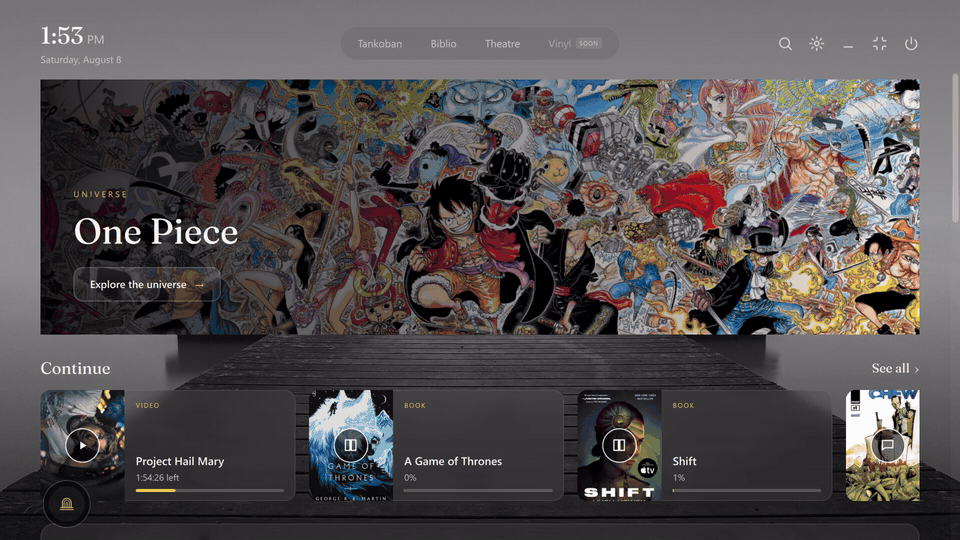
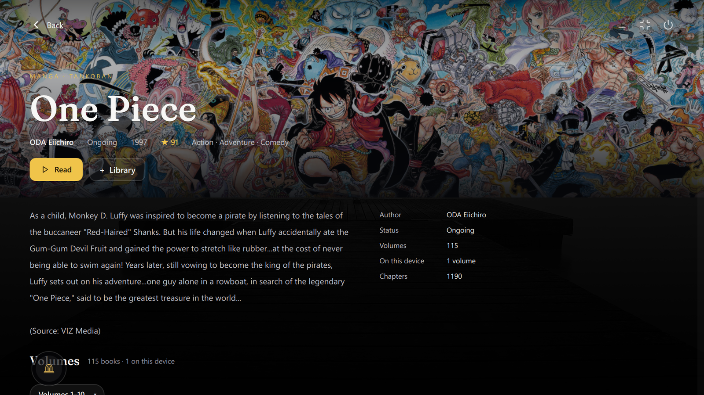
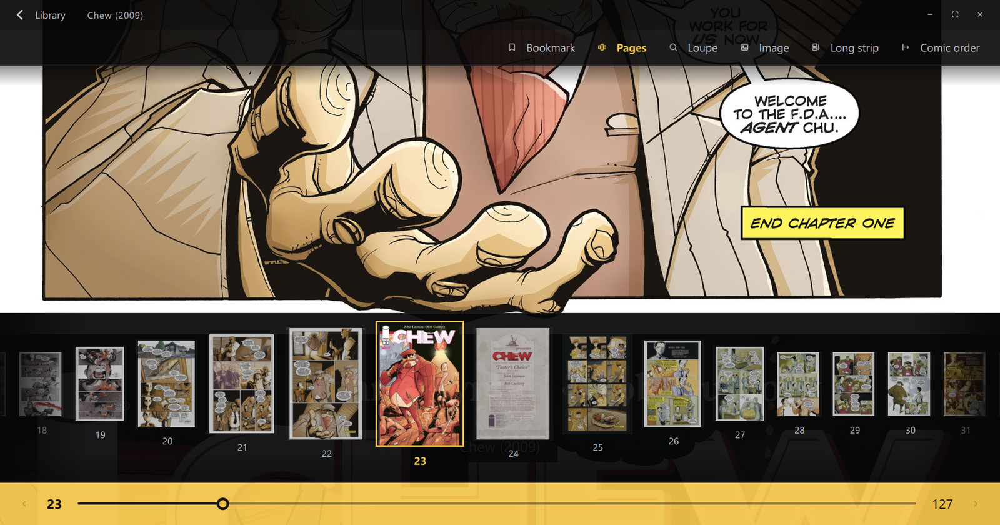
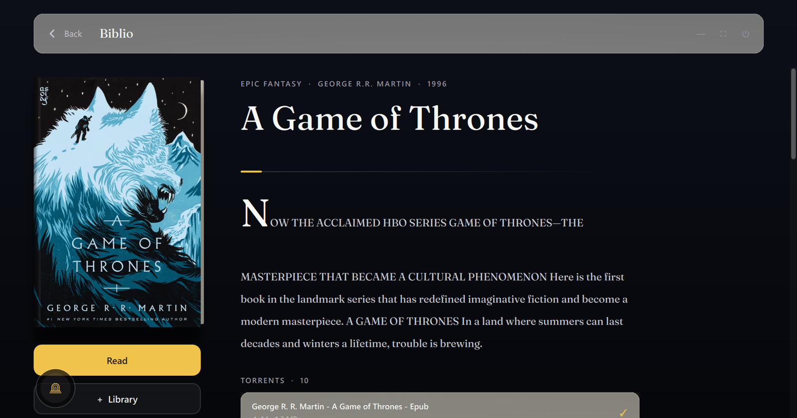
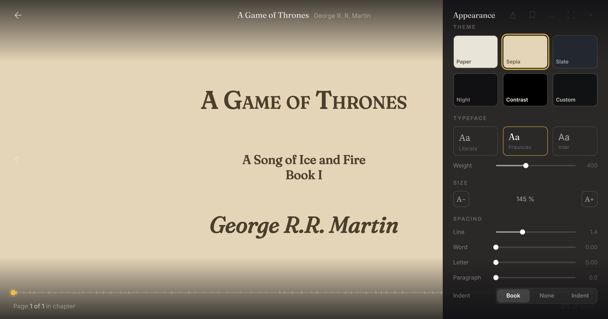
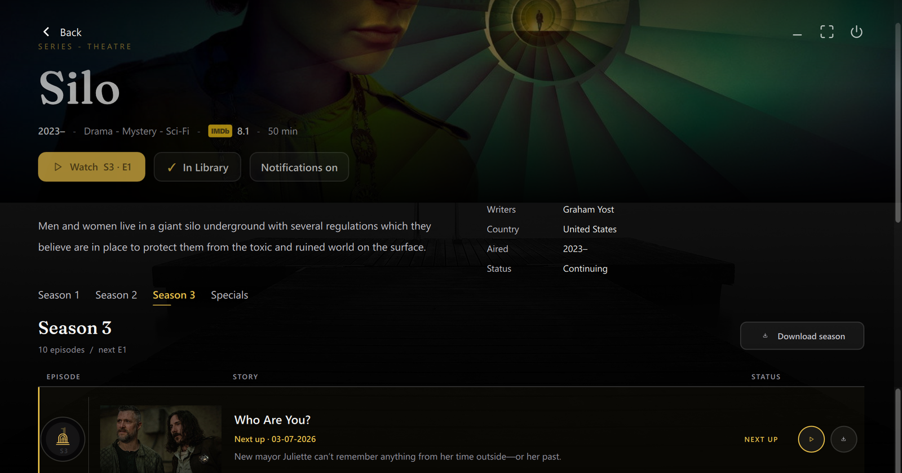
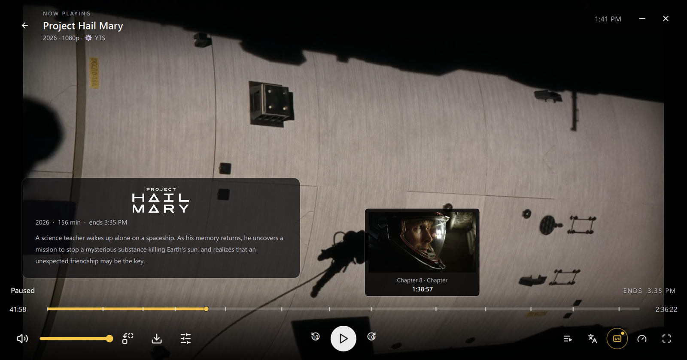
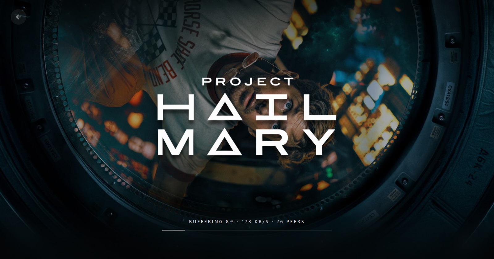

<p align="center">
  
</p>

<h1 align="center">Colosseum</h1>

<p align="center">
  <strong>A native desktop media environment for manga and comics, books and audiobooks, movies, shows, and anime.</strong>
</p>

<p align="center">
  <a href="https://github.com/kingoftheseas56/Colosseum/releases"></a>
  <a href="https://github.com/kingoftheseas56/Colosseum/releases/latest"></a>
  <a href="LICENSE"></a>
</p>

<p align="center">
  <a href="https://github.com/kingoftheseas56/Colosseum/actions/workflows/desktop-ci.yml"></a>
  <a href="https://github.com/kingoftheseas56/Colosseum/actions/workflows/code-quality.yml"></a>
</p>

<p align="center">
  
</p>

<p align="center">
  <a href="https://github.com/kingoftheseas56/Colosseum/releases/latest"><strong>Download latest</strong></a> &nbsp;|&nbsp;
  <a href="docs/README.md">Docs</a> &nbsp;|&nbsp;
  <a href="docs/build/windows.md">Build on Windows</a> &nbsp;|&nbsp;
  <a href="https://github.com/kingoftheseas56/Colosseum/issues/new?template=bug_report.yml">Report a bug</a> &nbsp;|&nbsp;
  <a href="SUPPORT.md">Support</a> &nbsp;|&nbsp;
  <a href="CONTRIBUTING.md">Contribute</a> &nbsp;|&nbsp;
  <a href="SECURITY.md">Security</a>
</p>

## Overview

Your media library lives in five different apps: one for manga, one for comics, one for books,
one for audiobooks, one for film and TV. Each has its own catalogue, its own reader or player,
its own idea of progress — and none of them talk to each other.

Colosseum is one fullscreen home for all of it. Three worlds — **Tankoban** (manga and western
comics), **Biblio** (ebooks and audiobooks), **Theatre** (movies, shows, anime) — share a single
shell: one Continue row across every medium, one Collection, one Downloads surface, one taskbar
of open sessions, and **Vault**, a local-media library for files you already own. Each medium keeps
the surface it deserves: a real comic reader, a real book reader with audiobook read-along, and a
real video player. Browsing is catalogue-first and discovery-rich; downloaded media remains local
so reading and listening can continue offline.

> [!IMPORTANT]
> Colosseum 1.1.4 is the current Windows 10/11 desktop release. Download the installer from
> [Releases](https://github.com/kingoftheseas56/Colosseum/releases) for a per-user install —
> no administrator required. Building from source is documented below.

## What's new in 1.1.4

- **Read now, download later — everywhere.** Comics, Tankoban volumes, and Biblio books share one
  consumption-first split: **Read** opens the reader as soon as the content can open, guarded against
  stale requests, while **Download** acquires the content and stops at Ready instead of flipping into
  the reader on its own.
- **The catalogues fetch themselves.** The installer no longer ships catalogue databases. On first
  launch, Colosseum downloads all four — anime/manga, Tankoban volumes, comics, and the IMDb index —
  from the public Colosseum-Data release, and shelves wake live as each one lands.
- **Comics catalogue intelligence.** A real catalogue engine drives new Discover shelves and a
  per-series ledger, with honest empty states while a catalogue is absent or still downloading.
- **Tankoban volume identity.** A Torrentio-style identity pipeline gives the source picker and file
  picker one shared volume grammar — better matches, fewer misfiled downloads.
- **Theatre and runtime polish.** Series episode lists scroll as a single surface; pause/resume
  authority, the Watch Party bridge, and the update cache moved into owned native services; startup
  gains an explicit bootstrap; pinned-host networking retries through a durable IPv4 pin store.
- **Quieter installs, more channels.** The installer registers a quiet uninstall command for silent
  managers, Colosseum is submitted to WinGet as `Colosseum.Colosseum`, and a Chocolatey package
  definition lives in-tree.

Full release notes: [docs/release-notes/v1.1.4.md](docs/release-notes/v1.1.4.md).

## Highlights

- **Three worlds, one shell.** Universal Continue, Collection, Downloads, search history,
  wallpapers, local Vault media, and window sessions across manga, comics, books, audiobooks,
  and video.
- **Real readers and players, built in.** A from-scratch comic reader (long strip, paired
  pages, RTL, exact resume), an ebook reader with typography control and audiobook read-along,
  and an mpv-based player with subtitles, skip segments, episode queues, and seek thumbnails.
- **Local media is first-class.** Vault indexes folders in place, watches confirmed roots for
  arrivals, keeps a recent-arrivals view, preserves unavailable roots, and routes supported local
  files back into the same readers and player used elsewhere in Colosseum.
- **Deep catalogues with offline backbones.** Theatre shelves are ranked by a local IMDb index;
  Tankoban discovery and series pages use local MAL/Tankoban catalogues; Biblio blends Apple
  Books with Open Library most-read, classics, and subject discovery.
- **Stremio-compatible extensions.** World-aware Sources, community/curated Browse, Installed
  management, configured manifests, and direct/torrent Theatre stream results. NoTorrent ships
  by default and is removable like any extension.
- **Download-fed reading.** Tankoban volumes, comics, and Biblio retain native acquisition paths
  so the media you keep does not depend on the source remaining online after download.

## Screenshots

<table>
  <tr>
    <td align="center"><br /><sub>Tankoban series — volume view</sub></td>
    <td align="center"><br /><sub>Comic reader</sub></td>
  </tr>
  <tr>
    <td align="center"><br /><sub>Biblio book page</sub></td>
    <td align="center"><br /><sub>Reader — themes and typography</sub></td>
  </tr>
  <tr>
    <td align="center"><br /><sub>Theatre series page</sub></td>
    <td align="center"><br /><sub>Native player</sub></td>
  </tr>
  <tr>
    <td colspan="2" align="center"><br /><sub>Cinematic loader</sub></td>
  </tr>
</table>

<!-- VIDEO EMBEDS: drag 01-hero-home.mp4, 02-theatre-discover.mp4, 05-tankoban-discover.mp4
     into this section in the GitHub editor; each becomes a playable embed. -->

## The three worlds

| World | For | Built-in sources |
|---|---|---|
| **Tankoban** | manga and western comics | local/managed MAL + Tankoban catalogues; AniList metadata; Nyaa volume source (off by default); GetComics + local comic catalog |
| **Biblio** | ebooks and audiobooks | Apple Books + Open Library discovery, LibGen, AudioBookBay |
| **Theatre** | movies, shows, anime | Cinemeta + offline IMDb catalogue, Jikan/AniList/Kitsu; installed Stremio extensions |

## Vault

**Vault is Colosseum's library for local files you already have.** It is separate from the
Downloads screen: Vault can index ordinary folders anywhere you choose, while Downloads continues
to track media acquired by Colosseum's own backends.

Vault has a permanent Home portal, so the local-library door is present even on a fresh
install with no roots configured. Add one or more roots and Colosseum scans them without relocating
the originals. The Browse face has recent arrivals, a root rail, breadcrumbs, nested folder
navigation, media-shaped cards, and in-place identity correction. Confirmed roots are watched for
new files, while disconnected or missing roots remain represented as **away** instead of making your
library silently shrink. Deleting or replacing files is also reconciled live, and stale background
enrichment is revision-guarded so older work cannot overwrite a newer file identity.

Artwork follows the media rather than one generic poster rule. Comics and books can reuse covers
inside their files; recognized movies and shows can receive locally cached canonical posters;
episodes, clips, and other local video can receive persistent ffmpeg frame grabs. The resolver
keeps the result local once it has been acquired, so the Browse wall can keep its art offline.

Vault also has identity continuity for files that move or appear as copies. When a likely-copy
ceremony needs a decision, you can keep existing state or treat it as a separate copy rather than
letting the scanner silently merge the two. Supported books, comics/manga, and video then open
through Reader2, the comic reader, or the Theatre player instead of a second set of local-only
viewers. Colosseum's Downloads tree can also appear as a synthetic Vault root without deleting or
moving the underlying download data.

## Players and readers

- **Theatre player** — fullscreen QML surface over MpvQt / libmpv. Resume, warm minimize, audio and subtitle selection, online subtitles, track delays, speed, fill and aspect, PiP, skip segments, episode queues, source failover, Up Next, A-B loop, sleep timer, captures, GIF tools, chapter markers, loudness normalization, and ffmpeg-backed seek thumbnails.
- **Player 2** — an experimental from-scratch D3D11 / FFmpeg engine, integrated behind an opt-in build and boot gate. Not the default player.
- **Custom comic reader** — built from scratch and shared by Tankoban volumes and western comic editions. Long strip, single and double page, MangaPlus-style pairing, LTR / RTL direction, fit and zoom, wide-page splitting, prefetch, page grids, spread knowledge, scrub navigation, and exact resume.
- **Reader2** — native QML chrome over a least-privilege WebEngine paper. Contents, bookmarks, annotations, search, footnotes, typography, themes, keyboard navigation, and minimizable sessions. The audiobook engine lives behind its Audio surface with Follow my reading read-along.

## Watch Party

Colosseum 1.1.4 includes the Player 1 Watch Party client and defaults to the hosted protocol-v3
relay, so creating or joining a room no longer requires endpoint configuration. A Join action lives
on the taskbar; room controls live inside Player 1. The client supports guest and signed-in identity,
participant rosters, chat and reactions, host/shared control, reconnect and host grace, kick/rejoin,
room end, source readiness, sync status, catch-up, and room timeline commands.

Source portability is intentionally strict. The UI proves torrent identity from `infoHash + fileIdx`,
so exact torrent sources can be shared and a joiner can fetch the room's source automatically.
Generic direct-stream URLs are not eligible, and the verified-debrid seam is not inferred from
ordinary QML rows.

`COLOSSEUM_WATCH_PARTY_URL` remains an override for self-hosting and testing. The repository
includes the Cloudflare Worker + Durable Object relay and deployment notes in
[`server/watchparty-relay/DEPLOYMENT.md`](server/watchparty-relay/DEPLOYMENT.md). Guest room flows
are accountless and work today; public signed-in hosting does not, because it needs bearer
authority from the account service, which is not deployed (see **Accounts and sync**).
Multi-client room membership/chat/kick/rejoin/grace/end behavior has runtime coverage; final
in-app synced-playback acceptance remains a field-testing boundary.

## Extensions

The extension system is Stremio-compatible and has three surfaces: **Sources** (world-aware source
chains), **Browse** (curated/community discovery and manifest preview), and **Installed** (enable,
order, configure, and remove).

In Theatre, compatible add-ons can return ordinary torrent streams or direct HTTP streams. Direct
results can carry the add-on's request headers into the player, while configured manifests can
hand their own setup/authentication flow back to the provider. Colosseum does not try to own a
provider's debrid credentials or authentication state.

Tankoban and Biblio can consume compatible extension **catalogues** in their Discover surfaces,
while their acquisition/download paths remain native to those worlds rather than pretending every
Stremio stream shape maps cleanly onto a book or manga volume.

**NoTorrent**, an HTTP streaming source extension, ships enabled by default in Theatre and is
removable like any extension. Explicit-content manifests are hidden by default, but they follow the
same global **Explicit Content** preference as the rest of Colosseum when that setting is enabled;
direct manifest installation and community Browse use the same gate so the two paths cannot drift.

## Downloads, Collection, sessions

- **Downloads** — one taskbar surface across Tankoban volumes, comics, LibGen ebooks, and Theatre video, with open, retry, pause, cancel, and delete routed to the owning backend. Tankoban volume acquisitions expose resolving/progress/done state both in the source sheet and on the volume shelf.
- **Collection** — a durable manual library across all three worlds, separate from progress and local ownership.
- **Sessions** — open books, comic / manga readers, and video surfaces, switched from the taskbar. Audiobook playback stays inside the open book session.

## Accounts and sync

**Not wired up yet — you cannot sign in.** There is no account service running, so account
creation, sign-in, and cloud sync do not work in any released build, and every attempt reports
that the account service configuration is invalid. Everything Colosseum does with your library
works fully offline and is unaffected; accounts are an unfinished addition, not a dependency.

What exists today is the desktop half: onboarding, remembered-session restore, an account
medallion/flyout, and a six-page Account Centre — **Profile**, **Your Colosseum**, **Security**,
**Devices**, **Recovery**, and **Data & privacy** — plus the server that answers them, which
lives in this repository at [`server/account-service`](server/account-service) but is not
deployed anywhere. See [its deployment runbook](server/account-service/DEPLOYMENT.md) for what
closing that gap requires.

The rest of this section describes what those surfaces do once a service is running.

Profile can rename the account and choose a built-in avatar. Security owns new-device protection,
pending sign-in approvals, password changes, and sign-out-everywhere. Devices can refresh and
revoke trusted devices. Recovery can replace the recovery key without exposing the secret through
the normal page state. Your Colosseum is backed by a profile-owned activity ledger and projects
monthly watch time, pages read, completions, active days, highlights, and recent activity.

Portable sync remains narrower than "sync my computer": Collection, Continue/progress, ordinary
history, and profile preferences have sync adapters. Machine-specific paths, downloaded/local
media files, window state, search history, and the raw Your Colosseum activity ledger stay local.
The Data & privacy page can clear local search history and activity history; its policy switches,
data export, and account-deletion flow do not yet have authoritative service wiring.

The account service endpoint is configurable rather than hard-coded into the public desktop source:
a build sets it with `-DCOLOSSEUM_ACCOUNT_SERVICE_URL=https://<host>`, and the
`COLOSSEUM_ACCOUNT_SERVICE_URL` environment variable overrides it at runtime. Released builds set
neither, which is why sign-in is unavailable. To exercise the surfaces locally, run
[`tests/mock-account-service`](tests/mock-account-service) and point the environment variable at
it.

## Wallpapers

Each world can persist its own wallpaper. The picker ships original Colosseum shaders — **Noir Flow** and **Low Poly** (animated) and **Aurora Flow** (adapted from an LGPL KDE Plasma wallpaper) — plus native mesh-gradient stills (Twilight, Ember, Mint). A curated KDE Plasma still shelf and Wallhaven search are also available. Animated scenes freeze while immersive media owns the screen.

## Tech stack

Qt 6 (Quick / QML, WebEngine, SQL, Concurrent) · C++ · MpvQt + libmpv · FFmpeg ·
libtorrent-rasterbar · SQLite catalogues · Stremio-compatible extension protocol.
QML owns presentation; native C++ owns durable state, files, catalogs, readers, playback
engines, torrent transport, WebEngine bridges, downloads, Vault indexing, accounts/sync, and
system integration.

## Code quality & security

Every push runs a multi-stage quality and security pipeline:

- **CodeQL** static analysis (security-and-quality queries) across C/C++ and the Python /
  JavaScript / GitHub Actions scripting.
- **clang-tidy** correctness gate on the native C++.
- **AddressSanitizer** — the app and its lifetime/ownership harnesses run instrumented and clean.
- **Coverage-guided fuzzing** of the untrusted-input parsers — the comic/CBZ archive reader, the
  Watch Party network protocol, and the update manifest — under AddressSanitizer. Initial campaigns
  ran past 10 million executions with no memory-safety defects.
- **Dependency scanning** — reachability-aware vulnerability checks on bundled and service
  dependencies.

See [SECURITY.md](SECURITY.md) to report a vulnerability.

## Install

### Download the installer

Grab the latest **Colosseum-x.x-setup.exe** from
[Releases](https://github.com/kingoftheseas56/Colosseum/releases). It installs per-user — no
administrator needed — and runs on Windows 10/11.

### Automatic updates

Colosseum's installed updater checks the stable GitHub Releases channel and shows a quiet
**Update** control in the Home top bar when a newer signed release is available. The Update page can
show a full-bleed release chronicle, download into a resumable cache, verify the signed manifest and
installer hash, and then launch the side-by-side installer. The installed release also ships with a
bundled, signature-verified chronicle so the page has trustworthy history before any network check
completes. In 1.1.3, updater result flags also survive the relaunch path instead of being mistaken for
a QML file override.

1.1.1 closes the installer handoff that was incomplete in 1.1.0: once the verified installer has
successfully launched, Colosseum persists the Installing state and requests its own orderly
shutdown, allowing the installer's `/WAITPID` contract to continue. The public 1.1.1 release ships
all three required assets: the installer, `colosseum-update-v1.json`, and
`colosseum-update-v1.json.sig`.

Release acceptance remains fail-closed. Drafts, prereleases, malformed manifests, unsigned assets,
wrong hashes, and unsafe URLs are rejected; source-tree/development launches do not perform normal
automatic checks. Because the 1.1.0 GitHub release did not contain the signed manifest assets,
1.1.0 users need one manual install of 1.1.1 from
[Releases](https://github.com/kingoftheseas56/Colosseum/releases). From 1.1.1 onward, later stable
releases can use the Update page when their signed release assets are present. Manual download
remains the fallback.

### Build from source

Windows source builds use Visual Studio 2022 C++ Build Tools, CMake/Ninja, Qt 6.11.1 MSVC 2022 64-bit, MpvQt/libmpv, and libtorrent/Boost/OpenSSL. Contributors should pass their own dependency locations explicitly when configuring the build.

See **[Build Colosseum on Windows](docs/build/windows.md)** for the supported dependency shape, neutral-path configure command, development launch, runtime deployment, and verification boundary. Player 2 remains an opt-in experimental build path; mpv/MpvQt is the default player.

### Development verification

The repository also contains **Lanista**, UI journey fixtures, and the Night Watch / Guardian
pipeline used to exercise the assembled app in isolated runs. Night Watch can collect failed
journeys and quality signals; the current Guardian policy is **document-only**, so its automated
path may reproduce, triage, diagnose, and write a bug record, but it does not silently merge a
repair into `master`. This is development infrastructure, not part of the installed media UI.

## First run

1. Launch Colosseum — it opens fullscreen on Home, with each world one click away.
2. Pick a world and browse its Discover shelves, or search within the world.
3. On a series, book, or title page: **Read** / **Watch** streams or opens immediately;
   download actions pull media into Downloads for offline reading and listening.
4. Add folders to **Vault** when you want Colosseum to index media already on your machine without
   moving the originals.
5. Everything you start appears in **Continue** on Home and in each world; open surfaces live on
   the taskbar as switchable sessions.
6. Extensions, wallpapers, preferences, account access, and updates live behind the shell's
   top-bar/taskbar controls.

## Known boundaries

- Home-wide cross-world search is not implemented (per-world search is).
- Tankoban remains volume-only. The old chapter browser/downloader is unrouted, and first launch
  removes the obsolete chapter tree plus `manga` progress. Downloaded Tankoban volumes are kept.
- After dismissing the Tankoban volume sources picker, volume cards can remain unresponsive for a
  few seconds before recovering. Known since 1.1.3; the picker flow was reworked in 1.1.4 but this
  issue has not been re-verified as fixed.
- Tankoban and Biblio can consume compatible extension catalogues for discovery, but their native
  acquisition paths are not generic Stremio stream consumers. Theatre is the world with generic
  torrent/direct-stream playback from compatible add-ons.
- Accounts and cloud sync do not work: no account service is deployed, so sign-in fails in every
  released build. The desktop surfaces and the service implementation both exist — Profile,
  Security, Devices, Recovery, and Your Colosseum are built out — but nothing hosts them yet.
  Separately, and even once a service is running, the Data & privacy policy switches, data export,
  and the account-deletion flow still lack authoritative service wiring.
- Watch Party uses the hosted relay by default; `COLOSSEUM_WATCH_PARTY_URL` is only an override.
  Exact torrents are eligible and can be fetched automatically by joiners; generic direct URLs are
  deliberately not. Guest rooms work; public signed-in hosting does not, because it needs bearer
  authority from the account service that is not deployed. Final in-app synced-playback acceptance
  remains a field-testing boundary.
- The calendar implementation is banked but has no live navigation route.
- Player 2 is integrated but opt-in and Windows / D3D11-oriented; mpv remains the default.
- Vinyl is visible as a coming-soon world, not yet implemented.
- Catalogue databases such as `data/comics_catalog.db`, `data/mal_catalog.db`,
  `data/tankoban_catalog.db`, and `data/imdb_catalog.db` are pipeline/deployment artifacts rather
  than normal Git source. Current source builds prefer local copies and otherwise use the catalogue
  vault to fetch published databases into AppData; they do not download or rebuild raw source dumps
  at runtime.
- Casting and live TV / DVR remain less mature than core playback.

## Design principles

- **Each medium gets the surface it needs.** Manga, books, and film are not the same problem.
- **Share transport, not policy.** One acquisition layer; each medium keeps its own rules.
- **Separate browsing from acquisition, and collection from progress.**
- **Treat local files as media, not anonymous paths.** Vault can identify, decorate, and reopen
  local works without taking ownership of the originals.
- **Match conservatively rather than opening the wrong work.**
- **Show real fallbacks and empty states instead of invented content.**
- **Credit influence instead of styling it away.** The Vault's Browse card language — poster
  grid, near-square corners, a centered one-line title with a dim fact line beneath, circular
  corner indicators, dim-and-reveal hover, 16:9 episode cards — is adapted from Jellyfin's
  library view as rendered.

## Repository layout

```text
Colosseum/
├── qml/         Shell, worlds, media surfaces, components, providers
├── native/      C++ launcher and native services
├── resources/   Reader assets and vendored runtime resources
├── data/        Pipeline-deployed, gitignored SQLite catalogs
├── scripts/     Catalogue bake, installer, verification, maintenance
├── assets/      Icons, extension logos, fonts, wallpaper assets
├── docs/        Architecture, research, mockups, specifications, release notes
├── tests/       Contract, harness, source, journey, and smoke tests
├── archive/     Retired implementations and preserved universe pages
├── dev.bat      Standard Windows QML live-reload loop
└── dist/        Built installers
```

## Contributing and project help

Colosseum is developed in the open and steered by real use. Focused bug reports and pull requests are welcome; larger changes should start with an issue so the direction can be agreed before implementation.

- [Contributing guide](CONTRIBUTING.md)
- [Bug reports and feature requests](https://github.com/kingoftheseas56/Colosseum/issues/new/choose)
- [Support and troubleshooting](SUPPORT.md)
- [Security policy](SECURITY.md)
- [Code of Conduct](CODE_OF_CONDUCT.md)

## License

[MIT](LICENSE) © 2026 Hemanth Ganneni

> [!NOTE]
> Colosseum is a client and does not host media. External APIs, sites, extensions, indexers, datasets, and scrapers are independent services and can change or disappear. Use sources and content only where you have the right to access them.
