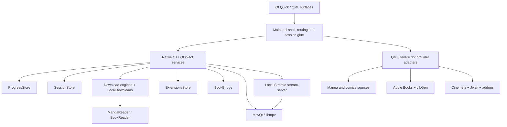

<p align="center">
  
</p>

<h1 align="center">Colosseum</h1>

<p align="center">
  <strong>A native media shell for manga and comics, books, movies, shows, and anime.</strong>
</p>

<p align="center">
  Qt 6 · QML · C++ · mpv · Foliate · Stremio-compatible extensions
</p>

> [!IMPORTANT]
> Colosseum is an active, fast-moving development build. Windows with Qt 6.11.1 and MSVC 2022 is the current tested path. It is not yet a polished, portable, one-command release build.

## What Colosseum is

Colosseum is a fullscreen desktop media environment built around three connected worlds:

- **Tankoban** for manga and western comics
- **Biblio** for ebooks
- **Theatre** for movies, shows, and anime

It is not three unrelated applications behind a launcher. The worlds share one home, one visual language, one Continue system, one local-download vault, and an OS-like session taskbar. A manga chapter, an EPUB, and a film can remain open as separate sessions and be switched, minimized, resumed, or closed from the same shell.

The interface is written in Qt Quick/QML. Native C++ objects provide the player, readers, download engines, persistent stores, extension registry, local-library model, and system-facing services.

## Current state at a glance

| Area | Current state |
|---|---|
| Home shell | Implemented: wallpaper, universe carousel, mixed Continue row, world entry boards, taskbar |
| Tankoban | Implemented: manga, XOXO comics, GetComics archives, downloads, shared reader |
| Biblio | Implemented: Apple Books discovery/search, LibGen editions/downloads, local EPUB reader |
| Theatre | Implemented: Movies, Shows, Anime, detail pages, stream selection, mpv playback, video downloads |
| Extensions | Implemented for Theatre: install, preview, enable, order, remove, browse community catalog |
| Downloads | Implemented across all three worlds with one unified local vault |
| Sessions | Implemented for books, comics/manga, and video |
| Universe pages | One Piece and Marvel templates are live; additional universes are parked until their templates exist |
| Home-wide search | Planned; world-scoped search works, but the Home search button is not yet wired to a global surface |
| Vinyl | Visible as a coming-soon world, not implemented |
| Platforms | Windows-first development build; other platforms are not currently packaged or verified |

## The three worlds

### Tankoban

Tankoban treats manga and western comics as related forms of sequential art while preserving their different structures and sources.

#### Manga

The manga path combines several focused sources:

- **WeebCentral** for search, series resolution, chapters, and page lists
- **AniList** for high-quality art and metadata
- **Kitsu** as the art/metadata fallback
- **MangaDex** for volume structure, tankōbon covers, and known chapter ranges

A manga detail page is built around its volume shelf. Chapters are grouped under real volume covers where the source can establish the relationship, with a flat fallback when volume ranges are incomplete.

#### Western comics

Tankoban currently has two complementary western-comics lanes:

- **XOXO** is the primary issue-oriented catalog. Series open into ascending issue tables, then download their page images into the local manga-reading pipeline.
- **GetComics** remains the archive and collected-edition lane. A tag acts as the series shelf, with collections, trades, omnibuses, and individual releases downloaded as archives and extracted into local pages.

The two lanes share the same Continue system and the same native reader, but retain distinct identities so XOXO issues and GetComics archives route back to the correct source.

### Biblio

Biblio separates discovery and delivery:

- **Apple Books RSS and Search APIs** provide current charts, search, covers, authors, genres, ratings, descriptions, and detail-page metadata.
- **LibGen** supplies available downloadable editions.
- The native **BookDownloader** saves a selected file into Colosseum's local book store.
- A downloaded EPUB opens in the embedded **Foliate-based reader** through Qt WebEngine and QWebChannel.

The book detail surface is intentionally different from the manga and film pages. It presents the cover as a physical object, a cleaned synopsis, metadata, and an editions list rather than forcing every medium into one generic template.

The reader persists progress, settings, bookmarks, annotations, and display names. Edge TTS entry points exist in the bridge but are currently stubbed, so read-aloud is not yet available in Colosseum.

### Theatre

Theatre has three tabs:

- **Movies**
- **Shows**
- **Anime**

House catalogs come from:

- **Cinemeta** for movie and series identity, metadata, posters, backdrops, and episode lists
- **Jikan** for anime discovery
- **Anime Kitsu** for anime metadata and ID resolution
- Installed **Stremio-protocol extensions** for additional catalogs, metadata, streams, and subtitles

Each tab renders its own catalog rows and genre directory. Installed catalog extensions can add extra shelves after the house rows without replacing the built-in identity path.

A title opens a Theatre detail page, where movies expose sources and shows expose seasons and episodes. Playback can come from a torrent-backed stream, a direct stream supplied by an extension, or a completed local download.

## Home and universe navigation

The Home surface is the meeting point for all three worlds.

It currently includes:

- A persistent, user-selectable wallpaper system with separate picks for Home, Tankoban, Biblio, and Theatre
- A curated universe carousel
- A single Continue row mixing books, manga, comics, movies, and episodes by recency
- A Tankoban bookshelf, Theatre film strip, and Biblio reading desk as world-entry surfaces
- A shared top bar for world switching and system actions

Colosseum also experiments with **cross-medium universe pages**. The current live examples are:

- **One Piece**, with a read/watch split and separate manga, anime, and movie rows
- **Marvel**, using the cinematic universe template

Dune, A Song of Ice and Fire, Middle-earth, and Star Wars are curated placeholders but remain hidden from the carousel until their own page templates are built.

## The session shell

Colosseum behaves more like a small media OS than a conventional stack of pages.

The native `SessionStore` tracks every open media session, its world, its content kind, its reopen target, and a saved-state blob. Only the active immersive surface needs to be instantiated. When the user switches away, Colosseum captures the state, tears down or suspends the surface as appropriate, and reconstructs it at the same position when reopened.

The auto-hiding taskbar groups sessions by world and provides:

- One-click switching for a single open session
- A fan-out menu when several items are open in the same world
- Individual session closing
- Direct entry to Downloads
- Direct entry to Extensions
- A live badge for active downloads

Video sessions can remain warm while minimized, allowing playback to resume without unnecessarily rebuilding the stream.

## Player

The Theatre player is a fullscreen QML surface over **MpvQt/libmpv**. The torrent transport is kept behind a separate local stream-server boundary, so the player consumes a normal playable URL rather than owning torrent logic.

The current player includes code paths for:

- Torrent-backed, direct-URL, and local-file playback
- Persistent Continue progress and resume-at-position
- Resume-or-start-over prompting
- Warm minimize and session restoration
- Audio and subtitle track selection
- Online subtitle aggregation and loading
- External subtitle files and subtitle drag/drop
- Preferred audio/subtitle languages and per-show track memory
- Audio and subtitle delay controls
- Playback speed, fill mode, seeking, volume, fullscreen, and PiP/window-mode state
- Intro, recap, and credits skip segments
- Source retry and failover between stream candidates
- Episode/source drawer and traveling episode queue
- Visible, cancelable Up Next countdowns
- Keyboard shortcut help
- A-B loop, sleep timer, playback statistics, frame capture/GIF tooling, and a drawing overlay

The player also contains state models for casting, live channels/DVR, and local watch rooms. Those areas are experimental compared with the core local and on-demand playback path.

## Readers

### Manga and comics reader

Manga, XOXO issues, and GetComics releases all use the same download-fed reader. It never reads directly from a remote page source: pages are saved locally first, then opened from disk.

Reading modes include:

- Long strip
- Single page
- Double page
- MangaPlus-style paired pages
- Left-to-right and right-to-left direction
- Width and height fitting
- 100–260% paged zoom with pan
- Optional wide-page splitting in strip mode
- Windowed strip loading and neighbor prefetch to control memory use

The reader also supports chapter and page grids, thumbnails, page jumping, chapter crossing, bookmarks, replay/checkpoint tools, per-series preferences, persisted spread-pair knowledge, scrub navigation, auto-hiding chrome, and exact resume restoration.

### EPUB reader

The book reader embeds the existing Foliate-derived web reader in `QWebEngineView`. A native `BookBridge` exposes local file access and persistent state through QWebChannel.

The bridge persists:

- Reading position
- Reader settings
- Bookmarks
- Annotations
- Display names

Progress is also mirrored into the shared Colosseum Continue store.

## Downloads

The Downloads page is a cross-world local vault rather than a list attached to one medium.

It is divided into two concepts:

1. **Now arriving** for active and queued jobs across all worlds
2. **Settled local media** organized by world, series, season where applicable, and item

A native `LocalDownloads` read model normalizes the separate manga, book, comic, and video backends into one shape for QML. It does not own files or network work; actions are routed back to the backend responsible for each item.

The Theatre download engine provides a persistent bounded queue with lazy source resolution, pause/resume, retry, cancellation, partial-file continuation, speed/ETA reporting, season grouping, and a durable downloaded-video index. Queue state survives application restarts.

## Extensions

The Extensions page manages Stremio-compatible addons.

It supports:

- Curated discovery
- Community-catalog browsing
- Search and sorting
- Manifest preview before installation
- Install from a normal or `stremio://` manifest link
- Enable/disable
- Priority ordering
- Removal of non-core extensions
- Atomic persistence under the application data directory

First run seeds the house extensions used by Theatre:

- Cinemeta core
- Torrentio
- Anime Kitsu
- OpenSubtitles v3

Ordering is meaningful: enabled stream extensions are asked in registry order. Adult manifests are rejected by the native registry rather than hidden only in the UI.

The store currently affects Theatre. Tankoban and Biblio have designed extension states but do not yet consume extension resources.

## Source map

| Domain | Current source or engine |
|---|---|
| Manga search, chapters, pages | WeebCentral |
| Manga art and metadata | AniList, with Kitsu fallback |
| Manga volumes and covers | MangaDex |
| Issue-oriented western comics | XOXO |
| Western comic archives and collected editions | GetComics |
| Book discovery and metadata | Apple Books |
| Book editions and delivery | LibGen |
| Movie and show identity/catalogs | Cinemeta |
| Anime discovery | Jikan |
| Anime metadata/ID bridge | Anime Kitsu |
| Stream discovery | Torrentio and installed Stremio extensions |
| Subtitles | OpenSubtitles v3 and installed subtitle extensions |
| Torrent transport | Bundled Stremio `stream-server` runtime |
| Video rendering | MpvQt/libmpv |
| EPUB rendering | Foliate-derived reader in Qt WebEngine |

> [!NOTE]
> Colosseum is a client and does not host media. External APIs, websites, addons, and scrapers are independent services and can change or disappear. Use sources and content only where you have the right to access them.

## Architecture



### Native services exposed to QML

The launcher currently exposes focused objects such as:

- `Manga`
- `Downloads`
- `Books`
- `Comics`
- `Stream`
- `Download`
- `LocalDownloads`
- `Extensions`
- `Progress`
- `Sessions`
- `BookBridge`
- `Cast`
- `Live`
- `Room`
- `WindowMode`
- `Power`

The launcher also installs a shared disk-backed network cache and IPv4 pinning for hosts that otherwise stall on the current development network's broken IPv6 route.

## Repository layout

```text
Colosseum/
├── qml/                    QML surfaces, components, provider adapters and shell logic
├── native/                 C++ launcher, engines, stores, player and reader bridges
│   ├── engine/             Manga/book/comic downloads, local vault, extensions
│   ├── player/             mpv integration, stream server, video queue and player services
│   └── reader/             Foliate QWebChannel bridge
├── resources/book_reader/  Embedded Foliate-derived EPUB reader
├── assets/                 Icons, fonts and wallpaper assets
├── tests/                  Contract tests and smoke/self-test harnesses
└── dev.bat                 Current Windows QML live-reload loop
```

## Building the current development version

### Requirements

The current tested setup is:

- Windows 10/11
- Visual Studio 2022 C++ Build Tools
- CMake 3.16 or newer
- Ninja, for the layout expected by `dev.bat`
- Qt 6.11.1 MSVC 2022 64-bit with:
  - Quick
  - QML
  - Network
  - GUI
  - SQL
  - WebEngineQuick
  - WebChannel
- A Windows build of MpvQt
- libmpv headers, import library, and runtime DLL

The checked-in CMake file currently defaults to the original development paths under `C:/tools/mpvqt-feasibility`. Override `MPVQT_PREFIX` and `LIBMPV_PREFIX` when your dependencies live elsewhere.

### Example configure and build

From a Visual Studio developer command prompt:

```bat
cmake -S native -B native/build-msvc -G Ninja ^
  -DCMAKE_PREFIX_PATH=C:/Qt/6.11.1/msvc2022_64 ^
  -DMPVQT_PREFIX=C:/tools/mpvqt-feasibility/mpvqt-msvc-install ^
  -DLIBMPV_PREFIX=C:/tools/mpvqt-feasibility/libmpv-prefix

cmake --build native/build-msvc
```

Run the live QML development loop:

```bat
dev.bat
```

`dev.bat` launches `native/build-msvc/colosseum.exe qml/Main.qml`, enables QML live reload, and disables the QML disk cache so saved edits are not masked by stale compiled components. Update the Qt path in the script when your installation differs.

This is a development recipe, not yet a clean-machine installer workflow.

## Useful development harnesses

Several subsystems can be exercised at startup through environment variables:

| Variable | Purpose |
|---|---|
| `COLOSSEUM_DEV=1` | Enable QML/JS live reload |
| `COLOSSEUM_OPEN_WORLD=Theatre` | Boot directly into a world |
| `COLOSSEUM_OPEN_EXTENSIONS=1` | Boot directly into the extension store |
| `COLOSSEUM_CATALOG_SELFTEST=movies` | Log the catalog rows built for a Theatre tab |
| `COLOSSEUM_STREAMS_SELFTEST=movie|tt0816692` | Ask installed stream extensions and log their results |
| `COLOSSEUM_SUBS_SELFTEST=movie|tt0111161` | Exercise the subtitle aggregation path |
| `COLOSSEUM_SESSION_SELFTEST=1` | Run the session-store contract test |
| `COLOSSEUM_VIDEOQ_SELFTEST=exactrow` | Exercise the persistent video queue |
| `COLOSSEUM_DL_SELFTEST=...` | Exercise manga/page downloads |
| `COLOSSEUM_BOOK_DLTEST=...` | Exercise book downloads |
| `COLOSSEUM_COMIC_DLTEST=...` | Exercise comic archive downloads |

The repository also contains focused PowerShell contract checks for important QML and persistence behavior.

## Known boundaries

- Home-wide search has not yet been built. Search is currently scoped to the active world.
- Vinyl is a non-interactive coming-soon entry.
- Only One Piece and Marvel have live universe-page templates.
- Theatre extensions are live; Tankoban and Biblio extension consumption is future work.
- Book read-aloud/Edge TTS is stubbed in the Colosseum `BookBridge`.
- Casting, live TV/DVR, and networked watch rooms are less mature than core playback.
- The build still assumes developer-supplied Qt, MpvQt, libmpv, and stream-server runtime dependencies.
- Scraper-backed sources are inherently more fragile than stable public APIs.
- `Main.qml` currently carries a large amount of shell coordination and is an obvious future service-boundary refactor target.

## Design principles

Colosseum is being built around a few recurring rules:

- **Each medium gets the surface it needs.** A book detail page should not be a recolored movie page.
- **Download-fed reading.** Manga, comics, and books are persisted locally before their readers open them.
- **One identity, many surfaces.** Continue, Downloads, and Sessions connect the worlds without erasing their differences.
- **Native engines behind declarative UI.** QML owns presentation; C++ owns the parts that need durable state, files, processes, or native integration.
- **Progressive honesty.** A slow or blocked source should show partial data, a cooldown, or a real empty state rather than fabricated content.
- **The shell is part of the product.** Wallpapers, sessions, taskbar behavior, and cross-medium universes are not ornamental wrappers around three catalogs.
