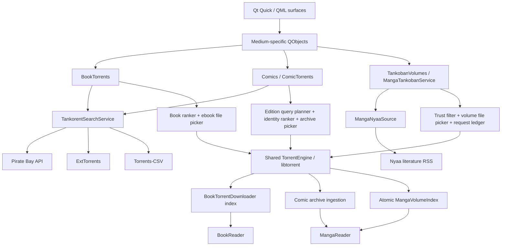
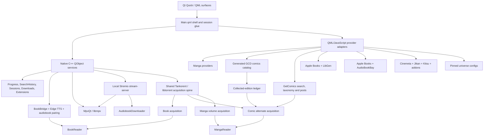

<p align="center">
  
</p>

<h1 align="center">Colosseum</h1>

<p align="center">
  <strong>A native media shell for manga and comics, books and audiobooks, movies, shows, and anime.</strong>
</p>

<p align="center">
  Qt 6 · QML · C++ · mpv · Foliate · Tankorent/libtorrent · Stremio-compatible extensions
</p>

> [!IMPORTANT]
> Colosseum is an active, fast-moving development build. Windows with Qt 6.11.1 and MSVC 2022 is the current tested path. It is not yet a polished, portable, one-command release build.

## What Colosseum is

Colosseum is a fullscreen desktop media environment built around three connected worlds:

- **Tankoban** for manga and western comics
- **Biblio** for ebooks and audiobooks
- **Theatre** for movies, shows, and anime

It is not three unrelated applications behind a launcher. The worlds share one home, one visual language, one Continue system, persistent search history, one local-download surface, and an OS-like session taskbar. A manga chapter or volume, an ebook, an audiobook, and a film can remain open as separate sessions and be switched, minimized, resumed, or closed from the same shell.

The interface is written in Qt Quick/QML. Native C++ objects provide the player, readers, download engines, Tankorent services, TTS bridge, persistent stores, extension registry, local-library models, and system-facing services.

## Current state at a glance

| Area | Current state |
|---|---|
| Home shell | Implemented: per-world wallpaper, 21-universe carousel, Hall of Worlds, mixed Continue row with See All, world-entry boards, top bar, taskbar, and a shared interactive scrollbar |
| Tankoban | Implemented: chapter reading plus per-series Tankoban Mode for complete-volume acquisition and reading; a lazy offline catalog of 688 western-comic series and 5,469 collected editions; GetComics and user-selected torrent acquisition; archive extraction; and one shared reader |
| Biblio | Implemented: Apple Books discovery, native multi-indexer book-torrent search, libtorrent-backed single-file delivery, LibGen editions, one-copy-per-book replacement, AudioBookBay matching, ebook reader, audiobook player, read-along pairing, and live Edge TTS |
| Theatre | Implemented: Movies, Shows, Anime, detail pages, stream selection, mpv playback, subtitles, sessions, video downloads, and a Jikan-to-Kitsu anime fallback lane |
| Search | Implemented per world with durable native search history; Tankoban search includes manga, the shipped comics catalog, and GetComics tags; Home-wide cross-world search is not yet built |
| Extensions | Implemented for Theatre: install, preview, enable, order, remove, and browse the community catalog |
| Downloads | Implemented for manga chapters, comics, LibGen ebooks, and video through one cross-world vault; Tankoban volumes, torrent ebooks, and audiobook files currently remain in their owning stores |
| Sessions | Implemented for books, audiobooks, manga chapters, Tankoban volumes, western comics, and video |
| Universe pages | 21 live entries, including bespoke One Piece, Dragon Ball, Marvel, Cosmere, Star Wars, Weekly Shonen Jump, Studio Ghibli, saga, and era surfaces |
| Vinyl | Visible as a coming-soon world, not implemented |
| Platforms | Windows-first development build; other platforms are not currently packaged or verified |

## Recent development snapshot

The newest commits change the shape of the native acquisition architecture:

- **Tankorent is now a shared acquisition spine rather than a book-only lane.** One native `TorrentEngine` and libtorrent session sit below medium-specific search, ranking, file-selection, persistence, and ingestion layers for ebooks, collected comics, and manga volumes.
- **Tankoban Mode is live.** A per-series switch replaces the chapter shelf with a canonical volume library. Nyaa supplies ranked volume candidates, the user chooses a source, the engine fetches only the required archive, and the existing MangaReader opens the published local volume.
- **Manga volume downloads are restart-safe and volume-keyed.** A durable request ledger records intent, metadata resolution, selected file indices, and progress. Several requested volumes can share one torrent while their file priorities are unioned safely.
- **WeebCentral can build a local volume when a torrent is not used.** The fallback is offered only when the chapter-to-volume map is complete. Volume packing is serialized, published atomically, and never labels a partial volume as ready.
- **Collected comics now have alternate torrent sources.** Every edition can open a manual, edition-aware source browser. Results are ranked by ISBN, canonical title, collected issue range, archive evidence, and then live health. Weak matches remain visible but require confirmation.
- **Comic source browsing is separate from acquisition.** Browsing creates no download job, partial indexer failures do not erase successful results, ambiguous packs open a second archive picker, and dismissing an uncommitted acquisition removes its temporary torrent state.
- **The shipped comics catalog now participates in Tankoban search and Explore.** Offline GCD-derived series results are merged with AniList manga and live GetComics tags without forcing the catalog into root startup.
- **The ebook reader gained audiobook read-along.** A downloaded audiobook can be paired to book chapters automatically or manually. Opening the paired book restores the listening position paused, and chapter changes can reposition the audio while preserving play/pause state.
- **One Piece and Dragon Ball now have bespoke universe pages.** One Piece is mapped as a Grand Line voyage; Dragon Ball uses a Seven-Star Saga surface. Both are built from pinned, verified media identities rather than loose title searches.

## The three worlds

### Tankoban

Tankoban treats manga and western comics as related forms of sequential art while preserving their different structures, identities, and acquisition rules.

#### Manga

The chapter path combines several focused sources:

- **WeebCentral** for search, series resolution, chapters, and page lists
- **AniList** for high-quality art and metadata
- **Kitsu** as the art, metadata, and outage fallback
- **MangaDex** for canonical volume structure, tankōbon covers, and known chapter ranges
- **Jikan** for genre discovery, with Kitsu stepping in when Jikan is unavailable or empty

The standard manga detail page keeps the chapter-first experience. Chapters are grouped under real volume covers where the source can establish the relationship, with a flat fallback when ranges are incomplete.

##### Tankoban Mode

Tankoban Mode is a persistent per-series alternative to chapter-first reading. It turns the series page into a complete-volume library without replacing or disabling the classic chapter path.

The native `MangaTankobanService`, exposed to QML as `TankobanVolumes`, composes the volume workflow:

1. MangaDex volume records and WeebCentral chapters are normalized into stable series and volume identities.
2. A best-effort synopsis pass uses Open Library first and Apple Books second. Ambiguous matches are rejected rather than attached to the wrong volume.
3. `MangaNyaaSource` searches Nyaa's literature category with trusted-uploader data and volume-aware query variants.
4. Chapter packs, raw releases, blocked uploaders, weak series matches, wrong-volume results, and missing hashes are rejected.
5. The user chooses a ranked source. Tankoban Mode does not silently auto-pick.
6. `MangaVolumeTorrentDownloader` adds the magnet paused, waits for metadata, selects the exact CBZ/CBR/CB7/CBT file, unions priorities for shared packs, and starts only the required files.
7. `MangaVolumeArchiveIngestor` extracts without recompression, validates local images, natural-sorts pages, and atomically publishes the result to the durable volume index.
8. MangaReader opens the local volume through the same reader used by chapters and western comics.

The volume request ledger survives restarts. It records volume intent separately from the torrent's info hash, so two requested volumes inside one pack remain two user-facing jobs while sharing one engine transfer. Reader progress uses the `tankoban` namespace, preventing a volume resume record from overwriting chapter progress for the same series.

A quieter **Build from chapters** card remains available when WeebCentral has a complete chapter map for the volume. A partial map is shown honestly as unavailable. Packing is serialized so two volume builds cannot race through one uncorrelated scraper response.

#### Western comics

Western comics separate **catalog identity** from **live discovery and acquisition**.

The catalog brain is a generated offline artifact:

- It contains **688 ranked series** and **5,469 collected editions**.
- RCO popularity supplies the ranked series set.
- GCD supplies the structured series and edition records.
- Editions remain visible even when no source is available.
- The multi-megabyte catalog is imported only when Tankoban is first instantiated.
- `ComicsDb.js` indexes the data and drives Top in Tankoban, Explore, search, series pages, and the collected-edition ledger.

GetComics remains a first-class live source:

- Tankoban search includes GetComics comic tags alongside the offline catalog and AniList manga.
- Explore Comics uses GetComics publisher and franchise taxonomy.
- A verified catalog match can reopen its stable GetComics post, resolve a fresh signed mirror, download the archive, extract local pages, and hand them to MangaReader.
- Blocked or mirrorless posts land in an honest terminal state instead of an unwinnable retry loop.

Collected editions also expose **Find alternate sources** through Tankorent:

- `ComicTorrentQueryPlanner` builds automatic edition-aware queries from series title, edition title, ISBN, and collected issue range. The user can replace them with a manual query.
- `TankorentSearchService` fans those queries across the configured public indexers.
- `ComicTorrentRanker` grades every canonical hash by identity evidence before considering seed counts. Duplicate hashes preserve the strongest title/ISBN/range evidence while merging the best observed swarm health.
- Strong and possible matches are selectable; weak matches require explicit confirmation.
- If torrent metadata contains several plausible comic archives, the user chooses the exact CBR/CBZ/CB7/CBT file in a second picker.
- The chosen archive flows through the same `ComicDownloader` local-ingestion boundary as GetComics, so reader identity, Continue state, deletion, and local pages remain source-independent.

The historical League of Comic Geeks adapter and its fixtures remain in-tree for research and compatibility work. They do not drive the active catalog. XOXO has been removed from the live provider path.

### Biblio

Biblio separates identity, discovery, editions, delivery, listening, and reading:

- **Apple Books RSS and Search APIs** provide charts, search, covers, authors, genres, ratings, descriptions, and book/audiobook identity.
- **BookTorrents** uses Tankorent's federated search service over Pirate Bay API, ExtTorrents, and Torrents-CSV.
- **LibGen** remains a separate editions and ebook-delivery lane beneath the torrent shelf.
- **AudioBookBay** supplies audiobook release candidates paired to the book identity.
- **BookDownloader** saves a selected LibGen edition into Colosseum's local book store.
- **BookTorrentDownloader** uses the shared native `TorrentEngine`, selects one supported ebook file, deprioritizes everything else, and records the completed copy under its info hash.
- **AudiobookDownloader** continues to use the local Stremio stream-server boundary and stores files under a durable book/audiobook pairing key.
- Downloaded books open in the embedded **Foliate-derived reader** through Qt WebEngine and QWebChannel.
- Downloaded audiobooks open in a dedicated **AudiobookPlayer** over the shared mpv backend.

The torrent shelf appears above LibGen editions on the book detail page. Results are category-scoped where an indexer supports it, filtered against audiobook and video classifications, deduplicated, ranked by conservative whole-token identity matching, and then ordered by live seeders.

Only formats the reader actually renders count as ebook candidates:

1. EPUB
2. MOBI or FB2
3. PDF

The preference is TTS-aware. Reflowable EPUB, MOBI, and FB2 beat fixed-layout PDF. AZW3 and DjVu are excluded. LibGen editions are cascaded to the best available renderable tier.

Biblio treats local ownership as one book-level state across both delivery lanes. A downloaded LibGen edition or torrent copy shows **Ready to read**. Starting another download clears the existing copy first, preventing duplicate editions from accumulating.

The reader's Audio tab can pair a downloaded audiobook to the book table of contents. Mapping can be one-to-one or manual. Opening a paired book summons the docked audiobook strip at the exact saved position, paused; moving into another mapped chapter follows the audiobook without changing its current play/pause state. Multi-file chapter sets map fully. A single-file M4B currently exposes one mapping unit.

### Theatre

Theatre has three tabs:

- **Movies**
- **Shows**
- **Anime**

House catalogs come from:

- **Cinemeta** for movie and series identity, metadata, posters, backdrops, and episode lists
- **Jikan** as the first source for anime discovery
- **Anime Kitsu** for anime metadata, ID resolution, and fallback airing rows when Jikan fails or is empty
- Installed **Stremio-protocol extensions** for additional catalogs, metadata, streams, and subtitles

Each tab renders its own rows and genre directory. Installed catalog extensions can append shelves without replacing the built-in identity path.

A title opens a Theatre detail page, where movies expose sources and shows expose seasons and episodes. Playback can come from a torrent-backed stream, a direct extension stream, or a completed local download.

Theatre torrent streaming remains behind the bundled Stremio stream-server. It is intentionally separate from Tankorent's native file-acquisition engine.

## Search

Search remains scoped to the active world rather than flattening three different catalogs into one index.

- **Tankoban** merges AniList manga, the loaded offline GCD comics catalog, and live GetComics comic tags. Catalog duplicates suppress lower-value tag duplicates while preserving live GetComics-only results.
- **Biblio** searches Apple Books books and audiobooks in separate lanes.
- **Theatre** searches Cinemeta movies and series together.
- Recent queries are stored by a native, world-scoped `SearchHistoryStore`, so they persist when a QML Loader is recreated and across application restarts.
- Search surfaces include a top match, grouped results, recent-query removal, and genre or surprise discovery where the world supports it.

The Home search button does not yet open a true cross-world search surface.

## Home and universe navigation

The Home surface currently includes:

- A persistent wallpaper system with separate picks for Home, Tankoban, Biblio, and Theatre
- A 21-entry curated universe carousel
- A **Hall of Worlds** see-all surface using the vertical Ledger Stack layout
- A single Continue row mixing books, audiobooks, manga chapters, manga volumes, comics, movies, and episodes by recency
- A full Continue See All surface
- Tankoban, Theatre, and Biblio world-entry boards
- A shared top bar for world switching and system actions
- One app-wide `HouseScrollBar` for standard vertical pages

Every universe in `Universes.js` is live in both the carousel and Hall of Worlds. Curation is governed by **[the Universe Page Law](docs/UNIVERSE_PAGE_LAW.md)**: entries use pinned, live-verified provider identities; upcoming work enters only with a real metadata identity; loose name search never qualifies as canon.

| Template | Live universes |
|---|---|
| Grand Line voyage | One Piece |
| Seven-Star saga | Dragon Ball |
| Generic anime/read-watch | Naruto, Attack on Titan |
| Cinematic | Marvel Cinematic Universe |
| Saga | Harry Potter, Lord of the Rings, A Song of Ice and Fire, Dune, The Witcher, Sherlock Holmes, Jurassic Park, Percy Jackson |
| Eras/timeline | DC Animated Universe, Star Trek, James Bond, Avatar: The Last Airbender |
| Magazine | Weekly Shonen Jump |
| Galaxy | Star Wars |
| Studio | Studio Ghibli |
| Cognitive atlas | Cosmere |

The templates are authored surfaces, not recolored grids:

- **One Piece** charts eleven canon sagas as waypoints along the Grand Line, with pinned anime, adaptations, films, and manga doors.
- **Dragon Ball** renders seven verified anime as the seven Dragon Balls and organizes 25 films and eight manga around the same pinned saga.
- **Marvel Cinematic Universe** uses phase panels plus Marvel Studios series and Special Presentations.
- **Saga** pages curate novels, films, shows, and optional comics doors around a book-first identity.
- **Weekly Shonen Jump** reads Jikan's magazine registry into current serialization, all-time circulation, and back-issue eras.
- **Star Wars** uses a trilogy triptych plus standalone, live-action, animated, and comics rails.
- **Eras** pages organize franchises into chronological or continuity groups and can carry books, comics, and metadata-confirmed `UPCOMING` plates.
- **Studio Ghibli** uses a numbered chronological filmography wall.
- **Cosmere** uses a newcomer-first Cognitive Atlas followed by eight ordered shelves. All 26 book and story slots resolve through Apple Books and open Biblio.

## The session shell

Colosseum behaves more like a small media OS than a conventional stack of pages.

The native `SessionStore` tracks every open media session, its world, content kind, reopen target, and saved-state blob. Only the active immersive surface needs to be instantiated. When the user switches away, Colosseum captures the state and reconstructs the surface at the same position when reopened.

The auto-hiding taskbar provides one-click switching, fan-out menus for several sessions in one world, individual closing, direct entry to Downloads and Extensions, and a live badge for active downloads.

Video sessions can remain warm while minimized. Audiobooks preserve their selected file or chapter and position. Chapter reads and Tankoban volume reads restore through distinct reader/session identities.

## Players

### Theatre player

The Theatre player is a fullscreen QML surface over **MpvQt/libmpv**. Torrent transport stays behind a separate local Stremio stream-server boundary, so the player consumes a normal playable URL rather than owning torrent logic.

The player includes torrent-backed, direct-URL, and local-file playback; Continue progress and resume; warm minimize; audio/subtitle track selection; online and external subtitles; preferred language memory; track delays; playback speed; fill mode; seeking; volume; fullscreen and PiP state; skip segments; source failover; episode queues; Up Next countdowns; keyboard help; A-B loop; sleep timer; statistics; frame capture/GIF tooling; and a drawing overlay.

Casting, live channels/DVR, and local watch rooms have state models but remain experimental compared with core local and on-demand playback.

### Audiobook player

The Biblio audiobook player uses the same mpv foundation without rendering video. It provides cover-led audio chrome, file or embedded-chapter navigation, transport controls, speed, sleep timer, automatic multi-file advance, Continue progress, and session capture/restore.

Cold restoration waits for mpv's file-loaded event before seeking. The reader's docked read-along strip is a remote over the same shared audiobook session, not a second player.

## Readers

### Manga and comics reader

Manga chapters, Tankoban volumes, and western comic editions use the same download-fed reader. The caller supplies the local page store and entry kind; the reading surface does not care whether pages came from WeebCentral, Nyaa, GetComics, or an alternate comic torrent.

Reading modes include long strip, single page, double page, MangaPlus-style paired pages, left-to-right and right-to-left direction, width/height fitting, 100 to 260 percent paged zoom with pan, optional wide-page splitting, and windowed strip loading with neighbor prefetch.

The reader supports chapter/page grids, thumbnails, jumping, chapter or volume crossing, bookmarks, replay/checkpoint tools, per-series preferences, persisted spread-pair knowledge, scrub navigation, auto-hiding chrome, and exact resume restoration. Crossing into a missing Tankoban volume opens its source chooser instead of pretending unreadable pages exist.

### Ebook reader

The book reader embeds the Foliate-derived web reader in `QWebEngineView`. A native `BookBridge` exposes local file access, persistent state, Edge TTS, and audiobook pairing through QWebChannel.

The bridge persists reading position, settings, bookmarks, annotations, display names, built-in or custom theme state, and read-along mappings. Binary files cross as base64 before being decoded by the EPUB, PDF, TXT, or Foliate engine. Missing legacy paths can be re-rooted into the current application-data directory.

The table of contents marks read, current, and unread chapters along one continuous spine. Twelve built-in themes are joined by a user-defined **Custom** page-and-ink theme.

Progress is mirrored into Continue. Edge TTS handles voices, synthesis, streaming lifecycle, cancellation, warmup, and boundary metadata through Qt WebSockets. TTS and the paired audiobook strip are mutually exclusive at the ear: opening one pauses the other rather than creating overlapping speech.

## Downloads

The Downloads page is a cross-world local vault with two concepts:

1. **Now arriving** for active and queued manga chapter, comic, LibGen ebook, and video jobs
2. **Settled local media** organized by world, series, season where applicable, and item

A native `LocalDownloads` read model normalizes those backends into one QML shape while routing actions back to the owning engine.

Western comic editions can arrive through either a verified GetComics post or a user-selected Tankorent source. Both routes publish into the same comic index and reader identity.

The Theatre download engine provides a persistent bounded queue with lazy source resolution, pause/resume, retry, cancellation, partial-file continuation, speed/ETA reporting, season grouping, and a durable downloaded-video index.

Tankoban volumes, torrent-sourced ebooks, and audiobook downloads have their own durable stores and active-job models. They are opened from their owning world and are not yet normalized into `LocalDownloads`.

## Extensions

The Extensions page manages Stremio-compatible addons. It supports curated discovery, community-catalog browsing, search and sorting, manifest preview, install from normal or `stremio://` links, enable/disable, priority ordering, removal of non-core extensions, addon logos, and atomic persistence.

First run seeds Cinemeta core, Torrentio, Anime Kitsu, and OpenSubtitles v3. Enabled stream extensions are asked in registry order. Adult manifests are rejected by the native registry rather than hidden only in the UI.

The store currently affects Theatre. Tankoban and Biblio have designed extension states but do not yet consume extension resources.

## Source map

| Domain | Current source or engine |
|---|---|
| Manga search, chapters, pages | WeebCentral |
| Manga art and metadata | AniList, with Kitsu fallback |
| Manga genre discovery | Jikan, with Kitsu fallback |
| Manga volume identity and covers | MangaDex plus the canonical Tankoban volume model |
| Manga volume torrent discovery | Nyaa literature RSS through `MangaNyaaSource`, with embedded uploader trust data |
| Manga volume fallback | WeebCentral chapter packing, only for complete chapter maps |
| Manga volume transport and storage | `MangaVolumeTorrentDownloader`, shared `TorrentEngine`/libtorrent, atomic `MangaVolumeIndex` |
| Western comics structured catalog | Generated offline GCD-derived catalog, ranked from RCO popularity |
| Western comics live search and taxonomy | GetComics tags, archives, and release posts |
| Western comics alternate search | `TankorentSearchService` plus edition-aware query planning and ranking |
| Western comic delivery | Verified GetComics posts or a user-selected torrent, converging through `ComicDownloader` archive ingestion |
| Parked western-comics research adapter | League of Comic Geeks remains in-tree but is not the active catalog |
| Book and audiobook discovery/metadata | Apple Books |
| Federated book-torrent search | Pirate Bay API, ExtTorrents, Torrents-CSV through `BookTorrents` and `TankorentSearchService` |
| Torrent ebook selection and delivery | `BookTorrentRanker`, `BookTorrentFilePicker`, shared `TorrentEngine`/libtorrent, `BookTorrentDownloader` |
| Ebook editions and alternate delivery | LibGen through `BookDownloader` |
| Audiobook release discovery | AudioBookBay |
| Audiobook delivery | Bundled Stremio stream-server plus `AudiobookDownloader` |
| Ebook rendering and read-along | Foliate-derived reader, native BookBridge, AudioPairingStore |
| Ebook read-aloud | Native Edge TTS bridge over Qt WebSockets |
| Movie and show identity/catalogs | Cinemeta |
| Anime discovery | Jikan first, Anime Kitsu fallback for the airing lane |
| Anime metadata/ID bridge | Anime Kitsu |
| Stream discovery | Torrentio and installed Stremio extensions |
| Subtitles | OpenSubtitles v3 and installed subtitle extensions |
| Theatre torrent transport | Bundled Stremio `stream-server` runtime |
| Native file-acquisition transport | libtorrent-rasterbar through Colosseum's shared `TorrentEngine` |
| Video and audiobook rendering | MpvQt/libmpv |
| Universe assembly | Pinned configs backed by Cinemeta, AniList, Kitsu, Apple Books, the comics catalog, GetComics, and Jikan registry data |

> [!NOTE]
> Colosseum is a client and does not host media. External APIs, websites, addons, indexers, and scrapers are independent services and can change or disappear. Use sources and content only where you have the right to access them.

## Tankorent architecture

Tankorent is the native file-acquisition architecture. It is deliberately separate from Theatre's Stremio streaming runtime.



The shared layer owns the libtorrent session, torrent repository, resume state, metadata, priorities, transfer progress, cancellation, and debug logging. It is not exposed as a raw QML singleton.

Policy remains medium-specific:

- **Books** accept one renderable ebook and discard unrelated pack files.
- **Collected comics** keep source browsing manual, rank by edition identity, and require a concrete archive choice when metadata is ambiguous.
- **Manga volumes** use Nyaa-specific trust and coverage rules, persist volume intents separately from info hashes, and can union several requested volumes inside one torrent.
- **Theatre and audiobooks** continue to use the Stremio stream-server because they are streaming problems, not complete-file acquisition problems.

## Application architecture



### Native services exposed to QML

The launcher exposes focused objects including `Manga`, `Downloads`, `TankobanVolumes`, `Books`, `BookTorrents`, `Audiobooks`, `Comics`, `Stream`, `Download`, `LocalDownloads`, `Extensions`, `Progress`, `SearchHistory`, `Sessions`, `BookBridge`, `Cast`, `Live`, `Room`, `WindowMode`, `Power`, and `Clipboard`.

`TankorentSearchService` and the shared `TorrentEngine` sit behind those facades. QML receives medium-shaped operations and state rather than raw torrent primitives.

The launcher installs a shared disk-backed network cache and browser-style user-agent fallback for QML requests. Hosts that stall on the current development network's broken IPv6 route are resolved and pinned to IPv4. Live indexer searches use a separate uncached network manager so seed counts are not frozen by catalog or image caching.

## Repository layout

```text
Colosseum/
├── qml/                    QML surfaces, components, provider adapters and shell logic
│   └── comics_db.gen.js    Generated lazy western-comics catalog
├── native/                 C++ launcher, engines, stores, player, reader and TTS bridges
│   ├── engine/             Acquisition publication, indexes, readers, stores and service facades
│   ├── player/             mpv integration, Stremio stream server, video queue and player services
│   ├── reader/             Foliate QWebChannel bridge
│   ├── torrent/            Tankorent search, rankers, file pickers, ledgers and medium downloaders
│   │   └── engine/         Shared libtorrent session, repository and debug-log core
│   └── tts/                Native Edge TTS client and worker
├── resources/
│   ├── book_reader/        Embedded Foliate-derived ebook reader
│   └── comics_db.json      Source-form western-comics catalog artifact
├── assets/                 Icons, addon logos, fonts and wallpaper assets
├── docs/                   Architecture laws, implementation plans and design records
├── tests/                  Contract tests, live-source fixtures and smoke/self-test harnesses
└── dev.bat                 Current Windows QML live-reload loop
```

## Building the current development version

### Requirements

- Windows 10/11
- Visual Studio 2022 C++ Build Tools
- CMake 3.16 or newer
- Ninja
- Qt 6.11.1 MSVC 2022 64-bit with Quick, QML, Network, GUI, SQL, WebEngineQuick, WebChannel, and WebSockets
- A Windows build of MpvQt
- libmpv headers, import library, and runtime DLL
- libtorrent-rasterbar with Boost and OpenSSL
- The bundled Stremio stream-server runtime used by Theatre and audiobook delivery

The checked-in CMake file first tries package-configured libtorrent, Boost, and OpenSSL targets. Its current Windows fallback paths are:

- `C:/tools/libtorrent-2.0-msvc`
- `C:/tools/boost-1.84.0`
- `C:/tools/openssl-msvc`

Missing libtorrent is a fatal configure error because Tankorent is a commissioned runtime subsystem, not an optional stub.

MpvQt and libmpv default to paths under `C:/tools/mpvqt-feasibility`. Override `MPVQT_PREFIX`, `LIBMPV_PREFIX`, `LIBTORRENT_ROOT`, `BOOST_ROOT`, or `OPENSSL_MSVC_ROOT` when dependencies live elsewhere.

### Example configure and build

```bat
cmake -S native -B native/build-msvc -G Ninja ^
  -DCMAKE_PREFIX_PATH=C:/Qt/6.11.1/msvc2022_64 ^
  -DMPVQT_PREFIX=C:/tools/mpvqt-feasibility/mpvqt-msvc-install ^
  -DLIBMPV_PREFIX=C:/tools/mpvqt-feasibility/libmpv-prefix ^
  -DLIBTORRENT_ROOT=C:/tools/libtorrent-2.0-msvc ^
  -DBOOST_ROOT=C:/tools/boost-1.84.0 ^
  -DOPENSSL_MSVC_ROOT=C:/tools/openssl-msvc

cmake --build native/build-msvc
```

Run the live QML development loop with:

```bat
dev.bat
```

`dev.bat` launches `native/build-msvc/colosseum.exe qml/Main.qml`, enables QML live reload, and disables the QML disk cache so saved edits are not masked by stale compiled components.

An argument-free development launch self-locates the repository and attempts a safe `git pull --ff-only` before loading the live QML tree. Offline, dirty, timed-out, or diverged repositories boot as-is. Native changes still require a rebuild.

## Useful development harnesses

| Variable | Purpose |
|---|---|
| `COLOSSEUM_DEV=1` | Enable QML/JS live reload |
| `COLOSSEUM_OPEN_WORLD=Theatre` | Boot directly into a world |
| `COLOSSEUM_OPEN_EXTENSIONS=1` | Boot directly into the extension store |
| `COLOSSEUM_CATALOG_SELFTEST=movies` | Log Theatre catalog rows |
| `COLOSSEUM_STREAMS_SELFTEST=movie\|tt0816692` | Exercise installed stream extensions |
| `COLOSSEUM_SUBS_SELFTEST=movie\|tt0111161` | Exercise subtitle aggregation |
| `COLOSSEUM_SESSION_SELFTEST=1` | Run the session-store contract test |
| `COLOSSEUM_VIDEOQ_SELFTEST=exactrow` | Exercise the persistent video queue |
| `COLOSSEUM_DL_SELFTEST=...` | Exercise manga chapter/page downloads |
| `COLOSSEUM_BOOK_DLTEST=...` | Exercise LibGen ebook downloads |
| `COLOSSEUM_COMIC_DLTEST=...` | Exercise verified GetComics archive downloads |
| `COLOSSEUM_ABB_DLTEST=<pairKey>\|<infoHash>` | Exercise audiobook manifest and download handling |
| `COLOSSEUM_TORRENT_SEARCHTEST=<query>` | Run the federated Tankorent indexers |
| `COLOSSEUM_TORRENT_DLTEST=<infoHash>\|<title>` | Exercise ebook metadata resolution, file priorities, and native download |
| `COLOSSEUM_TANKOBAN_DLTEST=<magnet-or-infohash>\|<seriesId>\|<seriesTitle>\|<volumeNumber>` | Exercise Tankoban volume transfer, ingestion, and local index publication |

The repository also contains focused PowerShell, QML, Node, and C++ checks for the comics catalog contract, full catalog search/explore, comic alternate-source planning/ranking/picking/cancellation, shared libtorrent behavior, book classification and file selection, Tankoban canonical identity, Nyaa trust filtering, volume file picking, restart-safe ledgers, atomic volume ingestion, WeebCentral fallback completeness, shared-reader volume crossing, read-along mapping, search history, sessions, bespoke universe pages, and player failure handling.

## Known boundaries

- Home-wide search has not yet been built. Search is currently scoped to the active world.
- Vinyl is a non-interactive coming-soon entry.
- All 21 registered universes are live, but their rails still depend on external source availability and the quality of pinned metadata mappings.
- Theatre extensions are live; Tankoban and Biblio extension consumption is future work.
- The western-comics catalog is a generated snapshot, not a universal live bibliography. It requires periodic rebuilding and enrichment as source data changes.
- GetComics and alternate torrent acquisition are availability lanes, not identity authorities. A missing or ambiguous source remains unavailable until the user makes a defensible choice.
- Comic torrent browsing keeps weak rows visible for transparency. Weak matches require confirmation, and ambiguous archive packs require a second explicit file choice.
- Tankoban Mode depends on trustworthy Nyaa metadata or a complete WeebCentral chapter map. Some canonical volumes will remain visible without an acquirable source.
- Tankoban volumes, torrent ebooks, and audiobook downloads are not yet represented in the unified `LocalDownloads` vault.
- Biblio intentionally stores one readable copy per book. Starting another download replaces the previous LibGen or torrent copy.
- Torrent names, categories, manifests, and uploader claims remain untrusted external input even when ranking and filtering are conservative.
- Read-along mapping treats a single-file M4B as one unit; multi-file chapter sets expose their files individually.
- Casting, live TV/DVR, and networked watch rooms are less mature than core playback.
- The build assumes developer-supplied Qt, MpvQt, libmpv, libtorrent, Boost, OpenSSL, and the stream-server runtime.
- Scraper-backed sources and public indexers are inherently more fragile than stable public APIs.
- `Main.qml` still carries a large amount of shell coordination and is an obvious future service-boundary refactor target.

## Design principles

- **Each medium gets the surface it needs.** A book detail page should not be a recolored movie page.
- **Share transport, not policy.** Tankorent centralizes session and transfer mechanics while books, comics, and manga keep their own identity and file-selection laws.
- **Separate discovery from acquisition.** Looking at source results must not create a download job.
- **Separate discovery from local ownership.** Remote sources identify or deliver media; Colosseum's readers and players resume durable local/session state.
- **Match conservatively.** A missing or ambiguous source stays unavailable instead of quietly opening the wrong title.
- **Download-fed reading.** Manga, comics, ebooks, and audiobooks are persisted locally before their dedicated reader or player opens them.
- **One identity, many surfaces.** Continue, Downloads, Search History, Universes, and Sessions connect the worlds without erasing their differences.
- **Native engines behind declarative UI.** QML owns presentation; C++ owns durable state, files, processes, TTS, transport, and native integration.
- **Progressive honesty.** A slow or blocked source should show partial data, a cooldown, a fallback, or a real empty state rather than fabricated content.
- **The shell is part of the product.** Wallpapers, sessions, taskbar behavior, scrolling, and cross-medium universes are product surfaces, not ornamental wrappers around three catalogs.
