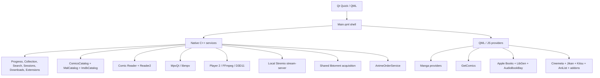

<p align="center">
  
</p>

<h1 align="center">Colosseum</h1>

<p align="center">
  <strong>A native desktop media environment for manga and comics, books and audiobooks, movies, shows, and anime.</strong>
</p>

<p align="center">
  Qt 6 · QML · C++ · Qt WebEngine · mpv · FFmpeg · libtorrent · Stremio-compatible extensions
</p>

> [!IMPORTANT]
> Colosseum is a fast-moving development build. Windows 10/11 with Qt 6.11.1 and MSVC 2022 is the currently tested path. It is not yet a polished, portable, one-command release.

## What Colosseum is

Colosseum is a fullscreen-first desktop shell built around three connected worlds:

- **Tankoban** for manga and western comics
- **Biblio** for ebooks and audiobooks
- **Theatre** for movies, shows, and anime

The worlds share Continue, Your Collection, downloads, wallpapers, open sessions, search history, and the taskbar, while each medium keeps its own reader, player, metadata rules, and acquisition policy.

Qt Quick/QML owns presentation. Native C++ owns durable state, files, catalogs, readers, playback engines, torrent transport, WebEngine bridges, downloads, and system integration.

## Current state

| Area | Current state |
|---|---|
| Home shell | Universal Continue, handcrafted world entry surfaces, persistent per-world wallpapers, top bar, taskbar, and shared scrolling |
| Your Collection | Durable manual library across all three worlds, separate from progress and local ownership |
| Tankoban | Discover/Manga/Comics tabs under shared world chrome; Discover is offline-first and series-only |
| Manga | Chapter reading, local downloads, Tankoban Mode, volume torrent acquisition, and complete-chapter fallback packing |
| Western comics | Read-only SQLite catalog, GetComics acquisition, alternate torrent sources, archive ingestion, and the new custom comic reader |
| Biblio | Apple Books discovery, LibGen and torrent acquisition, AudioBookBay matching, Reader2, and audiobook read-along |
| Theatre | Movies and Shows with an offline IMDb-backed deep catalogue plus live Cinemeta rows; Anime; extension-backed sources and subtitles; exact-source downloads; season checkout; mpv playback; optional VidKing hosted playback; and absolute anime ordering |
| Player 2 | From-scratch D3D11/FFmpeg engine integrated behind an opt-in build and boot gate; not the default player |
| Extensions | World-aware Sources page plus Browse and Installed views; Theatre consumption is live while Tankoban and Biblio integration is still being built |
| Downloads | Unified vault for manga, Tankoban volumes, comics, LibGen ebooks, and Theatre video |
| Sessions | Books, comic/manga readers, and video surfaces; audiobook playback remains embedded in Reader2 |
| Search | Per-world search with durable native history; Home-wide cross-world search is not yet built |
| Windowing | Fullscreen-first, persistent frameless developer mode, shell-wide F11 switching, native minimize, and protected transitions |
| Universe pages | Archived and absent from Home until the bespoke collection is complete |
| Vinyl | Visible as a coming-soon world, not implemented |
| Platforms | Windows-first development build; other platforms are not packaged or verified |

## Latest development snapshot

- **Theatre's Movies and Shows catalogues now have an offline IMDb spine.** `ImdbCatalog` reads the locally built, read-only `data/imdb_catalog.db` so Top Rated, Hidden Gems, Cult Classics, language, era, runtime, documentary, animation, limited-series, and long-running shelves are ranked with real IMDb ratings and vote counts. Index shelves paint synchronously and page deeply; live rows such as Top 10, Currently Airing, and recent releases still come from Cinemeta and are filtered with local facts when available. If the database is absent, the index shelves are omitted rather than fabricated.
- **Catalogue art now shares one gallery finish across worlds.** Theatre shelves and See-all grids, Tankoban browse and Top 10 tiles, Biblio's book fan, and Continue surfaces use common poster geometry, genuine rounded masks, bounded image decoding, lightweight depth plates, restrained gold hover edges, and viewport-aware shelf mounting. Missing or failed artwork keeps an honest gradient fallback.

- **Tankoban opens to a Discover tab.** Ahead of Manga and Comics, an offline-first, series-only Discover wall renders local catalogue rows immediately and refreshes from Jikan in the background. Manga lanes use the bundled MAL catalogue plus a non-blocking Jikan refresh; Comics lanes use a house ranking. See-all doors on existing shelves pin into Discover. Theatre already ships the same shared shell; Tankoban is the second implementation.
- **Explicit Content is a global preference and means sexually explicit, not mature-rated.** A single setting in Settings drives every world's Discover, genre browse, and genre index. When it is off, only sexually explicit classifications (Hentai, Erotica, pornography, adult film) hide. Berserk (R+), Game of Thrones (TV-MA), Ecchi, Mature Readers, horror, violent work, R/NC-17 films, romance, and ordinary adult fiction stay visible in every world. The ExtensionsStore refusal to preview or install addons declaring `behaviorHints.adult` is unchanged.

- **VidKing hosted playback is integrated into Theatre.** VidKing is an enabled-by-default, removable, keyless hosted-player extension that appears as the first Sources row for movies and episodes with a known Cinemeta TMDB ID. It plays through a restricted, off-the-record Qt WebEngine surface (local wrapper page + least-privilege `HostedPlayerBridge`) that rejects popups, navigation, downloads, and permissions, pins clipboard off, and destroys its page and profile on close/minimize. It participates in Continue Watching and session lifecycle, never touches mpv/torrent/download code, and shows an honest unavailable panel when VidKing has no source.
- **Player 2 has landed on master without replacing mpv.** It is a from-scratch video path with its own demux, decode, D3D11 presentation, seek, buffered-range reporting, playback HUD, source shortcut, and download controls. `COLOSSEUM_PLAYER2_IN_APP` defaults to `OFF`, and a Player 2 build still requires `COLOSSEUM_PLAYER2=1` at boot. mpv and Player 2 cannot coexist in one process because they require different Qt graphics backends.
- **The manga/comics reader was rebuilt from scratch.** `qml/MangaReader.qml` now delegates to the custom reader under `qml/comicreader/` and `native/comicreader/`. Existing callers keep the same boundary while the new implementation owns vsync-aware strip scrolling, page retention, resume restoration, decode-size limits, spread handling, scrub navigation, and reader chrome.
- **Extensions now have a world-aware Sources surface.** Theatre, Tankoban, and Biblio sources appear in one page as separate world chains, while Browse and Installed remain distinct views. Tankorent now has its own name and visual identity in that system.
- **Wallpaper shelves were restructured.** The native set is split into **Colosseum Animated** and **Colosseum Native**. Animated choices currently include Noir Flow, Aurora Flow, and Low Poly; native stills include Twilight, Ember, and Mint. Arena Night, Gilded Rain, and Facet were retired.
- **Noir Flow is the second original Colosseum shader wallpaper.** It joins Low Poly, the first original shader, with freeze-gated animation and registered runtime, preview, and test paths.
- **Poster loading no longer manufactures missing Metahub URLs.** Long-tail Discover art keeps the reliably available `small` source; poster decoding is capped around rendered size, and gallery shelves mount near the viewport instead of keeping every image tree resident.
- **A calendar implementation is banked but deliberately unreachable.** `CalendarApi` and `CalendarPage` are present with harnesses, but no current navigation route exposes them. It is not a shipped feature yet.

## The three worlds

### Tankoban

Tankoban treats manga and western comics as related forms of sequential art without flattening their identities or publication structures.

#### Discover

Tankoban opens to a **Discover** tab ahead of Manga and Comics. Discover is offline-first and series-only: it renders local catalogue rows immediately and refreshes from Jikan in the background without blocking first paint. Cards route to the existing Manga and Comics series pages; Discover performs no acquisition of its own.

- **Manga** lanes use the bundled MAL catalogue (`data/mal_catalog.db`) plus a non-blocking Jikan refresh. Canonical identity merges on stable MAL ids only — title-similarity never replaces a bundled entry.
- **Comics** lanes use a house ranking from `ComicsCatalog`. No Comic Vine or Metron runtime dependency is introduced; discovery extensions surface their own catalogues through the extension seam, and none ship yet.
- The shared Discover shell speaks a world-neutral adapter contract (`types/catalogs/filters/defaultCatalog/resolvePin/fetchPage`). Theatre ships the same shell; the Tankoban adapter is the second implementation.
- See-all doors on existing Manga and Comics shelves pin into Discover with a `{type, catalogId, filterGroup, filterKey}` shape. An invalid filter clears only the filter, never the catalogue.

#### Manga

The chapter-first path combines:

- **WeebCentral** for search, chapters, pages, and chapter downloads
- **AniList** for primary art and metadata
- **Kitsu** as an art, metadata, and outage fallback
- **MangaDex** for canonical volume structure, covers, and chapter ranges
- **MalCatalog** for local genre discovery when `data/mal_catalog.db` is deployed
- **Jikan**, AniList, and Kitsu as the live fallback ladder

##### Tankoban Mode

Tankoban Mode is a persistent per-series volume view. The native `MangaTankobanService`, exposed as `TankobanVolumes`, coordinates canonical volume identity, source ranking, torrent selection, archive ingestion, publication, and reader launch.

The user selects the source. Several requested volumes can safely share one torrent without collapsing into one user-facing job. A **Build from chapters** fallback is offered only when the source exposes a complete chapter-to-volume map.

#### Western comics

Western comics separate catalog identity from availability.

`ComicsCatalog` reads `data/comics_catalog.db` in read-only mode for GCD-backed series runs, exact-title resolution, curated editions, GetComics rows, mirrors, and durable `gcd:` identities. Same-name runs remain separate unless the match is unambiguous.

Acquisition can use GetComics or Tankorent. Alternate-source planning considers title, format, ISBN, issue coverage, info hash, uploader trust, and archive contents. Weak matches remain visible but require explicit confirmation.

The custom comic reader is download-fed and shared by manga chapters, Tankoban volumes, and western comic editions. The caller supplies local pages and identity; the reader does not depend on the acquisition source.

### Biblio

Biblio separates identity, editions, delivery, reading, and listening:

- **Apple Books** supplies discovery, charts, covers, authors, genres, descriptions, ratings, and identity
- **LibGen** supplies ebook editions and delivery candidates
- **BookTorrents** searches the shared Tankorent indexers
- **AudioBookBay** supplies audiobook release candidates
- **Reader2** renders ebooks with native QML chrome over a constrained WebEngine paper
- **AudiobookSession** provides embedded listening and read-along

Biblio keeps one readable ebook copy per book. Starting a replacement delivery replaces the previous local copy rather than accumulating duplicate editions.

#### Reader2 and read-along

Reader2 preserves progress, contents navigation, bookmarks, annotations, search, footnotes, typography, themes, keyboard navigation, minimizable sessions, and exact resume.

One app-wide `AudiobookSession` lives behind the reader's Audio surface. It supports files and embedded chapters, playback speed, seeking, pairing, chapter mapping, and **Follow my reading**. Audiobooks do not create a separate taskbar application.

### Theatre

Theatre contains **Movies**, **Shows**, and **Anime**.

Movies and Shows use a split catalogue model:

- **`ImdbCatalog`** reads `data/imdb_catalog.db`, a local read-only SQLite index built by `scripts/theatre_brain/build_imdb_db.py`. It supplies deep, offline-capable shelves whose labels depend on real ratings, vote counts, original language, runtime, year, genre, episode count, and title type.
- **Cinemeta** remains the live layer for Top 10, Currently Airing, recently released or premiered titles, detail metadata, and TMDB identity. When IMDb facts exist, live candidates are filtered rather than allowing popularity to masquerade as quality.
- **Anime** keeps its separate identity ladder through Jikan, Anime Kitsu, AniList, MalCatalog, and the absolute-order mapping service.
- **Installed Stremio-protocol extensions** add catalogues, metadata, streams, and subtitles without replacing the house catalogue policy.

IMDb-backed quality shelves include Top Rated, Hidden Gems, and Cult Classics. Movies also carry runtime, documentary, animation, international-language, decade, and rotating catalogue lanes; Shows carry long-running, true limited-series, genre, animation, and Korean-drama lanes. Anime is excluded from Movies and Shows when the index can identify it. If the IMDb index is missing or corrupt, those shelves disappear honestly while live rows and genre surfaces continue.

Detail pages expose playback, exact-source download actions, series navigation, optional absolute anime order, cast, facts, and related titles.

`SourcesSheet` aggregates enabled stream extensions in registry order, merges partial answers, deduplicates results, and preserves exact source identity. A chosen torrent or direct URL can be played immediately or persisted into the download queue. Full-season checkout pins the selected pack and falls back per episode when files are missing.

`AnimeOrderService` joins public mapping datasets by provider IDs rather than title guesses. Absolute ordering appears only when the mapping is complete; otherwise Theatre retains provider order.

## Players and readers

### Shipped Theatre player

The default Theatre player is a fullscreen QML surface over **MpvQt/libmpv**. Torrent transport remains behind the local Stremio stream-server, so the player consumes a playable URL rather than owning torrent logic.

It includes resume, warm minimize, cinematic loaders, Lucide controls, audio and subtitle selection, online subtitles, track delays, speed, fill, aspect, seek, volume, fullscreen, PiP, skip segments, episode queues, source failover, Up Next, A-B loop, sleep timer, statistics, captures, GIF tools, chapter markers, loudness normalization, and ffmpeg-backed seek thumbnails.

### Hosted playback (VidKing)

VidKing is an optional, **enabled-by-default but fully removable** Theatre extension that plays movies and series episodes through VidKing's documented iframe web player rather than through mpv or the torrent pipeline. It appears as the first row in the Sources sheet whenever a valid Cinemeta `moviedb_id` (TMDB ID) is known.

Key honesty and security properties:

- **Keyless.** Identity comes from Cinemeta's `moviedb_id`; there is no TMDB token, API key, login, or account dependency.
- **Documented interface only.** Colosseum uses only VidKing's documented movie (`/embed/movie/<tmdb>`) and TV (`/embed/tv/<tmdb>/<season>/<episode>`) embed routes with `color`, `autoPlay`, `progress`, `nextEpisode`, and `episodeSelector` parameters. No HLS/MP4 URLs are extracted, intercepted, or exposed.
- **Optimistic availability.** A valid TMDB ID means the row can be offered, not that VidKing has a playable source. If the embed cannot start a source within a 20-second startup guard, an honest unavailable panel offers **Back to Sources** and **Retry** rather than silently falling through to a torrent.
- **Least-privilege WebEngine surface.** Playback happens in a dedicated, off-the-record `WebEngineProfile` (memory-only cache, no persistent cookies) that loads only the local wrapper page `qrc:/hostedplayer/host.html`. The wrapper owns the cross-origin VidKing iframe and validates `postMessage` origin/source before forwarding a small sanitized event set through the `HostedPlayerBridge` — the only object on the WebChannel. The iframe content cannot reach `Progress`, `Extensions`, filesystem, or shell APIs.
- **Hard rejections.** Popups, new windows, top-level navigation away from the wrapper, downloads, and all permission requests are refused. Clipboard read and paste are pinned off.
- **No warm hidden iframe.** Closing or minimizing hosted playback unloads the Loader, destroying the WebEngine page and its off-the-record profile immediately — never merely hiding them.
- **Colosseum progress integration.** The surface writes the same Progress payload shape as mpv (keyed by the existing Colosseum video id), with a five-second silent heartbeat and notifying writes on lifecycle boundaries. Continue Watching resumes VidKing while the extension is installed and enabled; a disabled or removed VidKing routes Continue back to the Theatre detail page rather than bypassing the extension switch.
- **No native-player controls.** Because the hosted player does not expose mpv's quality, audio, subtitle, cast, download, screenshot, GIF, or skip-segment controls, none of those are presented inside it.

VidKing can be disabled, reordered, removed, and reinstalled locally from the Extensions page without any network manifest fetch.

### Player 2

Player 2 is the integrated experimental replacement path. It owns demux, decode, buffering, seeking, D3D11 presentation, playback state, and its own QML controls rather than embedding libmpv.

It is intentionally guarded:

```bat
cmake -S native -B native/build-player2 -G Ninja ^
  -DCMAKE_PREFIX_PATH=C:/Qt/6.11.1/msvc2022_64 ^
  -DCOLOSSEUM_PLAYER2_IN_APP=ON

cmake --build native/build-player2
set COLOSSEUM_PLAYER2=1
native\build-player2\colosseum.exe qml\Main.qml
```

A normal build still uses mpv. The default flip remains a separate product decision.

### Manga and comics reader

The custom reader supports long strip, single page, double page, MangaPlus-style pairing, left-to-right and right-to-left direction, fit modes, zoom and pan, wide-page splitting, neighboring-page prefetch, page and chapter grids, bookmarks, spread knowledge, scrub navigation, auto-hiding chrome, and exact resume.

### Ebook reader

Reader2 uses native chrome over a least-privilege WebEngine paper. `Reader2Bridge` exposes only the files and durable stores needed by the reading engine.

## Extensions

The extension system has three principal surfaces:

- **Sources** presents world-specific source chains for Theatre, Tankoban, and Biblio on one page
- **Browse** discovers and previews compatible manifests
- **Installed** manages enabled extensions, priority, metadata, and removal

Theatre currently consumes installed catalog, stream, metadata, and subtitle resources. Tankoban and Biblio are represented in the world-aware architecture, but their extension consumption is not yet complete.

Adult manifests are rejected by the native registry rather than merely hidden in QML.

## Wallpapers

Each world can persist its own wallpaper. The picker currently includes:

**Colosseum Animated**

- `NoirFlow.qml`, an original domain-warped monochrome shader
- `LowPoly.qml`, an original slow-morphing silver shader
- `AuroraFlow.qml`, adapted from an LGPL KDE Plasma wallpaper

**Colosseum Native**

- `MeshTwilight.qml`
- `MeshEmber.qml`
- `MeshMint.qml`

The animated scenes receive a shared `running` gate and freeze while immersive media owns the screen or the application is minimized. A curated, attributed KDE Plasma still-wallpaper shelf and Wallhaven search are also available.

## Downloads and sessions

The Downloads page combines active jobs and settled local media across supported worlds. It currently normalizes manga chapters, Tankoban volumes, western comics, LibGen ebooks, and Theatre video, then routes open, retry, pause, cancel, and delete actions back to the owning backend.

`SessionStore` tracks open books, comic/manga readers, and video surfaces. The taskbar switches, minimizes, restores, and closes those sessions. Audiobook playback remains part of the open book session.

## Architecture



## Repository layout

```text
Colosseum/
├── qml/                    Shell, worlds, media surfaces, components and providers
│   ├── comicreader/        Custom manga and western-comic reader UI
│   ├── player2/            Player 2 QML surface and controls
│   ├── reader2/            Ebook reader chrome and state
│   └── wallpapers/         Native still and animated wallpaper scenes
├── native/                 C++ launcher and native services
│   ├── anime/              Anime identity and absolute-order service
│   ├── comicreader/        Custom reader backend
│   ├── engine/             Downloaders, catalogs, indexes and publication services
│   ├── player/             mpv, stream-server, seek previews and window mode
│   ├── player2/            FFmpeg/D3D11 player engine
│   ├── reader2/            Reader2 bridge
│   └── torrent/            Tankorent search, ranking, ledgers and libtorrent engine
├── resources/              Reader assets and vendored runtime resources
├── data/                   Pipeline-deployed, gitignored SQLite catalogs
├── scripts/                Catalogue bake, verification and maintenance pipelines
├── assets/                 Icons, extension logos, fonts and wallpaper assets
├── archive/                Retired implementations and preserved universe pages
├── docs/                   Architecture laws, specifications and design records
├── tests/                  Contract, harness, source and smoke tests
├── dev.bat                 Standard Windows QML live-reload loop
└── player2-app.bat         Player 2 development launcher
```

## Building the current development version

### Requirements

- Windows 10 or 11
- Visual Studio 2022 C++ Build Tools
- CMake 3.16 or newer
- Ninja
- Qt 6.11.1 MSVC 2022 64-bit with Quick, QML, Network, GUI, SQL, Concurrent, WebEngineQuick, WebChannel, and WebSockets
- MpvQt and libmpv for the default player
- libtorrent-rasterbar with Boost and OpenSSL
- the bundled Stremio stream-server runtime
- ffmpeg for seek thumbnails, captures, and Player 2
- Python 3 only when rebuilding the optional local catalogue databases

### Standard build

```bat
cmake -S native -B native/build-msvc -G Ninja ^
  -DCMAKE_PREFIX_PATH=C:/Qt/6.11.1/msvc2022_64 ^
  -DMPVQT_PREFIX=C:/tools/mpvqt-feasibility/mpvqt-msvc-install ^
  -DLIBMPV_PREFIX=C:/tools/mpvqt-feasibility/libmpv-prefix ^
  -DLIBTORRENT_ROOT=C:/tools/libtorrent-2.0-msvc ^
  -DBOOST_ROOT=C:/tools/boost-1.84.0 ^
  -DOPENSSL_MSVC_ROOT=C:/tools/openssl-msvc

cmake --build native/build-msvc
```

Run the live QML loop with:

```bat
dev.bat
```

## Known boundaries

- Home-wide cross-world search is not implemented.
- The calendar code is banked but has no live route.
- Player 2 is integrated but opt-in and Windows/D3D11-oriented.
- Tankoban and Biblio extension consumption is incomplete.
- The bespoke universe collection is archived and absent from Home.
- Vinyl is a non-interactive coming-soon entry.
- `data/comics_catalog.db`, `data/mal_catalog.db`, and `data/imdb_catalog.db` are pipeline-built, gitignored deployment artifacts. Their dependent shelves or lanes remain dormant when absent; the runtime never downloads the source dumps.
- Tankorent 2.0 currently exists as a challenger-engine design and test plan, not a shipped replacement. Production torrent playback still uses the local Stremio stream-server; the existing Tankorent code remains the shared acquisition/search layer.
- The Discover extension seam is supported (a discovery addon can declare its own catalogue), but no discovery extension ships yet. Download-source extensions remain separate from discovery.
- Native-torrent ebooks and audiobook files are not yet fully normalized into the unified Downloads vault.
- Anime absolute order remains progressive enhancement.
- Seek thumbnails require ffmpeg and fall back to time-only labels when unavailable.
- Casting, live TV/DVR, and networked watch rooms are less mature than core playback.
- The build still assumes developer-supplied native dependencies and is not packaged for general installation.

## Design principles

- **Each medium gets the surface it needs.**
- **Share transport, not policy.**
- **Separate browsing from acquisition.**
- **Separate collection, progress, and ownership.**
- **Match conservatively rather than opening the wrong work.**
- **Persist reading media before opening dedicated readers.**
- **Keep native engines behind declarative UI.**
- **Show real fallbacks and empty states instead of invented content.**
- **Treat the shell, wallpapers, taskbar, windowing, and sessions as product surfaces.**

> [!NOTE]
> Colosseum is a client and does not host media. External APIs, sites, extensions, indexers, datasets, and scrapers are independent services and can change or disappear. Use sources and content only where you have the right to access them.
