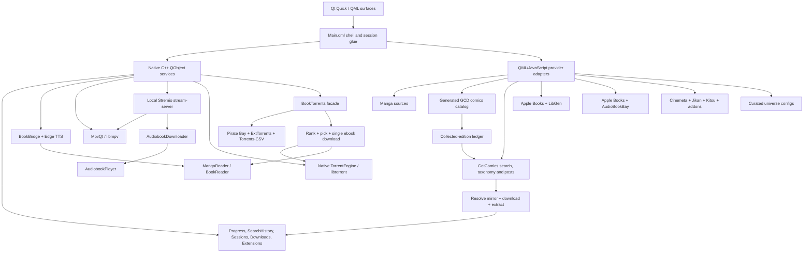

<p align="center">
  
</p>

<h1 align="center">Colosseum</h1>

<p align="center">
  <strong>A native media shell for manga and comics, books and audiobooks, movies, shows, and anime.</strong>
</p>

<p align="center">
  Qt 6 · QML · C++ · mpv · Foliate · libtorrent · Stremio-compatible extensions
</p>

> [!IMPORTANT]
> Colosseum is an active, fast-moving development build. Windows with Qt 6.11.1 and MSVC 2022 is the current tested path. It is not yet a polished, portable, one-command release build.

## What Colosseum is

Colosseum is a fullscreen desktop media environment built around three connected worlds:

- **Tankoban** for manga and western comics
- **Biblio** for ebooks and audiobooks
- **Theatre** for movies, shows, and anime

It is not three unrelated applications behind a launcher. The worlds share one home, one visual language, one Continue system, persistent search history, one local-download surface, and an OS-like session taskbar. A manga chapter, an ebook, an audiobook, and a film can remain open as separate sessions and be switched, minimized, resumed, or closed from the same shell.

The interface is written in Qt Quick/QML. Native C++ objects provide the player, readers, download engines, torrent services, TTS bridge, persistent stores, extension registry, local-library model, and system-facing services.

## Current state at a glance

| Area | Current state |
|---|---|
| Home shell | Implemented: per-world wallpaper, 21-universe carousel, Hall of Worlds, mixed Continue row with See All, world-entry boards, top bar, taskbar, and a shared interactive scrollbar |
| Tankoban | Implemented: manga discovery and volumes; a lazy offline catalog of 688 western-comic series and 5,469 collected editions; verified GetComics acquisition; archive extraction; and the shared reader |
| Biblio | Implemented: Apple Books discovery, native multi-indexer book-torrent search, libtorrent-backed single-file delivery, LibGen editions, one-copy-per-book replacement, AudioBookBay matching, ebook reader, audiobook player, and live Edge TTS |
| Theatre | Implemented: Movies, Shows, Anime, detail pages, stream selection, mpv playback, subtitles, sessions, video downloads, and a Jikan-to-Kitsu anime fallback lane |
| Search | Implemented per world with durable native search history; Home-wide cross-world search is not yet built |
| Extensions | Implemented for Theatre: install, preview, enable, order, remove, and browse the community catalog |
| Downloads | Implemented for manga, comics, LibGen ebooks, and video through one cross-world vault; torrent-sourced ebooks and audiobook files currently remain in Biblio-owned stores |
| Sessions | Implemented for books, audiobooks, comics/manga, and video |
| Universe pages | 21 live entries across anime, cinematic, saga, magazine, galaxy, eras, studio, and Cosmere atlas templates; no parked placeholders |
| Vinyl | Visible as a coming-soon world, not implemented |
| Platforms | Windows-first development build; other platforms are not currently packaged or verified |

## Recent development snapshot

The newest work changes several important parts of the architecture:

- **The full western-comics catalog v1 now ships with the app.** Tankoban lazily imports a generated catalog containing 688 RCO-ranked series and 5,469 GCD-derived collected editions. The catalog is available offline, preserves unavailable editions instead of erasing them, and exposes acquisition only when a verified GetComics post exists.
- **Book torrents now use Colosseum's native libtorrent engine.** The selected magnet is resolved in-process, the best supported ebook file is prioritized, unrelated files are skipped, and the completed file is finalized directly from the torrent engine's storage.
- **Biblio enforces one readable copy per book.** A LibGen copy and a torrent copy answer the same “Ready to read” question. Starting a new download removes the previous copy instead of allowing editions to pile up.
- **The ebook format policy now follows reader truth.** EPUB is preferred, MOBI and FB2 follow, and PDF is the fixed-layout fallback. AZW3 and DjVu are hidden because the current reader cannot render them. LibGen shows only the best available renderable tier.
- **The Cosmere is now a dedicated Cognitive Atlas.** It opens through newcomer-first world gates, then expands into eight ordered shelves covering Mistborn, Stormlight, Sel, Hoid, standalones, White Sand, and collections.
- **Universe curation is now governed by a checked-in law.** Entries are pinned to verified metadata IDs rather than loose name searches, and upcoming works enter only when a real metadata identity exists.
- **The original Foliate-derived reader remains the active book surface.** It gained a thirteenth Custom theme with user-selected page and ink colors, persisted per book and globally.
- **Audiobook cold resume was hardened.** Saved position is applied after mpv reports the file loaded, preventing a reopen from silently overwriting progress with zero.

## The three worlds

### Tankoban

Tankoban treats manga and western comics as related forms of sequential art while preserving their different structures and sources.

#### Manga

The manga path combines several focused sources:

- **WeebCentral** for search, series resolution, chapters, and page lists
- **AniList** for high-quality art and metadata
- **Kitsu** as the art, metadata, and outage fallback
- **MangaDex** for volume structure, tankōbon covers, and known chapter ranges
- **Jikan** for genre discovery, with Kitsu stepping in when Jikan is unavailable or empty

A manga detail page is built around its volume shelf. Chapters are grouped under real volume covers where the source can establish the relationship, with a flat fallback when volume ranges are incomplete.

#### Western comics

Western comics now separate **catalog identity** from **live discovery and acquisition**.

The catalog brain is a generated offline artifact:

- It contains **688 ranked series** and **5,469 collected editions**.
- RCO popularity supplies the ranked series set.
- GCD supplies the structured series and edition records.
- Editions remain visible even when no download source is available.
- The multi-megabyte catalog is imported only when Tankoban is first instantiated, so root startup does not parse it.
- `ComicsDb.js` indexes the generated data and drives the Top in Tankoban comics shelf and collected-edition ledger.

GetComics remains the active live web source around that catalog:

- Tankoban search combines AniList manga with GetComics comic-tag results.
- Explore Comics uses GetComics' publisher and franchise taxonomy.
- A catalog edition is downloadable only when the generated record contains a verified GetComics release post.
- At click time, `ComicDownloader` reopens the stable post, resolves a fresh signed mirror, downloads the archive, extracts local pages, and hands them to MangaReader.
- Missing, ambiguous, blocked, or mirrorless editions stay visibly unavailable instead of falling through to a guessed match.

A native comic-torrent stack also exists behind the same archive-ingestion boundary, but live comic torrent search is deliberately dormant in catalog v1. GetComics is the only surfaced acquisition path.

The older League of Comic Geeks adapter and its fixtures remain in-tree for research and compatibility work. They do not drive the live Tankoban catalog. XOXO has been removed from the active QML and provider path.

### Biblio

Biblio separates identity, discovery, editions, delivery, listening, and reading:

- **Apple Books RSS and Search APIs** provide charts, search, covers, authors, genres, ratings, descriptions, and book/audiobook identity.
- **BookTorrents** federates Pirate Bay API, ExtTorrents, and Torrents-CSV through a native C++ search service.
- **LibGen** remains a separate editions and ebook-delivery lane beneath the torrent shelf.
- **AudioBookBay** supplies audiobook release candidates paired to the book identity.
- **BookDownloader** saves a selected LibGen edition into Colosseum's local book store.
- **BookTorrentDownloader** uses the shared native `TorrentEngine` over libtorrent, selects one supported ebook file, deprioritizes the rest, and records the completed copy under its info hash.
- **AudiobookDownloader** continues to use the local Stremio stream-server boundary, keeps audio files from the selected release, and stores them under a durable book/audiobook pairing key.
- Downloaded books open in the embedded **Foliate-derived reader** through Qt WebEngine and QWebChannel.
- Downloaded audiobooks open in a dedicated **AudiobookPlayer** over the shared mpv backend.

The torrent shelf appears above LibGen editions on the book detail page. Results are category-scoped where an indexer supports it, filtered against audiobook-like results, deduplicated, ranked by conservative whole-token title matching, and then ordered by seeders. The first result is the recommended pick, while the rest remain one tap away.

Only formats the reader actually renders count as valid ebook candidates:

1. EPUB
2. MOBI or FB2
3. PDF

The preference is TTS-aware. Reflowable EPUB, MOBI, and FB2 beat fixed-layout PDF, which the current reader cannot read aloud. AZW3 and DjVu are excluded. LibGen editions are cascaded to the best available renderable tier, so an EPUB tier hides lower-value PDF copies rather than presenting every format as equally useful.

Biblio treats local ownership as one book-level state across both delivery lanes. A downloaded LibGen edition or a downloaded torrent shows **Ready to read**. Starting another download clears the existing local copy first, making replacement explicit and preventing duplicate editions from accumulating.

Biblio search presents Books and Audiobooks as separate result lanes and persists recent searches across restarts. The detail page keeps the cover-as-object design, cleaned synopsis, metadata, torrent shelf, LibGen editions, and paired audiobook shelf without forcing the medium into a movie-style template.

The ebook reader persists position, settings, bookmarks, annotations, display names, and theme state. Its native Edge TTS bridge is live, with voice discovery, synthesis, streaming controls, warmup, cancellation, and word-boundary data handled off the GUI thread.

The audiobook player supports multi-file chapter sets and embedded M4B chapters, playback speed, sleep timer, independent listening progress, Continue integration, and taskbar session restoration.

### Theatre

Theatre has three tabs:

- **Movies**
- **Shows**
- **Anime**

House catalogs come from:

- **Cinemeta** for movie and series identity, metadata, posters, backdrops, and episode lists
- **Jikan** as the first source for anime discovery
- **Anime Kitsu** for anime metadata, ID resolution, and fallback airing rows when Jikan fails or is empty
- Installed **Stremio-protocol extensions** for additional catalogs, metadata, streams, and subtitles

Each tab renders its own catalog rows and genre directory. Installed catalog extensions can add extra shelves after the house rows without replacing the built-in identity path.

A title opens a Theatre detail page, where movies expose sources and shows expose seasons and episodes. Playback can come from a torrent-backed stream, a direct stream supplied by an extension, or a completed local download.

## Search

Search remains scoped to the active world rather than pretending three very different catalogues are one flat index.

- **Tankoban** searches AniList manga and GetComics comic tags together. The shipped GCD catalog currently drives the comics shelf and series ledger rather than a separate full-catalog search surface.
- **Biblio** searches Apple Books books and audiobooks in separate lanes.
- **Theatre** searches Cinemeta movies and series together.
- Recent queries are stored by a native, world-scoped `SearchHistoryStore`, so they persist when a QML Loader is recreated and across application restarts.
- Search surfaces include a top match, grouped results, recent-query removal, and genre or surprise discovery where the world supports it.

The Home search button does not yet open a true cross-world search surface.

## Home and universe navigation

The Home surface is the meeting point for all three worlds. It currently includes:

- A persistent, user-selectable wallpaper system with separate picks for Home, Tankoban, Biblio, and Theatre
- A 21-entry curated universe carousel
- A **Hall of Worlds** see-all surface using the vertical Ledger Stack layout
- A single Continue row mixing books, audiobooks, manga, comics, movies, and episodes by recency
- A full Continue See All surface
- A Tankoban bookshelf, Theatre film strip, and Biblio reading desk as world-entry surfaces
- A shared top bar for world switching and system actions
- One app-wide `HouseScrollBar` for standard vertical pages

Every universe in `Universes.js` is live in both the carousel and Hall of Worlds. Universe curation is governed by **[the Universe Page Law](docs/UNIVERSE_PAGE_LAW.md)**, ratified on 2026-07-13. Every entry is a metadata-provider series ID: pinned, live-verified, and release-date-blind. Upcoming work enters tagged; a loose name search never qualifies as identity.

| Template | Live universes |
|---|---|
| Generic anime/read-watch | One Piece, Dragon Ball, Naruto, Attack on Titan |
| Cinematic | Marvel Cinematic Universe |
| Saga | Harry Potter, Lord of the Rings, A Song of Ice and Fire, Dune, The Witcher, Sherlock Holmes, Jurassic Park, Percy Jackson |
| Eras/timeline | DC Animated Universe, Star Trek, James Bond, Avatar: The Last Airbender |
| Magazine | Weekly Shonen Jump |
| Galaxy | Star Wars |
| Studio | Studio Ghibli |
| Cognitive atlas | Cosmere |

The templates are not recolored grids:

- **Marvel Cinematic Universe** uses phase panels plus separate Marvel Studios series and Special Presentations sections.
- **Saga** pages curate novels, films, shows, and optional comics doors around a book-first identity.
- **Weekly Shonen Jump** reads Jikan's magazine registry into current serialization, all-time circulation, and back-issue eras.
- **Star Wars** uses a trilogy triptych plus standalone, live-action, animated, and comics rails.
- **Eras** pages organize franchises into chronological or continuity groups and can carry book shelves, comics doors, and metadata-confirmed `UPCOMING` plates.
- **Studio Ghibli** uses a numbered chronological filmography wall.
- **Cosmere** uses a newcomer-first Cognitive Atlas, then continues beyond its world gates into eight complete ordered shelves. All 26 book and story slots resolve through Apple Books and open the existing Biblio detail page.

## The session shell

Colosseum behaves more like a small media OS than a conventional stack of pages.

The native `SessionStore` tracks every open media session, its world, content kind, reopen target, and saved-state blob. Only the active immersive surface needs to be instantiated. When the user switches away, Colosseum captures the state, tears down or suspends the surface as appropriate, and reconstructs it at the same position when reopened.

The auto-hiding taskbar groups sessions by world and provides one-click switching, fan-out menus for several open items in one world, individual session closing, direct entry to Downloads and Extensions, and a live badge for active downloads.

Video sessions can remain warm while minimized. Audiobooks preserve their selected file or chapter and position. Reader sessions restore their own reading state.

## Players

### Theatre player

The Theatre player is a fullscreen QML surface over **MpvQt/libmpv**. Torrent transport stays behind a separate local Stremio stream-server boundary, so the player consumes a normal playable URL rather than owning torrent logic.

The player includes torrent-backed, direct-URL, and local-file playback; Continue progress and resume; warm minimize; audio/subtitle track selection; online and external subtitles; preferred language memory; track delays; playback speed; fill mode; seeking; volume; fullscreen and PiP state; skip segments; source failover; episode queues; Up Next countdowns; keyboard help; A-B loop; sleep timer; statistics; frame capture/GIF tooling; and a drawing overlay.

Casting, live channels/DVR, and local watch rooms have state models but remain experimental compared with core local and on-demand playback.

### Audiobook player

The Biblio audiobook player uses the same mpv foundation without rendering a video surface. It provides cover-led audio chrome, file or embedded-chapter navigation, transport controls, speed, sleep timer, automatic multi-file advance, Continue progress, and session capture/restore.

Cold restoration waits for mpv's file-loaded event before applying the saved seek position. This avoids the pre-load seek no-op that previously allowed the first progress heartbeat to erase the stored resume point.

## Readers

### Manga and comics reader

Manga chapters and downloadable comic editions use the same download-fed reader. Archives are downloaded and extracted first, then MangaReader opens local pages.

Reading modes include long strip, single page, double page, MangaPlus-style paired pages, left-to-right and right-to-left direction, width/height fitting, 100 to 260 percent paged zoom with pan, optional wide-page splitting, and windowed strip loading with neighbor prefetch.

The reader also supports chapter and page grids, thumbnails, page jumping, chapter crossing, bookmarks, replay/checkpoint tools, per-series preferences, persisted spread-pair knowledge, scrub navigation, auto-hiding chrome, and exact resume restoration.

### Ebook reader

The book reader embeds the Foliate-derived web reader in `QWebEngineView`. A native `BookBridge` exposes local file access, persistent state, and Edge TTS through QWebChannel.

The bridge persists reading position, reader settings, bookmarks, annotations, display names, and built-in or custom theme state. Binary files cross the bridge as base64 before being decoded by the EPUB, PDF, TXT, or Foliate engine. Missing legacy paths can be re-rooted into the current application-data directory.

The table of contents marks read, current, and unread chapters along one continuous reading spine. Twelve built-in themes are joined by a **Custom** theme. Custom page and ink colors recolor the book iframe and reader chrome, persist per book and globally, and use page luminance to choose dark/light-dependent behavior such as TTS highlighting and image inversion.

Progress is mirrored into the shared Continue store. Edge TTS is live: the native worker handles voices, synthesis, streaming lifecycle, cancellation, warmup, and boundary metadata through Qt WebSockets.

## Downloads

The Downloads page is a cross-world local vault with two concepts:

1. **Now arriving** for active and queued manga, comic, LibGen ebook, and video jobs
2. **Settled local media** organized by world, series, season where applicable, and item

A native `LocalDownloads` read model normalizes the manga, LibGen ebook, comic, and video backends into one shape for QML. It does not own files or network work; actions route back to the responsible backend.

For western comics, one catalog edition is the local identity. When that edition has a verified GetComics post, the engine resolves current signed mirror links, downloads the archive, reports resolving/downloading/extracting state, extracts local pages, and indexes the completed item. Known-blocked Pixeldrain mirrors are skipped rather than consuming a full network timeout.

The Theatre download engine provides a persistent bounded queue with lazy source resolution, pause/resume, retry, cancellation, partial-file continuation, speed/ETA reporting, season grouping, and a durable downloaded-video index.

Torrent-sourced ebooks and audiobook downloads are implemented through `BookTorrentDownloader` and `AudiobookDownloader`, but their completed files and active jobs are not yet normalized into `LocalDownloads`. They are managed from Biblio and opened through the book or audiobook session path.

## Extensions

The Extensions page manages Stremio-compatible addons. It supports curated discovery, community-catalog browsing, search and sorting, manifest preview, install from normal or `stremio://` links, enable/disable, priority ordering, removal of non-core extensions, and atomic persistence.

First run seeds Cinemeta core, Torrentio, Anime Kitsu, and OpenSubtitles v3. Enabled stream extensions are asked in registry order. Adult manifests are rejected by the native registry rather than hidden only in the UI.

The store currently affects Theatre. Tankoban and Biblio have designed extension states but do not yet consume extension resources.

## Source map

| Domain | Current source or engine |
|---|---|
| Manga search, chapters, pages | WeebCentral |
| Manga art and metadata | AniList, with Kitsu fallback |
| Manga genre discovery | Jikan, with Kitsu fallback |
| Manga volumes and covers | MangaDex |
| Western comics structured catalog | Generated offline GCD-derived catalog, ranked from RCO popularity |
| Western comics live search and taxonomy | GetComics tags, archives, and release posts |
| Western comic delivery | Verified GetComics posts through `ComicDownloader`; live comic torrent acquisition is dormant in v1 |
| Parked western-comics research adapter | League of Comic Geeks remains in-tree but is not the active catalog |
| Book and audiobook discovery/metadata | Apple Books |
| Federated book-torrent search | Pirate Bay API, ExtTorrents, Torrents-CSV through `BookTorrents` |
| Torrent ebook selection and delivery | `BookTorrentRanker`, `BookTorrentFilePicker`, native `TorrentEngine`/libtorrent, `BookTorrentDownloader` |
| Ebook editions and alternate delivery | LibGen through `BookDownloader` |
| Audiobook release discovery | AudioBookBay |
| Audiobook delivery | Bundled Stremio stream-server plus `AudiobookDownloader` |
| Ebook rendering | Foliate-derived reader in Qt WebEngine |
| Ebook read-aloud | Native Edge TTS bridge over Qt WebSockets |
| Movie and show identity/catalogs | Cinemeta |
| Anime discovery | Jikan first, Anime Kitsu fallback for the airing lane |
| Anime metadata/ID bridge | Anime Kitsu |
| Stream discovery | Torrentio and installed Stremio extensions |
| Subtitles | OpenSubtitles v3 and installed subtitle extensions |
| Theatre torrent transport | Bundled Stremio `stream-server` runtime |
| Native file-download torrent transport | libtorrent-rasterbar through Colosseum's `TorrentEngine` |
| Video and audiobook rendering | MpvQt/libmpv |
| Universe assembly | Curated configs backed by Cinemeta, AniList, Kitsu, Apple Books, the comics catalog, GetComics, Jikan registry data, and pinned metadata IDs |

> [!NOTE]
> Colosseum is a client and does not host media. External APIs, websites, addons, indexers, and scrapers are independent services and can change or disappear. Use sources and content only where you have the right to access them.

## Architecture



### Native services exposed to QML

The launcher exposes focused objects including `Manga`, `Downloads`, `Books`, `BookTorrents`, `Audiobooks`, `Comics`, `Stream`, `Download`, `LocalDownloads`, `Extensions`, `Progress`, `SearchHistory`, `Sessions`, `BookBridge`, `Cast`, `Live`, `Room`, `WindowMode`, `Power`, and `Clipboard`.

The shared native `TorrentEngine` is injected behind `BookTorrents` and the dormant comic-torrent service rather than exposed as a raw QML singleton.

The launcher installs a shared disk-backed network cache and a browser-style user-agent fallback for QML requests. Hosts that stall on the current development network's broken IPv6 route are resolved and pinned to IPv4. Live torrent-indexer searches use a separate uncached network manager so seeder counts are not frozen by the image/catalog cache.

## Repository layout

```text
Colosseum/
├── qml/                    QML surfaces, components, provider adapters and shell logic
│   └── comics_db.gen.js    Generated lazy western-comics catalog shipped with Tankoban
├── native/                 C++ launcher, engines, stores, player, reader and TTS bridges
│   ├── engine/             Manga/book/audiobook/comic downloads, local vault, extensions
│   ├── player/             mpv integration, stream server, video queue and player services
│   ├── reader/             Foliate QWebChannel bridge
│   ├── torrent/            Book/comic search, ranking, file picking and download facades
│   │   └── engine/         Shared libtorrent session, repository and debug-log core
│   └── tts/                Native Edge TTS client and worker
├── resources/book_reader/  Embedded Foliate-derived ebook reader
├── assets/                 Icons, fonts and wallpaper assets
├── docs/                   Architecture laws, implementation plans and design records
├── tests/                  Contract tests, live-source fixtures and smoke/self-test harnesses
└── dev.bat                 Current Windows QML live-reload loop
```

## Building the current development version

### Requirements

- Windows 10/11
- Visual Studio 2022 C++ Build Tools
- CMake 3.16 or newer
- Ninja
- Qt 6.11.1 MSVC 2022 64-bit with Quick, QML, Network, GUI, SQL, WebEngineQuick, WebChannel, and WebSockets
- A Windows build of MpvQt
- libmpv headers, import library, and runtime DLL
- libtorrent-rasterbar with Boost and OpenSSL
- The bundled Stremio stream-server runtime used by Theatre and audiobook delivery

The checked-in CMake file first tries package-configured libtorrent, Boost, and OpenSSL targets. Its current Windows fallback paths are:

- `C:/tools/libtorrent-2.0-msvc`
- `C:/tools/boost-1.84.0`
- `C:/tools/openssl-msvc`

Missing libtorrent is a fatal configure error because the native torrent engine is now a runtime dependency rather than an optional stub.

MpvQt and libmpv default to paths under `C:/tools/mpvqt-feasibility`. Override `MPVQT_PREFIX`, `LIBMPV_PREFIX`, `LIBTORRENT_ROOT`, `BOOST_ROOT`, or `OPENSSL_MSVC_ROOT` when dependencies live elsewhere.

### Example configure and build

```bat
cmake -S native -B native/build-msvc -G Ninja ^
  -DCMAKE_PREFIX_PATH=C:/Qt/6.11.1/msvc2022_64 ^
  -DMPVQT_PREFIX=C:/tools/mpvqt-feasibility/mpvqt-msvc-install ^
  -DLIBMPV_PREFIX=C:/tools/mpvqt-feasibility/libmpv-prefix ^
  -DLIBTORRENT_ROOT=C:/tools/libtorrent-2.0-msvc ^
  -DBOOST_ROOT=C:/tools/boost-1.84.0 ^
  -DOPENSSL_MSVC_ROOT=C:/tools/openssl-msvc

cmake --build native/build-msvc
```

Run the live QML development loop with:

```bat
dev.bat
```

`dev.bat` launches `native/build-msvc/colosseum.exe qml/Main.qml`, enables QML live reload, and disables the QML disk cache so saved edits are not masked by stale compiled components.

An argument-free development launch self-locates the repository and attempts a safe `git pull --ff-only` before loading the live QML tree. Offline, dirty, timed-out, or diverged repositories boot as-is. Native changes still require a rebuild.

## Useful development harnesses

| Variable | Purpose |
|---|---|
| `COLOSSEUM_DEV=1` | Enable QML/JS live reload |
| `COLOSSEUM_OPEN_WORLD=Theatre` | Boot directly into a world |
| `COLOSSEUM_OPEN_EXTENSIONS=1` | Boot directly into the extension store |
| `COLOSSEUM_CATALOG_SELFTEST=movies` | Log Theatre catalog rows |
| `COLOSSEUM_STREAMS_SELFTEST=movie\|tt0816692` | Exercise installed stream extensions |
| `COLOSSEUM_SUBS_SELFTEST=movie\|tt0111161` | Exercise subtitle aggregation |
| `COLOSSEUM_SESSION_SELFTEST=1` | Run the session-store contract test |
| `COLOSSEUM_VIDEOQ_SELFTEST=exactrow` | Exercise the persistent video queue |
| `COLOSSEUM_DL_SELFTEST=...` | Exercise manga/page downloads |
| `COLOSSEUM_BOOK_DLTEST=...` | Exercise LibGen ebook downloads |
| `COLOSSEUM_COMIC_DLTEST=...` | Exercise verified GetComics archive downloads |
| `COLOSSEUM_ABB_DLTEST=<pairKey>\|<infoHash>` | Exercise audiobook manifest and download handling |
| `COLOSSEUM_TORRENT_SEARCHTEST=<query>` | Run the three live book indexers |
| `COLOSSEUM_TORRENT_DLTEST=<infoHash>\|<title>` | Exercise native metadata resolution, ebook picking, priorities, and libtorrent download |

The repository also contains focused PowerShell, QML, Node, and C++ checks for the 688-series/5,469-edition comics catalog contract, lazy catalog loading, comics-ledger availability, GetComics parsing and archive ingestion, libtorrent link/seed/download behavior, book ranking and file selection, the LibGen format cascade, one-copy-per-book replacement, search history, sessions, audiobook cold resume, universe templates, the Cosmere atlas, and player failure handling.

## Known boundaries

- Home-wide search has not yet been built. Search is currently scoped to the active world.
- Vinyl is a non-interactive coming-soon entry.
- All 21 registered universes are live, but their rails still depend on external source availability and the quality of pinned metadata mappings.
- Theatre extensions are live; Tankoban and Biblio extension consumption is future work.
- The western-comics catalog is a generated snapshot, not a live universal bibliography. It preserves 688 selected series and 5,469 editions, but requires periodic rebuilding and enrichment as source data changes.
- Only catalog editions with a verified GetComics post expose acquisition. Missing editions remain unavailable by design.
- Comic torrent search, ranking, file selection, and archive ingestion exist in native code, but the live torrent lane is intentionally dormant in comics catalog v1.
- The historical LOCG adapter remains parked in-tree and is not the active comics brain.
- Torrent-sourced ebooks and audiobook downloads are live but are not yet represented in the unified `LocalDownloads` vault.
- Biblio intentionally stores one readable copy per book. Starting another download replaces the previous LibGen or torrent copy.
- Book-torrent ranking deliberately prefers conservative title matches, but torrent names and file manifests remain untrusted external inputs.
- Casting, live TV/DVR, and networked watch rooms are less mature than core playback.
- The build assumes developer-supplied Qt, MpvQt, libmpv, libtorrent, Boost, OpenSSL, and the stream-server runtime.
- Scraper-backed sources and public indexers are inherently more fragile than stable public APIs.
- `Main.qml` still carries a large amount of shell coordination and is an obvious future service-boundary refactor target.

## Design principles

- **Each medium gets the surface it needs.** A book detail page should not be a recolored movie page.
- **Separate discovery from local ownership.** Remote sources identify or deliver media; Colosseum's readers and players resume durable local/session state.
- **Match conservatively.** A missing or ambiguous source match stays unavailable instead of quietly opening the wrong title.
- **Download-fed reading.** Manga, comics, ebooks, and audiobooks are persisted locally before their dedicated reader or player opens them.
- **One identity, many surfaces.** Continue, Downloads, Search History, Universes, and Sessions connect the worlds without erasing their differences.
- **Native engines behind declarative UI.** QML owns presentation; C++ owns durable state, files, processes, TTS, transport, and native integration.
- **Progressive honesty.** A slow or blocked source should show partial data, a cooldown, a fallback, or a real empty state rather than fabricated content.
- **The shell is part of the product.** Wallpapers, sessions, taskbar behavior, scrolling, and cross-medium universes are product surfaces, not ornamental wrappers around three catalogs.
