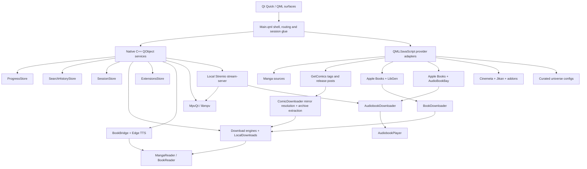

<p align="center">
  
</p>

<h1 align="center">Colosseum</h1>

<p align="center">
  <strong>A native media shell for manga and comics, books and audiobooks, movies, shows, and anime.</strong>
</p>

<p align="center">
  Qt 6 · QML · C++ · mpv · Foliate · Stremio-compatible extensions
</p>

> [!IMPORTANT]
> Colosseum is an active, fast-moving development build. Windows with Qt 6.11.1 and MSVC 2022 is the current tested path. It is not yet a polished, portable, one-command release build.

## What Colosseum is

Colosseum is a fullscreen desktop media environment built around three connected worlds:

- **Tankoban** for manga and western comics
- **Biblio** for ebooks and audiobooks
- **Theatre** for movies, shows, and anime

It is not three unrelated applications behind a launcher. The worlds share one home, one visual language, one Continue system, persistent search history, one local-download surface, and an OS-like session taskbar. A manga chapter, an EPUB, an audiobook, and a film can remain open as separate sessions and be switched, minimized, resumed, or closed from the same shell.

The interface is written in Qt Quick/QML. Native C++ objects provide the player, readers, download engines, TTS bridge, persistent stores, extension registry, local-library model, and system-facing services.

## Current state at a glance

| Area | Current state |
|---|---|
| Home shell | Implemented: per-world wallpaper, 21-universe carousel, Hall of Worlds, mixed Continue row with See All, world-entry boards, top bar, and taskbar |
| Tankoban | Implemented: manga discovery/volumes/downloads; GetComics-driven western-comics discovery, release shelves, archive delivery, and shared reader |
| Biblio | Implemented: Apple Books book/audiobook discovery, LibGen editions, AudioBookBay-backed audiobook matching, ebook and audiobook downloads, EPUB reader, audiobook player, and live Edge TTS |
| Theatre | Implemented: Movies, Shows, Anime, detail pages, stream selection, mpv playback, subtitles, sessions, and video downloads |
| Search | Implemented per world with durable native search history; Home-wide cross-world search is not yet built |
| Extensions | Implemented for Theatre: install, preview, enable, order, remove, and browse the community catalog |
| Downloads | Implemented for manga, comics, ebooks, and video through one cross-world vault; audiobook files currently remain in their own Biblio store |
| Sessions | Implemented for books, audiobooks, comics/manga, and video |
| Universe pages | 21 live entries across generic anime, cinematic, saga, magazine, galaxy, eras, and studio templates; no parked placeholders |
| Vinyl | Visible as a coming-soon world, not implemented |
| Platforms | Windows-first development build; other platforms are not currently packaged or verified |

## The three worlds

### Tankoban

Tankoban treats manga and western comics as related forms of sequential art while preserving their different structures and sources.

#### Manga

The manga path combines several focused sources:

- **WeebCentral** for search, series resolution, chapters, and page lists
- **AniList** for high-quality art and metadata
- **Kitsu** as the art/metadata fallback
- **MangaDex** for volume structure, tankōbon covers, and known chapter ranges

A manga detail page is built around its volume shelf. Chapters are grouped under real volume covers where the source can establish the relationship, with a flat fallback when volume ranges are incomplete.

#### Western comics

The active western-comics path now uses **GetComics for both catalogue structure and delivery**.

- A GetComics tag is the current series identity.
- Tankoban's curated Top in Comics row resolves titles to GetComics tags, preferring an exact slug before ranked search.
- Search combines AniList manga with GetComics comic tags on one surface.
- Explore Comics is driven by GetComics' own publisher and franchise taxonomy.
- A series page renders the tag's release posts, separates collected editions from individual issues, and supports filtering and natural sorting.
- Each release post is one downloadable unit. `ComicDownloader` resolves a signed mirror, downloads the archive, extracts its pages, and hands the local result to MangaReader.
- iTunes art is used as series-level presentation art where available; each release keeps its own GetComics cover.

The older LOCG catalogue adapter and its fixtures remain in-tree for research and compatibility work, but LOCG is parked and does not currently drive Tankoban's live comics experience. XOXO has been removed from the active QML and provider path.

### Biblio

Biblio separates discovery, editions, listening, and reading:

- **Apple Books RSS and Search APIs** provide charts, search, covers, authors, genres, ratings, descriptions, and book/audiobook identity.
- **LibGen** supplies downloadable ebook editions.
- **AudioBookBay** supplies audiobook release candidates paired to the book identity.
- The native **BookDownloader** saves a selected ebook into Colosseum's local book store.
- The native **AudiobookDownloader** asks the bundled Stremio stream engine for the selected torrent's file manifest, keeps audio files, downloads them completely, and stores them under a durable book/audiobook pairing key.
- A downloaded EPUB opens in the embedded **Foliate-based reader** through Qt WebEngine and QWebChannel.
- A downloaded audiobook opens in a dedicated **AudiobookPlayer** over the shared mpv backend.

Biblio search presents Books and Audiobooks as separate result lanes and persists recent searches across restarts. The detail page keeps the cover-as-object design, cleaned synopsis, metadata, LibGen editions, and the paired audiobook shelf without forcing the medium into a movie-style template.

The EPUB reader persists position, settings, bookmarks, annotations, and display names. Its native Edge TTS bridge is live, with voice discovery, synthesis, streaming controls, warmup, cancellation, and word-boundary data handled off the GUI thread.

The audiobook player supports multi-file chapter sets and embedded M4B chapters, playback speed, sleep timer, independent listening progress, Continue integration, and taskbar session restoration.

### Theatre

Theatre has three tabs:

- **Movies**
- **Shows**
- **Anime**

House catalogs come from:

- **Cinemeta** for movie and series identity, metadata, posters, backdrops, and episode lists
- **Jikan** for anime discovery
- **Anime Kitsu** for anime metadata and ID resolution
- Installed **Stremio-protocol extensions** for additional catalogs, metadata, streams, and subtitles

Each tab renders its own catalog rows and genre directory. Installed catalog extensions can add extra shelves after the house rows without replacing the built-in identity path.

A title opens a Theatre detail page, where movies expose sources and shows expose seasons and episodes. Playback can come from a torrent-backed stream, a direct stream supplied by an extension, or a completed local download.

## Search

Search remains scoped to the active world rather than pretending three very different catalogues are one flat index.

- **Tankoban** searches AniList manga and GetComics tags together.
- **Biblio** searches Apple Books books and audiobooks in separate lanes.
- **Theatre** searches Cinemeta movies and series together.
- Recent queries are stored by a native, world-scoped `SearchHistoryStore`, so they persist when a QML Loader is recreated and across application restarts.
- Search surfaces include a top match, grouped results, recent-query removal, and genre/surprise discovery where the world supports it.

The Home search button does not yet open a true cross-world search surface.

## Home and universe navigation

The Home surface is the meeting point for all three worlds. It currently includes:

- A persistent, user-selectable wallpaper system with separate picks for Home, Tankoban, Biblio, and Theatre
- A 21-entry curated universe carousel
- A **Hall of Worlds** see-all surface using the vertical Ledger Stack layout
- A single Continue row mixing books, audiobooks, manga, comics, movies, and episodes by recency
- A full Continue See All surface
- A Tankoban bookshelf, Theatre film strip, and Biblio reading desk as world-entry surfaces
- A shared top bar for world switching and system actions

Every universe in `Universes.js` is live in both the carousel and Hall of Worlds. The shell chooses a page template from the universe category:

| Template | Live universes |
|---|---|
| Generic anime/read-watch | One Piece, Dragon Ball, Naruto, Pokémon, Attack on Titan |
| Cinematic | Marvel |
| Saga | Harry Potter, Lord of the Rings, A Song of Ice and Fire, Dune, The Witcher, Sherlock Holmes, Jurassic Park, Percy Jackson |
| Eras/timeline | DC Animated Universe, Star Trek, James Bond, Avatar: The Last Airbender |
| Magazine | Weekly Shonen Jump |
| Galaxy | Star Wars |
| Studio | Studio Ghibli |

The templates are not just recolored grids:

- **Marvel** uses a cinematic phase-oriented surface.
- **Saga** pages curate novels, films, and shows around a book-first identity.
- **Weekly Shonen Jump** is a manga-only ranked magazine spread.
- **Star Wars** uses a trilogy triptych plus standalone and television rails.
- **Eras** pages organize a franchise into curated chronological or continuity groups.
- **Studio Ghibli** uses a numbered chronological filmography wall.

## The session shell

Colosseum behaves more like a small media OS than a conventional stack of pages.

The native `SessionStore` tracks every open media session, its world, content kind, reopen target, and saved-state blob. Only the active immersive surface needs to be instantiated. When the user switches away, Colosseum captures the state, tears down or suspends the surface as appropriate, and reconstructs it at the same position when reopened.

The auto-hiding taskbar groups sessions by world and provides:

- One-click switching for a single open session
- A fan-out menu when several items are open in the same world
- Individual session closing
- Direct entry to Downloads
- Direct entry to Extensions
- A live badge for active downloads

Video sessions can remain warm while minimized. Audiobooks preserve their selected file/chapter and position. Reader sessions restore their own reading state.

## Players

### Theatre player

The Theatre player is a fullscreen QML surface over **MpvQt/libmpv**. Torrent transport stays behind a separate local stream-server boundary, so the player consumes a normal playable URL rather than owning torrent logic.

The current player includes code paths for:

- Torrent-backed, direct-URL, and local-file playback
- Persistent Continue progress and resume-at-position
- Resume-or-start-over prompting
- Warm minimize and session restoration
- Audio and subtitle track selection
- Online subtitle aggregation and loading
- External subtitle files and subtitle drag/drop
- Preferred audio/subtitle languages and per-show track memory
- Audio and subtitle delay controls
- Playback speed, fill mode, seeking, volume, fullscreen, and PiP/window-mode state
- Intro, recap, and credits skip segments
- Source retry and failover between stream candidates
- Episode/source drawer and traveling episode queue
- Visible, cancelable Up Next countdowns
- Keyboard shortcut help
- A-B loop, sleep timer, playback statistics, frame capture/GIF tooling, and a drawing overlay

The player also contains state models for casting, live channels/DVR, and local watch rooms. Those areas remain experimental compared with core local and on-demand playback.

### Audiobook player

The Biblio audiobook player uses the same mpv foundation without rendering a video surface. It provides cover-led audio chrome, file or embedded-chapter navigation, transport controls, speed, sleep timer, automatic multi-file advance, Continue progress, and session capture/restore.

## Readers

### Manga and comics reader

Manga chapters and GetComics releases use the same download-fed reader. Archives are downloaded and extracted first, then MangaReader opens local pages.

Reading modes include:

- Long strip
- Single page
- Double page
- MangaPlus-style paired pages
- Left-to-right and right-to-left direction
- Width and height fitting
- 100–260% paged zoom with pan
- Optional wide-page splitting in strip mode
- Windowed strip loading and neighbor prefetch to control memory use

The reader also supports chapter and page grids, thumbnails, page jumping, chapter crossing, bookmarks, replay/checkpoint tools, per-series preferences, persisted spread-pair knowledge, scrub navigation, auto-hiding chrome, and exact resume restoration.

### EPUB reader

The book reader embeds the Foliate-derived web reader in `QWebEngineView`. A native `BookBridge` exposes local file access, persistent state, and Edge TTS through QWebChannel.

The bridge persists:

- Reading position
- Reader settings
- Bookmarks
- Annotations
- Display names

Progress is mirrored into the shared Colosseum Continue store. Edge TTS is no longer a stub: the native worker handles voices, synthesis, streaming lifecycle, cancellation, warmup, and boundary metadata through Qt WebSockets.

## Downloads

The Downloads page is a cross-world local vault rather than a list attached to one medium.

It is divided into two concepts:

1. **Now arriving** for active and queued manga, comic, ebook, and video jobs
2. **Settled local media** organized by world, series, season where applicable, and item

A native `LocalDownloads` read model normalizes the manga, ebook, comic, and video backends into one shape for QML. It does not own files or network work; actions route back to the responsible backend.

For western comics, one GetComics post is the download unit. The engine resolves signed mirror links, downloads the archive, reports progress through resolving/downloading/extracting states, extracts local pages, and indexes the completed item under its `gc:` series identity. Known-blocked Pixeldrain mirrors are discarded or skipped rather than consuming a full network timeout.

The Theatre download engine provides a persistent bounded queue with lazy source resolution, pause/resume, retry, cancellation, partial-file continuation, speed/ETA reporting, season grouping, and a durable downloaded-video index. Queue state survives application restarts.

Audiobook downloads are implemented through `AudiobookDownloader`, but their completed files and active jobs are not yet normalized into `LocalDownloads`; they are currently managed from Biblio and opened through the audiobook session path.

## Extensions

The Extensions page manages Stremio-compatible addons.

It supports:

- Curated discovery
- Community-catalog browsing
- Search and sorting
- Manifest preview before installation
- Install from a normal or `stremio://` manifest link
- Enable/disable
- Priority ordering
- Removal of non-core extensions
- Atomic persistence under the application data directory

First run seeds the house extensions used by Theatre:

- Cinemeta core
- Torrentio
- Anime Kitsu
- OpenSubtitles v3

Ordering is meaningful: enabled stream extensions are asked in registry order. Adult manifests are rejected by the native registry rather than hidden only in the UI.

The store currently affects Theatre. Tankoban and Biblio have designed extension states but do not yet consume extension resources.

## Source map

| Domain | Current source or engine |
|---|---|
| Manga search, chapters, pages | WeebCentral |
| Manga art and metadata | AniList, with Kitsu fallback |
| Manga volumes and covers | MangaDex |
| Western comics catalogue, taxonomy, series identity, release shelves | GetComics tags and release posts |
| Western comic series presentation art | iTunes search where available; GetComics release art per item |
| Western comic delivery | GetComics through `ComicDownloader` |
| Parked western-comics research adapter | League of Comic Geeks remains in-tree but is not the active catalogue |
| Book and audiobook discovery/metadata | Apple Books |
| Ebook editions and delivery | LibGen through `BookDownloader` |
| Audiobook release discovery | AudioBookBay |
| Audiobook delivery | Bundled Stremio stream-server plus `AudiobookDownloader` |
| EPUB rendering | Foliate-derived reader in Qt WebEngine |
| EPUB read-aloud | Native Edge TTS bridge over Qt WebSockets |
| Movie and show identity/catalogs | Cinemeta |
| Anime discovery | Jikan |
| Anime metadata/ID bridge | Anime Kitsu |
| Stream discovery | Torrentio and installed Stremio extensions |
| Subtitles | OpenSubtitles v3 and installed subtitle extensions |
| Torrent transport | Bundled Stremio `stream-server` runtime |
| Video and audiobook rendering | MpvQt/libmpv |
| Universe assembly | Curated configs backed by Cinemeta, AniList, Apple Books, and pinned IDs/queries |

> [!NOTE]
> Colosseum is a client and does not host media. External APIs, websites, addons, and scrapers are independent services and can change or disappear. Use sources and content only where you have the right to access them.

## Architecture



### Native services exposed to QML

The launcher currently exposes focused objects such as:

- `Manga`
- `Downloads`
- `Books`
- `Audiobooks`
- `Comics`
- `Stream`
- `Download`
- `LocalDownloads`
- `Extensions`
- `Progress`
- `SearchHistory`
- `Sessions`
- `BookBridge`
- `Cast`
- `Live`
- `Room`
- `WindowMode`
- `Power`
- `Clipboard`

The launcher installs a shared disk-backed network cache, browser-style user-agent fallback for QML requests, and IPv4 pinning for hosts that otherwise stall on the current development network's broken IPv6 route.

## Repository layout

```text
Colosseum/
├── qml/                    QML surfaces, components, provider adapters and shell logic
├── native/                 C++ launcher, engines, stores, player, reader and TTS bridges
│   ├── engine/             Manga/book/audiobook/comic downloads, local vault, extensions
│   ├── player/             mpv integration, stream server, video queue and player services
│   ├── reader/             Foliate QWebChannel bridge
│   └── tts/                Native Edge TTS client and worker
├── resources/book_reader/  Embedded Foliate-derived EPUB reader
├── assets/                 Icons, fonts and wallpaper assets
├── tests/                  Contract tests, live-source fixtures and smoke/self-test harnesses
└── dev.bat                 Current Windows QML live-reload loop
```

## Building the current development version

### Requirements

The current tested setup is:

- Windows 10/11
- Visual Studio 2022 C++ Build Tools
- CMake 3.16 or newer
- Ninja, for the layout expected by `dev.bat`
- Qt 6.11.1 MSVC 2022 64-bit with:
  - Quick
  - QML
  - Network
  - GUI
  - SQL
  - WebEngineQuick
  - WebChannel
  - WebSockets
- A Windows build of MpvQt
- libmpv headers, import library, and runtime DLL
- The bundled Stremio stream-server runtime expected by the player/download engines

The checked-in CMake file currently defaults to the original development paths under `C:/tools/mpvqt-feasibility`. Override `MPVQT_PREFIX` and `LIBMPV_PREFIX` when your dependencies live elsewhere.

### Example configure and build

From a Visual Studio developer command prompt:

```bat
cmake -S native -B native/build-msvc -G Ninja ^
  -DCMAKE_PREFIX_PATH=C:/Qt/6.11.1/msvc2022_64 ^
  -DMPVQT_PREFIX=C:/tools/mpvqt-feasibility/mpvqt-msvc-install ^
  -DLIBMPV_PREFIX=C:/tools/mpvqt-feasibility/libmpv-prefix

cmake --build native/build-msvc
```

Run the live QML development loop:

```bat
dev.bat
```

`dev.bat` launches `native/build-msvc/colosseum.exe qml/Main.qml`, enables QML live reload, and disables the QML disk cache so saved edits are not masked by stale compiled components.

An argument-free development launch self-locates the repository and attempts a safe `git pull --ff-only` before loading the live QML tree. Offline, dirty, timed-out, or diverged repositories boot as-is. QML changes can land immediately; native changes still require a rebuild.

This is a development recipe, not yet a clean-machine installer workflow.

## Useful development harnesses

Several subsystems can be exercised at startup through environment variables:

| Variable | Purpose |
|---|---|
| `COLOSSEUM_DEV=1` | Enable QML/JS live reload |
| `COLOSSEUM_OPEN_WORLD=Theatre` | Boot directly into a world |
| `COLOSSEUM_OPEN_EXTENSIONS=1` | Boot directly into the extension store |
| `COLOSSEUM_CATALOG_SELFTEST=movies` | Log the catalog rows built for a Theatre tab |
| `COLOSSEUM_STREAMS_SELFTEST=movie\|tt0816692` | Ask installed stream extensions and log their results |
| `COLOSSEUM_SUBS_SELFTEST=movie\|tt0111161` | Exercise subtitle aggregation |
| `COLOSSEUM_SESSION_SELFTEST=1` | Run the session-store contract test |
| `COLOSSEUM_VIDEOQ_SELFTEST=exactrow` | Exercise the persistent video queue |
| `COLOSSEUM_DL_SELFTEST=...` | Exercise manga/page downloads |
| `COLOSSEUM_INDEX_SELFTEST=1` | Exercise manga-download index self-healing |
| `COLOSSEUM_BOOK_DLTEST=...` | Exercise ebook downloads |
| `COLOSSEUM_COMIC_DLTEST=...` | Exercise comic archive downloads |
| `COLOSSEUM_ABB_DLTEST=<pairKey>\|<infoHash>` | Exercise audiobook manifest and download handling |

The repository also contains focused PowerShell/QML/Node/C++ contract checks for search history, Continue See All, session hydration, universe templates and Hall of Worlds, GetComics parsing, audiobook pairing, player behavior, and source-specific failure handling.

## Known boundaries

- Home-wide search has not yet been built. Search is currently scoped to the active world.
- Vinyl is a non-interactive coming-soon entry.
- All 21 registered universes are live, but their rails still depend on external source search, pinned IDs, and curated query quality.
- Theatre extensions are live; Tankoban and Biblio extension consumption is future work.
- GetComics tags are pragmatic series identities, not a canonical comic bibliography. A tag can mix reprints, collections, and issues, and site markup or mirror availability can change.
- The LOCG catalogue path is parked rather than deleted; it is not the active Tankoban comics brain.
- Audiobook discovery and downloading are live, but audiobooks are not yet represented in the unified `LocalDownloads` vault.
- The proposed Biblio book-torrents shelf currently exists only as a design document; LibGen remains the implemented ebook-delivery lane.
- Casting, live TV/DVR, and networked watch rooms are less mature than core playback.
- The build still assumes developer-supplied Qt, MpvQt, libmpv, and stream-server runtime dependencies.
- Scraper-backed sources are inherently more fragile than stable public APIs.
- `Main.qml` still carries a large amount of shell coordination and is an obvious future service-boundary refactor target.

## Design principles

Colosseum is being built around a few recurring rules:

- **Each medium gets the surface it needs.** A book detail page should not be a recolored movie page.
- **Separate discovery from local ownership.** Remote sources identify or deliver media; Colosseum's readers and players resume durable local/session state.
- **Match conservatively.** A missing or ambiguous source match stays unavailable instead of quietly opening the wrong title.
- **Download-fed reading.** Manga, comics, ebooks, and audiobooks are persisted locally before their dedicated reader/player opens them.
- **One identity, many surfaces.** Continue, Downloads, Search History, Universes, and Sessions connect the worlds without erasing their differences.
- **Native engines behind declarative UI.** QML owns presentation; C++ owns durable state, files, processes, TTS, transport, and native integration.
- **Progressive honesty.** A slow or blocked source should show partial data, a cooldown, or a real empty state rather than fabricated content.
- **The shell is part of the product.** Wallpapers, sessions, taskbar behavior, and cross-medium universes are not ornamental wrappers around three catalogs.
