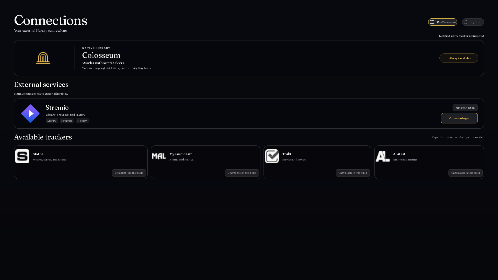
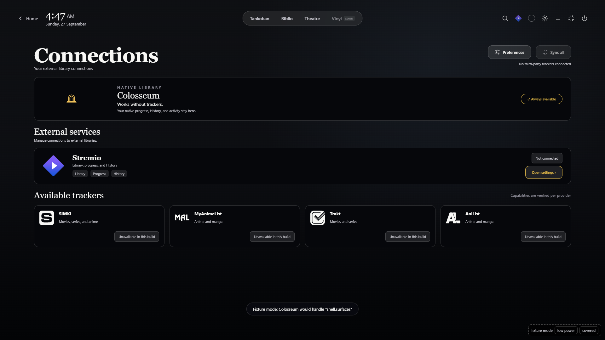
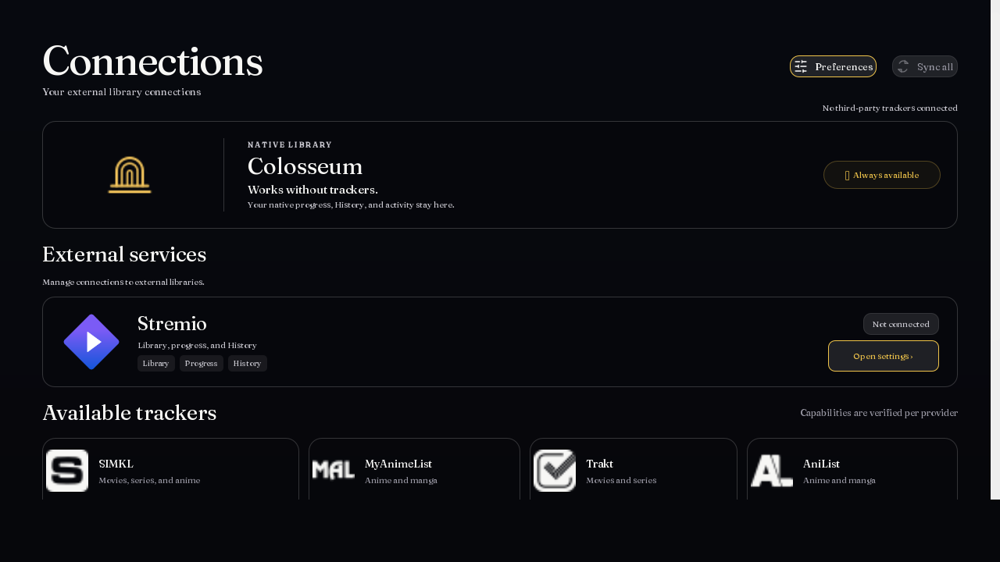
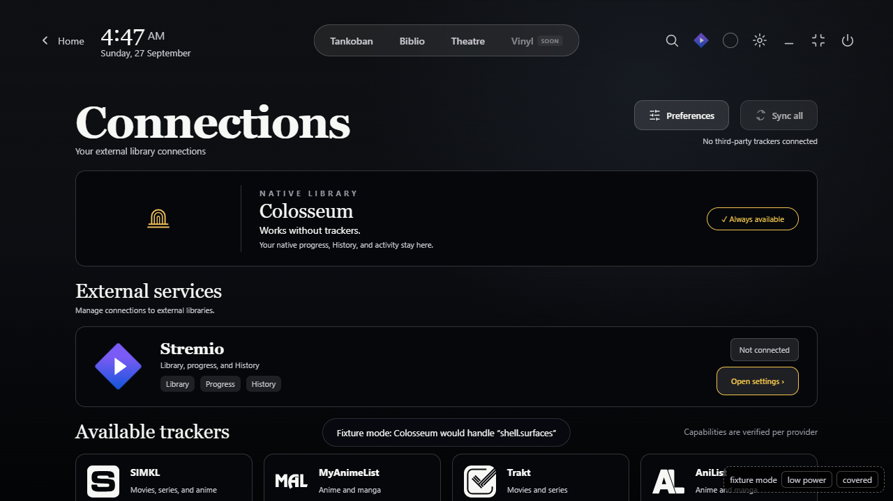

# Connections parity

Source reference: `git show 7463dab8^:qml/TrackerSyncCenterPage.qml`. That QML file was removed in `7463dab8`; these comparisons use its historical source, not a reconstructed layout.

The QML captures were rendered at 1920×1080 and 1280×720 in a temporary `qmlscene` harness with the historical component, current `Theme.qml`, bundled icons, an empty tracker model, and an idle unlinked Stremio state. The web captures replay `page.connections__44136fa355b3.json`, recorded from an isolated native profile after the shared seams landed. That feed reported `status: "unavailable"`, `linkedAccount: false`, and `panelAvailable: true`; the web and QML both display **Not connected**. No account identifier or credential appears in the fixture.

| Viewport | Historical QML | Web surface |
|---|---|---|
| 1920×1080 |  |  |
| 1280×720 |  |  |

The web image includes the persistent web shell; the historical component capture starts at the page itself. At 1280, the offscreen QML capture has a narrow unpainted right edge. Compare the page content, cards and controls within those limits. The [compiled app capture](live-app.png) shows the revised surface under the user's wallpaper.

| Behavior | Historical QML | Web/native result |
|---|---|---|
| Native library, Stremio, then tracker catalogue | `TrackerSyncCenterPage.qml:1560-1730,2141-2402` | The same hierarchy and wording appear in `connections.header`, `.native`, `.stremio`, and `.catalogue`. |
| Stremio badge | `TrackerSyncCenterPage.qml:109,216-224,2233-2249` | `status` maps `reconnectRequired`, `syncFailed`, and `paused` to **Needs attention**, `connecting` to **Connecting**, and `syncing` to **Updating**; otherwise `linkedAccount` selects **Connected** or **Not connected**. The badge reads each delivered feed snapshot. |
| Stremio panel | `TrackerSyncCenterPage.qml:2250-2279` emits `mainSyncRequested` | `panelAvailable` gates the focusable **Open settings** button. The button calls `env.door('stremioSync')`; the tagged native app returned `{ok:true}` for that door. |
| Unavailable tracker providers | `TrackerSyncCenterPage.qml:2280-2402` | Catalogue cards retain the native unavailable state and do not imply an authentication path. |

Checks: the refreshed browser fixture rendered four ready sections at both sizes; the keyboard walk reached **17/17** focus targets and Back worked. `native\build-target.bat colosseum` exited `TARGET_BUILD_OK`. In a tagged run of that new executable, the revised page rendered four ready sections, displayed **Not connected**, focused the enabled settings button, and a click called the `stremioSync` door with `{ok:true}`. The screenshots establish overview parity for an empty tracker profile; connected accounts, other status transitions, review dialogs and profile changes are outside this capture.
