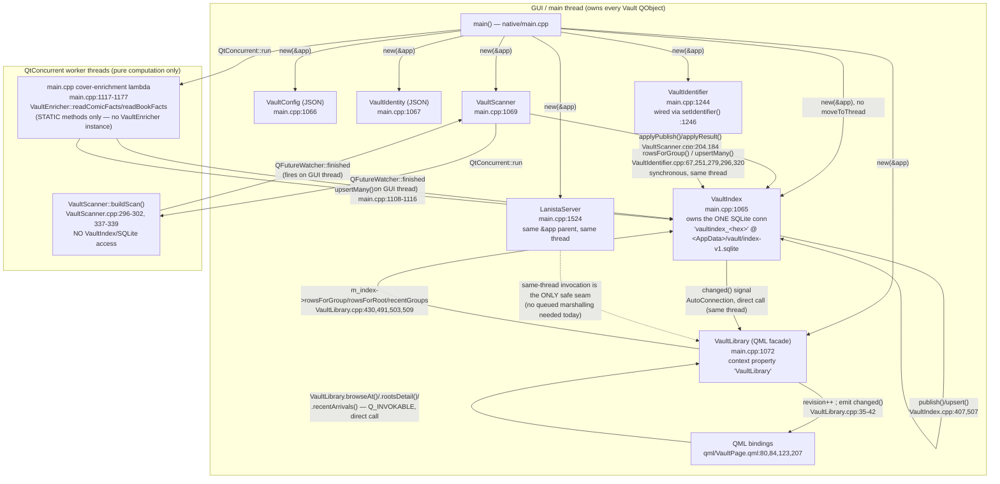

# Vault forensic owner/thread trace (Slice F0)

> **What this is.** A read-only re-pin of who owns the Vault's SQLite database and which
> thread may answer a read, done fresh against current HEAD because the earlier recon predates
> schema v5 (`identityState`/`identityCandidateCount`) and the `recentGroups()` /
> `browseAt()` / `rootsDetail()` / `recentArrivals()` projections. **No production source was
> changed to produce this document.** Every claim below carries an exact `file:line` pin.

**Baseline — record this first.**

| Fact | Value | Pin |
|---|---|---|
| HEAD at trace time | `b9dded2ef1eb485df9c5a14e3cf91fef62b491a7` | `git rev-parse HEAD`, run 2026-08-12 |
| Vault schema version | `kVaultSchemaVersion = 5` (adds `identityState`/`identityCandidateCount`) | `native/engine/VaultIndex.cpp:16` |
| SQLite connection name | `"vaultindex_" + hex(this)` (one name per `VaultIndex` instance, e.g. `vaultindex_1a2b3c4`) | `native/engine/VaultIndex.cpp:123-124` |
| SQLite connection path | `<AppDataLocation>/vault/index-v1.sqlite` | `native/main.cpp:1050-1053` (vaultDir) + `native/main.cpp:1065` (`new VaultIndex(vaultDir + "/index-v1.sqlite", &app)`) |
| Owning thread | The thread that runs `main()`/`QGuiApplication::exec()` — i.e. the process's GUI/main thread. No `moveToThread()` call exists anywhere in the Vault subsystem (verified below). | see "Thread affinity" section |
| `recentGroups()` current call path | `VaultLibrary::recentArrivals(6)` (QML-bound) → `VaultIndex::recentGroups(limit*2)` | `qml/VaultPage.qml:84` → `native/engine/VaultLibrary.cpp:503` → `native/engine/VaultIndex.cpp:872-894` |
| `browseAt()` current call path | QML binding `VaultLibrary.browseAt(root.currentBrowsePath)` | `qml/VaultPage.qml:123` → `native/engine/VaultLibrary.cpp:381-469` (Q_INVOKABLE declared `native/engine/VaultLibrary.h:111`) |
| `rootsDetail()` current call path | QML binding `VaultLibrary.rootsDetail()` | `qml/VaultPage.qml:80` and `qml/VaultPage.qml:207` → `native/engine/VaultLibrary.cpp:471-496` (Q_INVOKABLE declared `native/engine/VaultLibrary.h:114`) |
| `recentArrivals()` current call path | QML binding `VaultLibrary.recentArrivals(6)` | `qml/VaultPage.qml:84` → `native/engine/VaultLibrary.cpp:498-551` (Q_INVOKABLE declared `native/engine/VaultLibrary.h:117`) |

---

## 1. Construction graph (`native/main.cpp`)

All Vault objects are constructed in `main()`, in this order, every one parented directly to
`&app` (the `QGuiApplication`/`QApplication` instance) — **no `moveToThread()` call exists
anywhere in `native/engine/Vault*.cpp` or `native/engine/Vault*.h`** (grep-verified: zero hits).
A `QObject`'s `thread()` is fixed to the thread that constructed it unless explicitly moved;
since `main()` itself runs on the process's initial (GUI) thread and never moves any Vault
object, **every Vault QObject listed below lives on the GUI thread for its entire lifetime.**

| Object | Construction pin | Parent | Notes |
|---|---|---|---|
| `vaultIndex` (`VaultIndex*`) | `native/main.cpp:1065` | `&app` | Opens the one SQLite connection (see §2). |
| `vaultConfig` (`VaultConfig*`) | `native/main.cpp:1066` | `&app` | JSON file store (roots + kind overrides) — **no SQLite** (grep-verified: zero `QSqlDatabase`/`sqlite` hits in `VaultConfig.h/.cpp`). |
| `vaultIdentity` (`VaultIdentity*`) | `native/main.cpp:1067` | `&app` | JSON file store (content-addressed ids) — **no SQLite** (same grep). |
| `vaultScanner` (`VaultScanner*`) | `native/main.cpp:1069` | `&app` | Owns no store of its own; drives `QtConcurrent::run` workers that return data via `QFutureWatcher`. |
| `vaultLibrary` (`VaultLibrary*`) | `native/main.cpp:1072` | `&app` | The single QML façade; exposed as context property `VaultLibrary` (`native/main.cpp:1073`). |
| `vaultIdentifier` (`VaultIdentifier*`) | `native/main.cpp:1244` | `&app` | Wired into `vaultLibrary` via `vaultLibrary->setIdentifier(vaultIdentifier)` at `native/main.cpp:1246`. |
| `LanistaServer` | `native/main.cpp:1524` | `&app` | Constructed **after** every Vault object, same `&app` parent → same GUI thread. |

`VaultEnricher` is **not instantiated anywhere in production** — see §4.

---

## 2. The one SQLite connection (`VaultIndex`)

- `VaultIndex::VaultIndex(const QString& dbPath, QObject* parent)` opens the database in its
  constructor: `m_db = QSqlDatabase::addDatabase(QStringLiteral("QSQLITE"), m_conn); m_db.setDatabaseName(dbPath); if (m_db.open() && !ensureSchema()) m_db.close();`
  — `native/engine/VaultIndex.cpp:120-129`.
- Connection name is generated from the instance pointer: `m_conn = QStringLiteral("vaultindex_%1").arg(reinterpret_cast<quintptr>(this), 0, 16);` — `native/engine/VaultIndex.cpp:123-124`. Because it is keyed off `this`, a second `VaultIndex` instance would get a *different* connection name — Qt would not collide them, but a second instance would still be a second live connection against the same file, which is exactly forbidden condition 1 (§6).
- **Production instantiates exactly one `VaultIndex`**, at `native/main.cpp:1065` — grep-verified (`grep -rn "new VaultIndex(" native/` outside `tests/` returns exactly one hit).
- **Every other `QSqlDatabase::addDatabase` call in `native/` belongs to an unrelated subsystem's own database**, not the Vault: `native/engine/BiblioCatalogStore.cpp:135`, `native/engine/ComicsCatalog.cpp:21`, `native/engine/ImdbCatalog.cpp:26`, `native/engine/MalCatalog.cpp:58`, `native/torrent/engine/TorrentRepository.cpp:192/218/251`. None of these open `index-v1.sqlite` or touch `VaultIndex`'s connection.
- `VaultIndex`'s destructor closes and removes its own connection only: `native/engine/VaultIndex.cpp:131-138`.

## 3. Write paths and the thread they execute on

All three ways rows land in `VaultIndex` execute on the GUI thread, never on a `QtConcurrent`
worker thread:

1. **`publish()`** — the full-replace transactional write (`native/engine/VaultIndex.cpp:407-505`).
   Called from `VaultScanner::applyPublish()` (`native/engine/VaultScanner.cpp:204-273`, the
   `m_index->publish(allRows)` call at line 271), which itself only runs inside the lambda
   connected to `QFutureWatcher<QList<RawResult>>::finished` — `native/engine/VaultScanner.cpp:289-295`.
   The watcher is `new QFutureWatcher<...>(this)` where `this` is `VaultScanner`
   (`native/engine/VaultScanner.cpp:289`), constructed on the GUI thread (since
   `publishConfirmed()` is only reached via `VaultLibrary::confirmRoot()`, a Q_INVOKABLE QML
   command); the raw census itself (`buildScan`, pure computation, no `VaultIndex`/SQLite touch)
   runs inside `QtConcurrent::run(...)` at `native/engine/VaultScanner.cpp:296-302`, but the
   `finished` signal fires on the watcher's own thread (GUI) via the default `AutoConnection`,
   so `applyPublish()` — and therefore `publish()` — executes on the GUI thread.
2. **`upsert()` / `upsertMany()`** (`native/engine/VaultIndex.cpp:507-537`) — called from:
   - `VaultScanner::applyResult()` path (single-root live-shelf arrival), same
     GUI-thread-via-`QFutureWatcher::finished` pattern (`native/engine/VaultScanner.cpp:331-336`
     connects `finished` on `this`/GUI thread; the actual census work is `QtConcurrent::run` at
     `:337-339`).
   - The boot/post-publish cover-enrichment lambda in `main.cpp`: the CBZ/EPUB/ffprobe file I/O
     runs inside `QtConcurrent::run(...)` at `native/main.cpp:1117-1177`, but the write —
     `vaultIndex->upsertMany(enriched)` — happens inside the lambda connected to
     `QFutureWatcher<...>::finished` at `native/main.cpp:1108-1116`, which (same reasoning:
     `watcher` has no explicit thread affinity change and is driven by the GUI-thread event loop)
     executes on the GUI thread.
   - `VaultIdentifier::applyGroup()` / `identifyGroupWith()` / `unidentifyGroup()` /
     `reshelveGroup()` / `recordAmbiguous()` — every one calls `m_index->upsertMany(rows)`
     synchronously (`native/engine/VaultIdentifier.cpp:251,279,296,320`). `VaultIdentifier` runs
     no thread of its own (grep-verified: zero `QThread`/`QtConcurrent`/`moveToThread` hits in
     `VaultIdentifier.cpp`); it is driven either by `VaultLibrary::runAutoIdentifySlice()`, which
     is scheduled purely via `QTimer::singleShot(...)` on `this` (`VaultLibrary`, GUI thread) —
     `native/engine/VaultLibrary.cpp:111-184` — or directly by a Q_INVOKABLE QML command
     (`identifyGroup`, `identifyGroupWith`, `unidentifyGroup`, `reshelveGroup`,
     `native/engine/VaultLibrary.h:122-126`), which QML always calls on the GUI thread.
3. **`markRootAway()`** (`native/engine/VaultIndex.cpp:716-729`) — called from
   `VaultLibrary`'s watcher-availability handler (`onRootAvailabilityChanged`), itself a plain
   slot connected to `VaultWatcher`, which (like every other Vault object) is constructed with no
   `moveToThread` and lives on the GUI thread.

**No code path writes to `VaultIndex` from a `QtConcurrent` worker thread or any other foreign
thread.** Every off-thread computation (`buildScan`, CBZ/EPUB parsing, ffprobe) returns plain
data through a `QFutureWatcher`, and the actual `publish`/`upsert`/`upsertMany`/`markRootAway`
call always happens inside a slot running on the GUI thread.

## 4. `VaultEnricher` — declared in the plan's ownership chain, absent from the live object graph

The plan's implementation guidance names `VaultEnricher` alongside `VaultLibrary`/`VaultIndex`/
`VaultIdentifier` as part of "authoritative Vault ownership." **That assumption is false against
current HEAD**: `VaultEnricher` is never `new`'d in `native/main.cpp` or anywhere else in
`native/` — grep-verified (`grep -rn "new VaultEnricher" native/` returns zero hits; the only
non-comment, non-static-call references to the symbol in `main.cpp` are the two `#include` /
comment lines at `native/main.cpp:79,1063,1076`, and two **static** method calls,
`VaultEnricher::readComicFacts(r.path)` at `native/main.cpp:1122` and
`VaultEnricher::readBookFacts(r.path)` at `native/main.cpp:1159`, both invoked from inside the
`QtConcurrent::run` lambda at `native/main.cpp:1117-1177` — pure functions, no `VaultEnricher`
instance, no `VaultIndex` access from that lambda at all).

`VaultEnricher` **does** have a fully-built instance API — `enrich()`
(`native/engine/VaultEnricher.cpp:525-611`) and a documented owner-thread marshalling helper,
`commitRowsOnIndexThread()`, which explicitly posts the commit onto `m_index`'s own thread via
`QMetaObject::invokeMethod(m_index, std::move(commit), Qt::QueuedConnection)`
(`native/engine/VaultEnricher.cpp:614-632`, guarded at `:626` by
`QThread::currentThread() == m_index->thread()` to commit inline when already on the owner
thread). This is a real, working, thread-safe seam — **but it is exercised only by
`tests/auto/vault/tst_vault_enricher.cpp`** (stack-allocated `VaultEnricher enricher(&index, tmp.path())` at e.g. lines 250, 279, 319, 335, 366, 415; grep-verified zero `new VaultEnricher`/instance construction anywhere under `native/` or non-test `tests/`). Production enrichment is
composed inline in `main.cpp` using only `VaultEnricher`'s static, stateless functions, with its
own hand-rolled `QtConcurrent`/`QFutureWatcher` marshalling (§3.2) that never touches a
`VaultEnricher` instance or its `commitRowsOnIndexThread` seam.

**Practical effect on this slice:** the live "owner" of Vault forensic reads is `VaultLibrary`
(wrapping `VaultIndex`), not `VaultEnricher`. `VaultEnricher`'s instance-level thread-marshalling
pattern is a useful *reference* for how a foreign-thread caller should be handled (see §6), but it
is not itself part of the live call graph a forensic projection would sit behind.

## 5. `VaultIdentifier` — synchronous decorator, no separate connection or thread

`VaultIdentifier` (constructed `native/main.cpp:1244`, wired `native/main.cpp:1246`) holds a
non-owning `VaultIndex* m_index` (`native/engine/VaultIdentifier.h:58`) and reads/writes through
it directly and synchronously: `rowsForGroup()` (read) then `upsertMany()` (write) — see the four
pins in §3.2. It opens no `QSqlDatabase` of its own (grep-verified: zero `QSqlDatabase`/`sqlite`
hits in `VaultIdentifier.cpp`), and starts no `QThread`/`QtConcurrent` task
(`native/engine/VaultIdentifier.cpp` — zero hits for either). Its `matchGroup()` calls into
`ComicsCatalog`/`MalCatalog`/`ImdbCatalog`, each of which is its own read-only, pipeline-deployed
SQLite database (see §2's "unrelated subsystem" list) — those are separate database files, not a
second connection to `index-v1.sqlite`, and are irrelevant to the Vault forensic surface.

## 6. Publish/revision signal chain

- `VaultIndex::changed()` (`native/engine/VaultIndex.cpp` — declared `VaultIndex.h:143`) fires at
  the end of a successful `publish()` (`:503`), `upsert()` (`:513`), `upsertMany()` (`:535`), and
  `markRootAway()` (`:727`) — never on a rolled-back/failed write.
- `VaultLibrary` connects to it once, in its constructor: `connect(m_index, &VaultIndex::changed, this, [this]() { ++m_revision; emit changed(); if (m_identifier) scheduleAutoIdentify(); });` — `native/engine/VaultLibrary.cpp:35-42`. This is a same-thread (GUI→GUI) `AutoConnection`, so it dispatches as a **direct call**, not a queued one.
- `VaultLibrary::revision` is a plain `Q_PROPERTY(int revision READ revision NOTIFY changed)` (`native/engine/VaultLibrary.h:33`) that QML reads as a cheap dependency token before calling any projection — e.g. `qml/VaultPage.qml:80,83-84,122`: `VaultLibrary.revision, VaultLibrary.rootsDetail()`. This is why every current read projection is **revision-gated but stateless-per-call**: QML re-invokes the Q_INVOKABLE method itself on every revision bump; nothing caches a query object across calls.
- **`VaultIndex::publish()`'s identity-carry snapshot is untouched by this trace** — the durable-facts-carry-forward logic (`native/engine/VaultIndex.cpp:418-494`, keyed on `(id, size, mtimeMs)` unchanged) was only *read*, never edited, to produce this document. No production source was modified.

## 7. Every current read projection named in the plan

| Projection | Owner | Pin | Reads SQLite? | Foreign-thread callers today? |
|---|---|---|---|---|
| `VaultIndex::recentGroups(int limit)` | `VaultIndex` | `native/engine/VaultIndex.cpp:872-894`, declared `VaultIndex.h:131` | Yes — one `SELECT ... GROUP BY groupKey ORDER BY newest DESC LIMIT ?` | No — only called from `VaultLibrary::recentArrivals()` (GUI thread, see below). |
| `VaultLibrary::browseAt(const QString& rootOrPath)` | `VaultLibrary` | `native/engine/VaultLibrary.cpp:381-469`, declared `VaultLibrary.h:111` | Indirectly — calls `m_index->rowsForGroup()` for `Film` nodes (`VaultLibrary.cpp:430`) | No — only called from QML (`qml/VaultPage.qml:123`), GUI thread. |
| `VaultLibrary::rootsDetail()` | `VaultLibrary` | `native/engine/VaultLibrary.cpp:471-496`, declared `VaultLibrary.h:114` | Indirectly — `m_index->rowsForRoot()` (`:491`) and recurses into `browseAt()` (`:492`) | No — only called from QML (`qml/VaultPage.qml:80,207`), GUI thread. |
| `VaultLibrary::recentArrivals(int limit)` | `VaultLibrary` | `native/engine/VaultLibrary.cpp:498-...`, declared `VaultLibrary.h:117` | Indirectly — `m_index->recentGroups()` (`:503`) then `m_index->rowsForGroup()` per row (`:509`) | No — only called from QML (`qml/VaultPage.qml:84`), GUI thread. |

All four are plain, synchronous, `const`-qualified reads. None retains a `QSqlQuery`, none
writes, none is currently invoked from any thread other than the GUI thread — including
`LanistaServer`, which (per §1) shares the exact same GUI-thread affinity, so a bridge command
that calls one of these methods directly, from the same thread, requires **no marshalling at
all**. A call arriving on a different thread (there is none in the live app today, but the
question matters for a general-purpose bridge) would need the same `QMetaObject::invokeMethod(
target, ..., Qt::QueuedConnection)` pattern `VaultEnricher::commitRowsOnIndexThread` already
demonstrates (§4) — bounded by a deadline, returning an error on timeout, never blocking the
owner thread indefinitely.

---

## 8. Call/thread diagram

---

## 9. The five forbidden conditions — findings

| # | Forbidden condition | Required for a safe bounded read projection? | Pin proving the answer |
|---|---|---|---|
| 1 | A second SQLite connection | **No.** `VaultIndex` is the sole owner of `index-v1.sqlite`; a bounded read projection can compose `VaultLibrary`'s existing `browseAt()`/`rootsDetail()`/`recentArrivals()`/`admissionById()` (and `VaultIndex::recentGroups()`/`itemCount()`/etc.) exactly as QML already does, without opening any new `QSqlDatabase`. | `native/engine/VaultIndex.cpp:120-129` (one `addDatabase` call, one production instantiation site `native/main.cpp:1065`). |
| 2 | Store access from a foreign thread | **No.** Every existing read projection is already a plain, synchronous, GUI-thread call (§7 table). `LanistaServer` itself lives on the same GUI thread (§1) — a bridge command invoking `VaultLibrary`'s existing Q_INVOKABLE methods needs no thread hop at all. | `native/main.cpp:1524` (LanistaServer, `&app` parent) vs. `native/main.cpp:1065-1073` (Vault objects, same parent/thread). |
| 3 | A writer | **No.** Every projection named in the plan (`recentGroups`, `browseAt`, `rootsDetail`, `recentArrivals`) is `const`-qualified on `VaultIndex` or reads-only on `VaultLibrary`; none calls `publish`/`upsert`/`upsertMany`/`markRootAway`. | `native/engine/VaultIndex.h:123-131` (all four listed query methods are `const`); `native/engine/VaultLibrary.cpp:381-469,471-496,498-551` (no write call in any of the three bodies). |
| 4 | A mutation | **No.** Same evidence as #3 — the read path never reaches `insertRow`/`ensureSchema`/any `ALTER`/`DELETE`/`INSERT` statement. | Same pins as #3. |
| 5 | Widening `VaultIndex::publish()` identity-carry | **No.** This trace did not touch `publish()`'s durable-facts-carry logic; a read projection composing already-published data has no occasion to touch it either. | `native/engine/VaultIndex.cpp:407-505` (read-only in this trace; identity-carry snapshot at `:418-494` unchanged). |

**None of the five forbidden conditions is required.** The stop law is not triggered.

## 10. The named safe seam

**Object:** `VaultLibrary` (the existing QML façade, `native/engine/VaultLibrary.h`), composing its
already-shipped read-only Q_INVOKABLE methods (`browseAt`, `rootsDetail`, `recentArrivals`,
`series`, `items`, `admissionById`, plus `VaultIndex::recentGroups`/`itemCount`/`itemCountForKind`/
`kinds` reached through it) — **not** `VaultIndex` directly (QML never touches `VaultIndex`
itself; the plan's own Slice F1-Core guidance says the same), and **not** `VaultEnricher` (absent
from the live graph, §4) or `VaultIdentifier` (a decorator *of* `VaultIndex`, not an independent
read surface, §5).

**Thread:** the process's GUI/main thread — the same thread that runs `main()`, owns every Vault
QObject (§1), and already owns `LanistaServer` (`native/main.cpp:1524`).

**Invocation mode:** direct, synchronous same-thread call — exactly the pattern QML already uses
(`qml/VaultPage.qml:80,84,123,207`). Because the bridge (`LanistaServer`) and the Vault objects
already share one thread, a forensic projection built as another `Q_INVOKABLE` (or an owner-thread
lambda dispatched via `QMetaObject::invokeMethod(vaultLibrary, ..., Qt::QueuedConnection)` for a
caller on a genuinely different thread, mirroring `VaultEnricher::commitRowsOnIndexThread` at
`native/engine/VaultEnricher.cpp:614-632`) needs no new connection, no cross-thread store access,
no writer, no mutation, and no change to `publish()`'s identity-carry. This is the seam a later
F1-Core slice should target — **stated for the record, not implemented here; F0 changes no
production source.**
